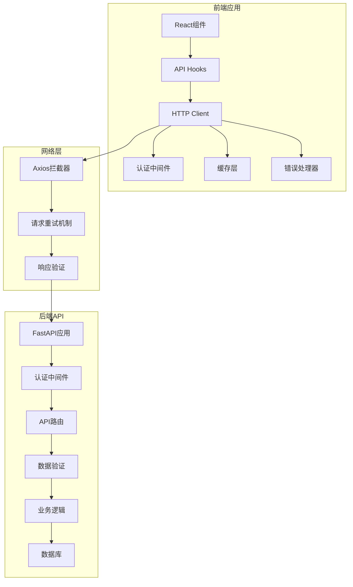
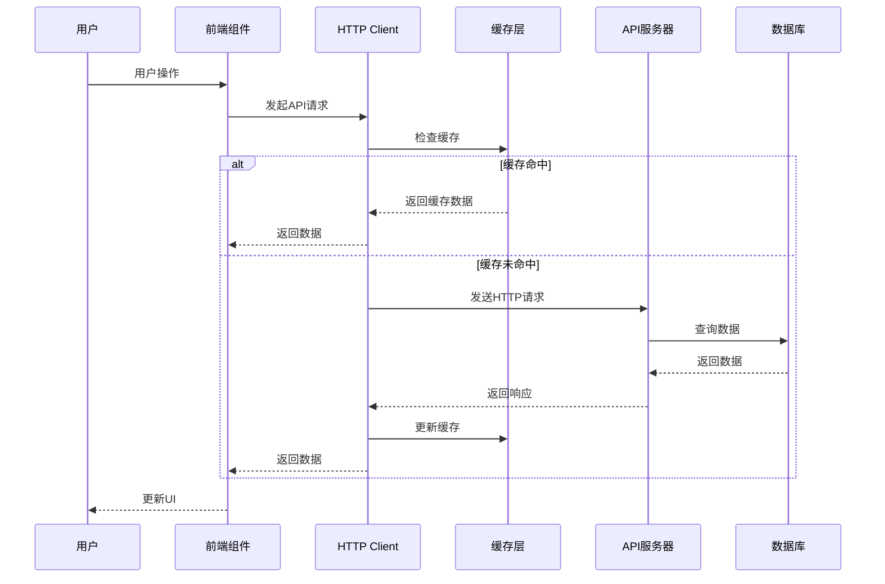
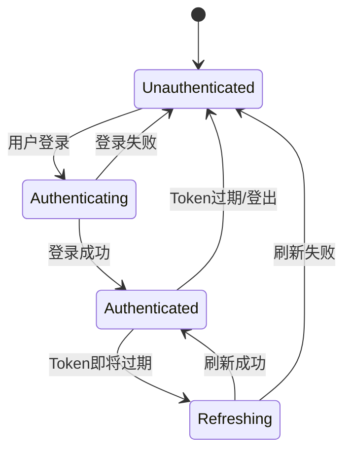
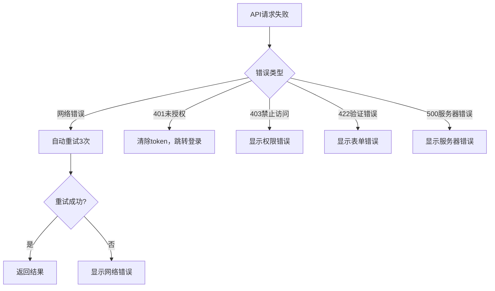

# 设计文档

## 概述

本设计文档描述了如何将基于mock数据的前端应用与后端API完全集成。设计重点关注数据格式一致性、错误处理、认证流程、缓存策略和用户体验优化。

## 架构

### 整体架构图



### 数据流架构



## 组件和接口

### 1. API客户端层

#### HttpClient增强
- **目的**: 统一管理所有API请求
- **功能**: 
  - 自动添加认证头
  - 请求/响应拦截
  - 错误处理和重试
  - 缓存管理
  - 请求去重

#### API端点映射
```typescript
interface APIEndpoints {
  // 认证相关
  auth: {
    login: '/auth/access-token'
    me: '/users/me'
  }
  
  // 数据源管理
  dataSources: {
    list: '/data-sources/'
    create: '/data-sources/'
    detail: (id: number) => `/data-sources/${id}/`
    test: (id: number) => `/data-sources/${id}/test/`
    preview: (id: number) => `/data-sources/${id}/preview/`
  }
  
  // 模板管理
  templates: {
    list: '/templates/'
    create: '/templates/'
    detail: (id: string) => `/templates/${id}/`
    upload: '/templates/upload/'
  }
  
  // 报告生成
  reports: {
    generate: '/reports/generate/'
    status: (taskId: number) => `/reports/status/${taskId}/`
    preview: '/reports/preview/'
    validate: '/reports/validate/'
  }
  
  // 智能占位符
  placeholders: {
    analyze: '/intelligent-placeholders/analyze'
    fieldMatching: '/intelligent-placeholders/field-matching'
    generateReport: '/intelligent-placeholders/generate-report'
    taskStatus: (taskId: string) => `/intelligent-placeholders/task/${taskId}/status`
    statistics: '/intelligent-placeholders/statistics'
  }
}
```

### 2. 认证系统

#### JWT Token管理
```typescript
interface AuthState {
  token: string | null
  user: User | null
  isAuthenticated: boolean
  isLoading: boolean
}

interface AuthActions {
  login: (credentials: LoginCredentials) => Promise<void>
  logout: () => void
  refreshToken: () => Promise<void>
  checkAuth: () => Promise<boolean>
}
```

#### 认证流程


### 3. 数据验证层

#### 响应数据验证
```typescript
interface APIResponse<T> {
  success: boolean
  data: T
  message?: string
  errors?: ValidationError[]
  meta?: {
    total?: number
    page?: number
    limit?: number
  }
}

interface ValidationError {
  field: string
  message: string
  code: string
}
```

#### 数据类型定义
```typescript
// 用户相关
interface User {
  id: string
  username: string
  email: string
  full_name?: string
  is_active: boolean
  is_superuser: boolean
  created_at: string
  updated_at?: string
}

// 数据源相关
interface DataSource {
  id: number
  name: string
  type: DataSourceType
  config: Record<string, any>
  is_active: boolean
  created_at: string
  updated_at?: string
}

// 模板相关
interface Template {
  id: string
  name: string
  content: string
  description?: string
  created_at: string
  updated_at?: string
}
```

### 4. 错误处理系统

#### 错误类型定义
```typescript
enum ErrorType {
  NETWORK_ERROR = 'NETWORK_ERROR',
  AUTHENTICATION_ERROR = 'AUTHENTICATION_ERROR',
  VALIDATION_ERROR = 'VALIDATION_ERROR',
  SERVER_ERROR = 'SERVER_ERROR',
  UNKNOWN_ERROR = 'UNKNOWN_ERROR'
}

interface AppError {
  type: ErrorType
  message: string
  code?: string
  details?: any
  retryable: boolean
}
```

#### 错误处理策略


### 5. 缓存策略

#### 缓存配置
```typescript
interface CacheConfig {
  // GET请求默认缓存5分钟
  defaultTTL: 5 * 60 * 1000
  
  // 不同端点的缓存策略
  endpointConfigs: {
    '/users/me': { ttl: 10 * 60 * 1000 } // 用户信息缓存10分钟
    '/data-sources/': { ttl: 2 * 60 * 1000 } // 数据源列表缓存2分钟
    '/templates/': { ttl: 5 * 60 * 1000 } // 模板列表缓存5分钟
  }
  
  // 缓存失效策略
  invalidationPatterns: {
    'POST /data-sources/': ['/data-sources/']
    'PUT /data-sources/*': ['/data-sources/']
    'DELETE /data-sources/*': ['/data-sources/']
  }
}
```

## 数据模型

### 请求/响应格式标准化

#### 统一响应格式
```typescript
// 成功响应
interface SuccessResponse<T> {
  success: true
  data: T
  message?: string
  meta?: ResponseMeta
}

// 错误响应
interface ErrorResponse {
  success: false
  error: {
    code: string
    message: string
    details?: any
  }
  meta?: ResponseMeta
}

interface ResponseMeta {
  timestamp: string
  request_id: string
  total?: number
  page?: number
  limit?: number
}
```

#### 分页数据格式
```typescript
interface PaginatedResponse<T> {
  success: true
  data: T[]
  meta: {
    total: number
    page: number
    limit: number
    has_next: boolean
    has_prev: boolean
  }
}
```

### 数据转换层

#### 前后端数据格式映射
```typescript
// 后端返回的用户数据格式
interface BackendUser {
  id: string
  username: string
  email: string
  full_name: string | null
  is_active: boolean
  is_superuser: boolean
  created_at: string
  updated_at: string | null
}

// 前端使用的用户数据格式
interface FrontendUser {
  id: string
  username: string
  email: string
  fullName?: string
  isActive: boolean
  isSuperuser: boolean
  createdAt: Date
  updatedAt?: Date
}

// 数据转换函数
const transformUser = (backendUser: BackendUser): FrontendUser => ({
  id: backendUser.id,
  username: backendUser.username,
  email: backendUser.email,
  fullName: backendUser.full_name || undefined,
  isActive: backendUser.is_active,
  isSuperuser: backendUser.is_superuser,
  createdAt: new Date(backendUser.created_at),
  updatedAt: backendUser.updated_at ? new Date(backendUser.updated_at) : undefined
})
```

## 错误处理

### 错误分类和处理策略

#### 1. 网络错误
- **类型**: 连接超时、网络不可达、DNS解析失败
- **处理**: 自动重试，指数退避，用户友好提示
- **用户体验**: 显示网络连接问题，提供重试按钮

#### 2. 认证错误
- **类型**: Token过期、无效Token、权限不足
- **处理**: 自动清除认证信息，重定向到登录页
- **用户体验**: 平滑跳转，保存用户操作上下文

#### 3. 验证错误
- **类型**: 表单数据验证失败、业务规则违反
- **处理**: 解析错误详情，映射到对应表单字段
- **用户体验**: 实时表单验证，清晰的错误提示

#### 4. 服务器错误
- **类型**: 500内部错误、503服务不可用
- **处理**: 记录错误日志，提供错误ID，联系支持
- **用户体验**: 友好的错误页面，提供解决建议

### 错误恢复机制

```typescript
interface ErrorRecoveryStrategy {
  // 自动重试策略
  retry: {
    maxAttempts: number
    backoffMultiplier: number
    retryableErrors: ErrorType[]
  }
  
  // 降级策略
  fallback: {
    useCache: boolean
    showOfflineMode: boolean
    disableFeatures: string[]
  }
  
  // 用户通知策略
  notification: {
    showToast: boolean
    showModal: boolean
    redirectToErrorPage: boolean
  }
}
```

## 测试策略

### 1. 单元测试
- API客户端方法测试
- 数据转换函数测试
- 错误处理逻辑测试
- 缓存机制测试

### 2. 集成测试
- 前后端API调用测试
- 认证流程测试
- 错误场景测试
- 数据一致性测试

### 3. 端到端测试
- 用户登录流程
- 数据CRUD操作
- 报告生成流程
- 错误恢复场景

### 测试数据管理
```typescript
interface TestDataManager {
  // Mock数据生成
  generateMockData: <T>(schema: Schema<T>) => T
  
  // 测试环境数据
  setupTestData: () => Promise<void>
  cleanupTestData: () => Promise<void>
  
  // API Mock服务
  startMockServer: () => Promise<void>
  stopMockServer: () => Promise<void>
}
```

## 性能优化

### 1. 请求优化
- 请求去重：防止重复请求
- 请求合并：批量处理相关请求
- 预加载：预测用户需求，提前加载数据

### 2. 缓存优化
- 智能缓存：根据数据更新频率调整缓存策略
- 缓存预热：应用启动时预加载关键数据
- 缓存同步：多标签页间缓存数据同步

### 3. 用户体验优化
- 乐观更新：先更新UI，后同步服务器
- 骨架屏：加载过程中显示内容结构
- 渐进式加载：分批加载大量数据

### 性能监控
```typescript
interface PerformanceMetrics {
  // API请求性能
  apiMetrics: {
    responseTime: number
    successRate: number
    errorRate: number
    cacheHitRate: number
  }
  
  // 用户体验指标
  uxMetrics: {
    pageLoadTime: number
    firstContentfulPaint: number
    timeToInteractive: number
  }
}
```

## 安全考虑

### 1. 数据传输安全
- HTTPS强制使用
- 敏感数据加密传输
- 请求签名验证

### 2. 认证安全
- JWT Token安全存储
- Token自动刷新机制
- 会话超时管理

### 3. 输入验证
- 前端数据验证
- 后端数据验证
- XSS防护

### 4. 错误信息安全
- 敏感信息过滤
- 错误信息标准化
- 调试信息控制

## 部署和配置

### 环境配置
```typescript
interface EnvironmentConfig {
  development: {
    apiBaseUrl: 'http://localhost:8000/api/v1'
    enableDebugLogs: true
    enableMockMode: false
  }
  
  staging: {
    apiBaseUrl: 'https://staging-api.autoreportai.com/api/v1'
    enableDebugLogs: true
    enableMockMode: false
  }
  
  production: {
    apiBaseUrl: 'https://api.autoreportai.com/api/v1'
    enableDebugLogs: false
    enableMockMode: false
  }
}
```

### 配置管理
- 环境变量管理
- 配置热更新
- 配置验证
- 敏感配置加密