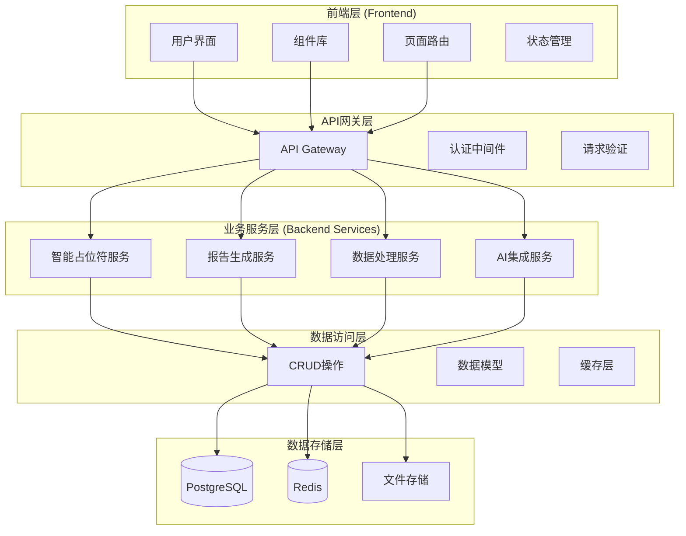
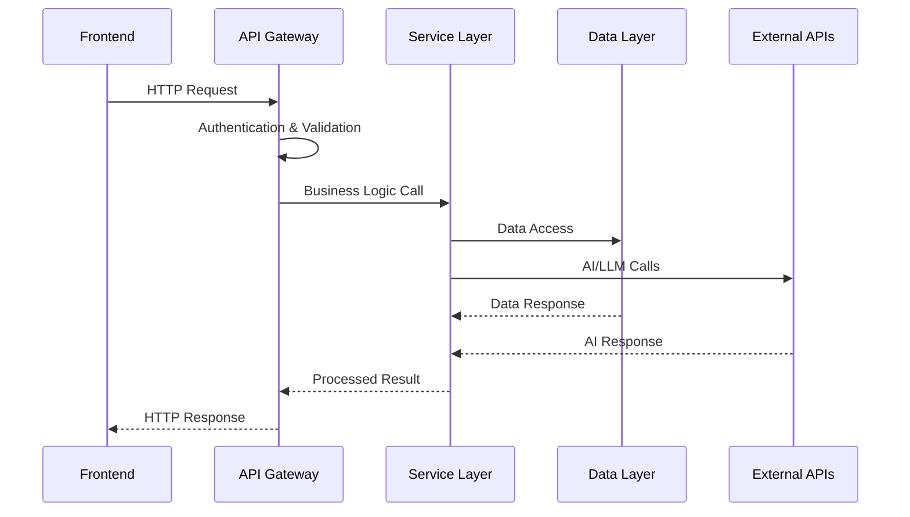

# 前后端架构重构设计文档

## 系统架构概览

### 整体架构图



## 后端架构设计

### 目录结构

```
backend/
├── app/                          # 应用核心代码
│   ├── __init__.py
│   ├── main.py                   # FastAPI应用入口
│   ├── api/                      # API路由层
│   │   ├── __init__.py
│   │   ├── deps.py               # 依赖注入
│   │   ├── router.py             # 主路由
│   │   └── endpoints/            # API端点
│   │       ├── __init__.py
│   │       ├── auth.py           # 认证相关
│   │       ├── templates.py      # 模板管理
│   │       ├── data_sources.py   # 数据源管理
│   │       ├── intelligent_placeholders.py  # 智能占位符
│   │       ├── reports.py        # 报告生成
│   │       ├── ai_providers.py   # AI提供商
│   │       └── analytics.py      # 分析功能
│   ├── core/                     # 核心配置
│   │   ├── __init__.py
│   │   ├── config.py             # 应用配置
│   │   ├── security.py           # 安全配置
│   │   ├── logging_config.py     # 日志配置
│   │   └── dependencies.py       # 全局依赖
│   ├── services/                 # 业务逻辑层
│   │   ├── __init__.py
│   │   ├── intelligent_placeholder/  # 智能占位符服务组
│   │   │   ├── __init__.py
│   │   │   ├── processor.py      # 占位符处理器
│   │   │   ├── adapter.py        # 适配器
│   │   │   └── matcher.py        # 字段匹配器
│   │   ├── report_generation/    # 报告生成服务组
│   │   │   ├── __init__.py
│   │   │   ├── generator.py      # 报告生成器
│   │   │   ├── composer.py       # 报告组合器
│   │   │   └── quality_checker.py # 质量检查器
│   │   ├── data_processing/      # 数据处理服务组
│   │   │   ├── __init__.py
│   │   │   ├── retrieval.py      # 数据检索
│   │   │   ├── analysis.py       # 数据分析
│   │   │   └── etl.py           # ETL处理
│   │   ├── ai_integration/       # AI集成服务组
│   │   │   ├── __init__.py
│   │   │   ├── llm_service.py    # LLM服务
│   │   │   ├── content_generator.py # 内容生成
│   │   │   └── chart_generator.py # 图表生成
│   │   └── notification/         # 通知服务组
│   │       ├── __init__.py
│   │       ├── email_service.py  # 邮件服务
│   │       └── websocket_service.py # WebSocket服务
│   ├── models/                   # 数据模型层
│   │   ├── __init__.py
│   │   ├── base.py               # 基础模型
│   │   ├── user.py               # 用户模型
│   │   ├── template.py           # 模板模型
│   │   ├── data_source.py        # 数据源模型
│   │   ├── report.py             # 报告模型
│   │   └── ai_provider.py        # AI提供商模型
│   ├── schemas/                  # Pydantic模式
│   │   ├── __init__.py
│   │   ├── base.py               # 基础模式
│   │   ├── user.py               # 用户模式
│   │   ├── template.py           # 模板模式
│   │   ├── data_source.py        # 数据源模式
│   │   ├── report.py             # 报告模式
│   │   └── ai_provider.py        # AI提供商模式
│   ├── crud/                     # 数据访问层
│   │   ├── __init__.py
│   │   ├── base.py               # 基础CRUD
│   │   ├── user.py               # 用户CRUD
│   │   ├── template.py           # 模板CRUD
│   │   ├── data_source.py        # 数据源CRUD
│   │   └── report.py             # 报告CRUD
│   ├── db/                       # 数据库配置
│   │   ├── __init__.py
│   │   ├── base.py               # 数据库基础
│   │   ├── session.py            # 数据库会话
│   │   └── base_class.py         # 基础类
│   └── utils/                    # 工具函数
│       ├── __init__.py
│       ├── security.py           # 安全工具
│       ├── email.py              # 邮件工具
│       └── file_handler.py       # 文件处理
├── tests/                        # 测试目录（统一）
│   ├── __init__.py
│   ├── conftest.py               # 全局测试配置
│   ├── unit/                     # 单元测试
│   │   ├── __init__.py
│   │   ├── conftest.py
│   │   ├── test_services/        # 服务层测试
│   │   ├── test_crud/            # CRUD测试
│   │   ├── test_models/          # 模型测试
│   │   └── test_schemas/         # 模式测试
│   ├── integration/              # 集成测试
│   │   ├── __init__.py
│   │   ├── conftest.py
│   │   ├── test_api/             # API集成测试
│   │   ├── test_database/        # 数据库集成测试
│   │   └── test_services_integration/ # 服务集成测试
│   └── e2e/                      # 端到端测试
│       ├── __init__.py
│       ├── conftest.py
│       └── test_workflows/       # 工作流测试
├── migrations/                   # 数据库迁移
├── scripts/                      # 脚本工具
├── docs/                         # 文档目录
│   ├── api/                      # API文档
│   ├── development/              # 开发文档
│   └── deployment/               # 部署文档
├── requirements/                 # 依赖管理
│   ├── base.txt                  # 基础依赖
│   ├── development.txt           # 开发依赖
│   ├── testing.txt               # 测试依赖
│   └── production.txt            # 生产依赖
├── .env.example                  # 环境变量示例
├── .gitignore                    # Git忽略文件
├── Dockerfile                    # Docker配置
├── docker-compose.yml            # Docker Compose配置
├── Makefile                      # 构建脚本
└── README.md                     # 项目说明
```

## 前端架构设计

### 目录结构

```
frontend/
├── src/
│   ├── app/                      # Next.js 13+ App Router
│   │   ├── (auth)/              # 认证路由组
│   │   │   ├── login/
│   │   │   │   └── page.tsx
│   │   │   └── register/
│   │   │       └── page.tsx
│   │   ├── (dashboard)/         # 仪表板路由组
│   │   │   ├── page.tsx         # 仪表板首页
│   │   │   ├── templates/       # 模板管理
│   │   │   │   ├── page.tsx
│   │   │   │   ├── [id]/
│   │   │   │   │   └── page.tsx
│   │   │   │   └── create/
│   │   │   │       └── page.tsx
│   │   │   ├── reports/         # 报告管理
│   │   │   │   ├── page.tsx
│   │   │   │   ├── [id]/
│   │   │   │   │   └── page.tsx
│   │   │   │   └── generate/
│   │   │   │       └── page.tsx
│   │   │   ├── data-sources/    # 数据源管理
│   │   │   │   ├── page.tsx
│   │   │   │   ├── [id]/
│   │   │   │   │   └── page.tsx
│   │   │   │   └── create/
│   │   │   │       └── page.tsx
│   │   │   ├── intelligent-placeholders/ # 智能占位符
│   │   │   │   ├── page.tsx
│   │   │   │   └── manage/
│   │   │   │       └── page.tsx
│   │   │   └── settings/        # 设置页面
│   │   │       └── page.tsx
│   │   ├── api/                 # API路由（如果需要）
│   │   ├── globals.css          # 全局样式
│   │   ├── layout.tsx           # 根布局
│   │   └── page.tsx             # 首页
│   ├── components/              # 组件库
│   │   ├── ui/                  # 基础UI组件
│   │   │   ├── button.tsx
│   │   │   ├── input.tsx
│   │   │   ├── modal.tsx
│   │   │   ├── table.tsx
│   │   │   └── index.ts         # 统一导出
│   │   ├── forms/               # 表单组件
│   │   │   ├── template-form.tsx
│   │   │   ├── data-source-form.tsx
│   │   │   ├── report-form.tsx
│   │   │   └── index.ts
│   │   ├── charts/              # 图表组件
│   │   │   ├── bar-chart.tsx
│   │   │   ├── line-chart.tsx
│   │   │   ├── pie-chart.tsx
│   │   │   └── index.ts
│   │   ├── intelligent/         # 智能功能组件
│   │   │   ├── placeholder-manager.tsx
│   │   │   ├── report-generator.tsx
│   │   │   ├── ai-assistant.tsx
│   │   │   └── index.ts
│   │   ├── layout/              # 布局组件
│   │   │   ├── header.tsx
│   │   │   ├── sidebar.tsx
│   │   │   ├── footer.tsx
│   │   │   └── index.ts
│   │   └── providers/           # 上下文提供者
│   │       ├── auth-provider.tsx
│   │       ├── theme-provider.tsx
│   │       ├── notification-provider.tsx
│   │       └── index.ts
│   ├── lib/                     # 工具库
│   │   ├── api/                 # API客户端
│   │   │   ├── client.ts        # HTTP客户端
│   │   │   ├── auth.ts          # 认证API
│   │   │   ├── templates.ts     # 模板API
│   │   │   ├── reports.ts       # 报告API
│   │   │   ├── data-sources.ts  # 数据源API
│   │   │   └── index.ts
│   │   ├── auth/                # 认证逻辑
│   │   │   ├── config.ts        # 认证配置
│   │   │   ├── utils.ts         # 认证工具
│   │   │   └── index.ts
│   │   ├── utils/               # 通用工具
│   │   │   ├── format.ts        # 格式化工具
│   │   │   ├── validation.ts    # 验证工具
│   │   │   ├── constants.ts     # 常量定义
│   │   │   └── index.ts
│   │   └── hooks/               # 自定义Hook
│   │       ├── use-auth.ts      # 认证Hook
│   │       ├── use-api.ts       # API Hook
│   │       ├── use-local-storage.ts # 本地存储Hook
│   │       └── index.ts
│   ├── types/                   # TypeScript类型定义
│   │   ├── api.ts               # API类型
│   │   ├── auth.ts              # 认证类型
│   │   ├── template.ts          # 模板类型
│   │   ├── report.ts            # 报告类型
│   │   ├── data-source.ts       # 数据源类型
│   │   └── index.ts
│   └── styles/                  # 样式文件
│       ├── globals.css          # 全局样式
│       ├── components.css       # 组件样式
│       └── themes/              # 主题样式
│           ├── light.css
│           └── dark.css
├── public/                      # 静态资源
│   ├── images/
│   ├── icons/
│   └── favicon.ico
├── docs/                        # 前端文档
├── .env.local.example           # 环境变量示例
├── .gitignore                   # Git忽略文件
├── .eslintrc.json              # ESLint配置
├── .prettierrc                  # Prettier配置
├── next.config.js               # Next.js配置
├── tailwind.config.js           # Tailwind配置
├── tsconfig.json                # TypeScript配置
├── package.json                 # 依赖配置
└── README.md                    # 项目说明
```

## 核心组件设计

### 1. 智能占位符服务架构

```python
# app/services/intelligent_placeholder/processor.py
class IntelligentPlaceholderProcessor:
    def __init__(self, 
                 llm_service: LLMService,
                 field_matcher: FieldMatcher,
                 data_retrieval: DataRetrievalService):
        self.llm_service = llm_service
        self.field_matcher = field_matcher
        self.data_retrieval = data_retrieval
    
    async def process_placeholder(self, 
                                placeholder: PlaceholderInfo,
                                context: ProcessingContext) -> ProcessedResult:
        # 占位符处理逻辑
        pass
```

### 2. API层设计

```python
# app/api/endpoints/intelligent_placeholders.py
from fastapi import APIRouter, Depends
from app.services.intelligent_placeholder import IntelligentPlaceholderProcessor
from app.schemas.placeholder import PlaceholderRequest, PlaceholderResponse

router = APIRouter(prefix="/api/v1/intelligent-placeholders", tags=["intelligent-placeholders"])

@router.post("/process", response_model=PlaceholderResponse)
async def process_placeholder(
    request: PlaceholderRequest,
    processor: IntelligentPlaceholderProcessor = Depends()
):
    # API端点实现
    pass
```

### 3. 前端组件设计

```typescript
// src/components/intelligent/placeholder-manager.tsx
interface PlaceholderManagerProps {
  templateId: string;
  onPlaceholderUpdate: (placeholders: Placeholder[]) => void;
}

export const PlaceholderManager: React.FC<PlaceholderManagerProps> = ({
  templateId,
  onPlaceholderUpdate
}) => {
  // 组件实现
  return (
    <div className="placeholder-manager">
      {/* 占位符管理界面 */}
    </div>
  );
};
```

## 数据流设计

### 1. 请求处理流程



### 2. 状态管理

前端使用React Context + useReducer进行状态管理：

```typescript
// src/lib/context/app-context.tsx
interface AppState {
  user: User | null;
  templates: Template[];
  reports: Report[];
  loading: boolean;
  error: string | null;
}

const AppContext = createContext<{
  state: AppState;
  dispatch: Dispatch<AppAction>;
} | null>(null);
```

## 错误处理策略

### 1. 后端错误处理

```python
# app/core/exceptions.py
class AppException(Exception):
    def __init__(self, message: str, code: str, status_code: int = 400):
        self.message = message
        self.code = code
        self.status_code = status_code

class PlaceholderProcessingError(AppException):
    pass

class DataRetrievalError(AppException):
    pass
```

### 2. 前端错误处理

```typescript
// src/lib/utils/error-handler.ts
export class ApiError extends Error {
  constructor(
    message: string,
    public status: number,
    public code?: string
  ) {
    super(message);
    this.name = 'ApiError';
  }
}

export const handleApiError = (error: unknown): string => {
  if (error instanceof ApiError) {
    return error.message;
  }
  return '发生未知错误';
};
```

## 测试策略

### 1. 后端测试

- **单元测试**：测试各个服务类的独立功能
- **集成测试**：测试API端点和数据库交互
- **端到端测试**：测试完整的业务流程

### 2. 前端测试

- **组件测试**：使用React Testing Library测试组件
- **集成测试**：测试页面和API交互
- **端到端测试**：使用Playwright测试用户流程

## 部署架构

### 1. 容器化部署

```yaml
# docker-compose.yml
version: '3.8'
services:
  backend:
    build: ./backend
    ports:
      - "8000:8000"
    environment:
      - DATABASE_URL=postgresql://user:pass@db:5432/autoreport
    depends_on:
      - db
      - redis
  
  frontend:
    build: ./frontend
    ports:
      - "3000:3000"
    environment:
      - NEXT_PUBLIC_API_URL=http://backend:8000
    depends_on:
      - backend
  
  db:
    image: postgres:15
    environment:
      - POSTGRES_DB=autoreport
      - POSTGRES_USER=user
      - POSTGRES_PASSWORD=pass
    volumes:
      - postgres_data:/var/lib/postgresql/data
  
  redis:
    image: redis:7-alpine
    ports:
      - "6379:6379"

volumes:
  postgres_data:
```

### 2. CI/CD流程

```yaml
# .github/workflows/ci-cd.yml
name: CI/CD Pipeline
on:
  push:
    branches: [main, develop]
  pull_request:
    branches: [main]

jobs:
  test-backend:
    runs-on: ubuntu-latest
    steps:
      - uses: actions/checkout@v3
      - name: Set up Python
        uses: actions/setup-python@v4
        with:
          python-version: '3.11'
      - name: Install dependencies
        run: |
          cd backend
          pip install -r requirements/testing.txt
      - name: Run tests
        run: |
          cd backend
          pytest --cov=app --cov-report=xml
      - name: Upload coverage
        uses: codecov/codecov-action@v3
  
  test-frontend:
    runs-on: ubuntu-latest
    steps:
      - uses: actions/checkout@v3
      - name: Set up Node.js
        uses: actions/setup-node@v3
        with:
          node-version: '18'
      - name: Install dependencies
        run: |
          cd frontend
          npm ci
      - name: Run tests
        run: |
          cd frontend
          npm run test:coverage
      - name: Upload coverage
        uses: codecov/codecov-action@v3
```

## 性能优化

### 1. 后端优化

- 使用Redis缓存频繁查询的数据
- 数据库查询优化和索引设计
- 异步处理长时间运行的任务
- API响应压缩和分页

### 2. 前端优化

- 代码分割和懒加载
- 图片优化和CDN使用
- 缓存策略和离线支持
- 组件级别的性能优化

## 安全考虑

### 1. 认证和授权

- JWT令牌认证
- 基于角色的访问控制（RBAC）
- API密钥管理
- 会话管理

### 2. 数据安全

- 数据加密存储
- SQL注入防护
- XSS和CSRF防护
- 敏感数据脱敏

## 监控和日志

### 1. 应用监控

- 健康检查端点
- 性能指标收集
- 错误追踪和报警
- 用户行为分析

### 2. 日志管理

- 结构化日志记录
- 日志级别管理
- 日志聚合和分析
- 审计日志记录