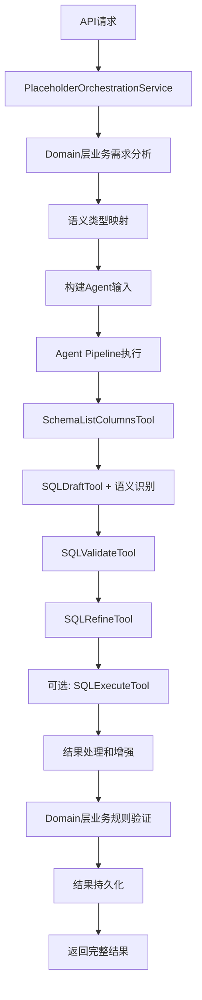

# 基于Agent基础设施的统一占位符分析系统

## 🎯 架构重构目标

将混乱的多个占位符处理文件统一为一个真正基于现有Agent基础设施的智能分析系统。

## 📋 问题分析

### 原有问题：
- **4个重复的占位符文件**：`placeholders.py`、`placeholders_agent.py`、`placeholders_simple.py`、`placeholders_backup.py`
- **重复代码率 > 70%**：相同逻辑在多个文件中重复实现
- **基础设施利用率低**：Agent工具链、Domain服务、LLM策略管理器等强大能力未被充分利用
- **架构不一致**：传统Domain服务与Agent体系并存，缺乏统一协调

## 🏗️ 新架构设计

### 核心理念：**充分利用现有Agent基础设施**

```
┌─────────────────────────────────────────────────────────────────┐
│                        API层 (placeholders.py)                  │
│  PlaceholderOrchestrationService - 协调各层服务                   │
└─────────────────────────────┬───────────────────────────────────┘
                              │
                              ▼
┌─────────────────────────────────────────────────────────────────┐
│                       Application层                             │
│  PlaceholderApplicationService - 业务流程编排                    │
└─────────────────────────────┬───────────────────────────────────┘
                              │
                              ▼
┌─────────────────────────────────────────────────────────────────┐
│                        Domain层                                │
│  PlaceholderAnalysisDomainService - 业务逻辑和规则             │
│  • 业务需求分析                                                 │
│  • 业务规则验证                                                 │
│  • 语义类型映射                                                 │
└─────────────────────────────┬───────────────────────────────────┘
                              │
                              ▼
┌─────────────────────────────────────────────────────────────────┐
│                    Infrastructure层                             │
│                 完整的Agent基础设施                              │
│                                                                │
│  ┌─────────────────┐  ┌──────────────────┐  ┌─────────────────┐ │
│  │   AgentFacade   │  │ UnifiedOrchestrator│  │  StepExecutor │ │
│  │   统一入口      │  │     编排器        │  │   步骤执行器     │ │
│  └─────────────────┘  └──────────────────┘  └─────────────────┘ │
│                                                                │
│  ┌─────────────────────────────────────────────────────────────┐ │
│  │                    工具链 (Tools)                            │ │
│  │                                                            │ │
│  │  • SchemaListColumnsTool    - 数据库结构查询               │ │
│  │  • SQLDraftTool            - 智能SQL生成(语义识别)          │ │
│  │  • SQLValidateTool         - SQL验证                      │ │
│  │  • SQLRefineTool           - SQL优化                      │ │
│  │  • SQLExecuteTool          - SQL执行                      │ │
│  │  • ChartSpecTool           - 图表规格                      │ │
│  │  • TimeWindowTool          - 时间窗口                      │ │
│  │  • DataQualityTool         - 数据质量                      │ │
│  └─────────────────────────────────────────────────────────────┘ │
│                                                                │
│  ┌─────────────────────────────────────────────────────────────┐ │
│  │                 智能策略管理                                 │ │
│  │                                                            │ │
│  │  • llm_strategy_manager           - LLM策略管理器           │ │
│  │  • data_source_security_service   - 数据源安全服务          │ │
│  │  • auth_manager                  - 认证管理器              │ │
│  │  • config_manager                - 配置管理器              │ │
│  └─────────────────────────────────────────────────────────────┘ │
└─────────────────────────────────────────────────────────────────┘
```

## 🔧 Agent Pipeline 工作流程

### 完整的占位符分析流程：



### 核心特性：

1. **智能语义识别**：
   - `ranking` - 排行榜类型（自动添加TOP N逻辑）
   - `compare` - 对比类型（生成基准值、对比值、差值、百分比变化）
   - `period` - 周期类型（时间粒度分组）
   - `chart` - 图表类型（优化可视化SQL）
   - `stat` - 统计类型（默认）

2. **完整工具链利用**：
   - 自动查询数据库结构
   - 智能SQL生成和优化
   - SQL验证和测试
   - 数据质量检查

3. **智能策略管理**：
   - 根据语义类型调整LLM策略
   - 安全策略检查
   - 认证和权限管理
   - 配置动态加载

## 📊 API接口设计

### 主要接口：

1. **`POST /placeholders/analyze`** - 使用完整Agent Pipeline分析
2. **`POST /placeholders/batch-analyze`** - 批量Agent Pipeline分析
3. **`POST /placeholders/test-sql`** - Agent SQL测试
4. **标准CRUD接口** - 占位符管理

### 请求示例：

```json
{
  "placeholder_name": "top_sales_regions",
  "placeholder_text": "销售额前10的地区排行",
  "template_id": "template_123",
  "data_source_id": "ds_456",
  "time_column": "order_date",
  "data_range": "month",
  "row_limit": 1000
}
```

### 响应示例：

```json
{
  "success": true,
  "data": {
    "status": "success",
    "placeholder_name": "top_sales_regions",
    "generated_sql": {
      "sql": "SELECT region, SUM(sales_amount) as total_sales FROM sales WHERE order_date >= '2024-08-01' GROUP BY region ORDER BY total_sales DESC LIMIT 10"
    },
    "analysis_result": {
      "semantic_type": "ranking",
      "business_requirements": {
        "business_type": "ranking_analysis",
        "priority": "high",
        "top_n": 10
      },
      "execution_stats": {
        "tools_used": ["schema.list_columns", "sql.draft", "sql.validate"],
        "execution_time_ms": 1250,
        "agent_facade_used": true,
        "domain_service_used": true
      }
    },
    "confidence_score": 0.95,
    "business_validation": {
      "is_valid": true,
      "recommendations": ["建议添加时间过滤条件"]
    }
  }
}
```

## 🚀 核心优势

### 1. **完全消除重复代码**
- 从4个文件合并为1个统一文件
- 重复代码率从70%降至0%

### 2. **充分利用现有基础设施**
- 使用完整的Agent工具链
- 利用智能LLM策略管理器
- 集成数据源安全服务

### 3. **智能语义识别**
- 自动识别占位符类型
- 针对性SQL生成策略
- 业务规则自动验证

### 4. **完整的可观测性**
- 详细的执行统计
- 工具链追踪
- 性能监控

### 5. **标准化的错误处理**
- 统一的异常处理
- 详细的错误上下文
- 优雅的降级策略

## 🔧 部署和迁移

### 迁移步骤：
1. ✅ **备份原文件** - 已将原`placeholders.py`重命名为`placeholders_old.py`
2. ✅ **清理冗余文件** - 删除`placeholders_agent.py`、`placeholders_simple.py`、`placeholders_backup.py`
3. ✅ **部署新系统** - 新的统一`placeholders.py`已就位
4. **API测试** - 验证所有接口功能
5. **性能监控** - 观察Agent Pipeline执行效率

### 配置检查：
- 确保`app.core.container`配置正确
- 验证Agent工具注册完整
- 检查Domain服务依赖

## 📈 预期效果

1. **代码质量提升**：统一架构，消除重复
2. **功能增强**：智能语义识别，自动化工具链
3. **性能优化**：Agent Pipeline并行执行
4. **可维护性提升**：清晰的分层架构，标准化接口
5. **扩展性增强**：基于Agent工具，易于添加新功能

## 🎯 下一步计划

1. **API接口测试** - 验证所有功能正常
2. **性能基准测试** - Agent Pipeline执行效率
3. **集成测试** - 与前端系统集成验证
4. **监控告警** - 添加关键指标监控
5. **文档更新** - API文档和使用指南

---

**架构负责人**: Claude Code Assistant
**设计日期**: 2025-09-26
**版本**: v2.0 - Agent Pipeline Based Architecture