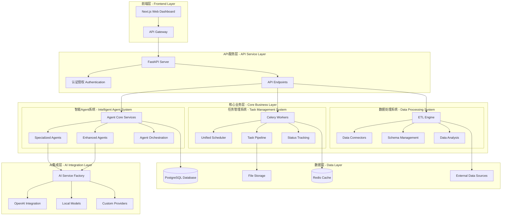

<div align="center">
  
  <h1>AutoReportAI</h1>
  <p>
    <b>下一代 AI 驱动的智能报告生成系统</b>
  </p>
  <p>
    基于先进的 Agent 架构，AutoReportAI 将原始数据转换为专业的商业报告，提供端到端的智能化数据分析和报告生成解决方案。
  </p>

  <p>
    <a href="https://github.com/kongusen/AutoReportAI/stargazers"></a>
    <a href="https://github.com/kongusen/AutoReportAI/forks"></a>
    <a href="https://github.com/kongusen/AutoReportAI/issues"></a>
    <a href="./LICENSE"></a>
  </p>

  <p>
    <a href="https://github.com/kongusen/AutoReportAI/actions/workflows/ci-cd.yml"></a>
    <a href="https://github.com/kongusen/AutoReportAI/actions/workflows/quality.yml"></a>
    <a href="https://codecov.io/gh/kongusen/AutoReportAI"></a>
  </p>

  <p>
    <a href="./README_EN.md">English</a> | <b>简体中文</b>
  </p>
</div>

---

## 📋 快速开始

### 🐳 Docker 部署（推荐）

1. **克隆项目**
   ```bash
   git clone <repository-url>
   cd AutoReportAI
   ```

2. **使用便捷脚本启动**
   ```bash
   cd docker
   ./start.sh
   ```

3. **或者手动启动**
   ```bash
   # 配置环境
   cp docker/.env.template docker/.env
   # 编辑 .env 文件，设置必要的配置项
   
   # 启动服务
   docker-compose -f docker/docker-compose.yml up -d
   ```

4. **访问应用**
   - 前端: http://localhost:3000
   - 后端API: http://localhost:8000
   - API文档: http://localhost:8000/docs

📖 **详细部署指南**: 请参考 [docker/DEPLOYMENT.md](./docker/DEPLOYMENT.md) 获取完整的部署说明。

🛠️ **Docker 文件说明**:
- `docker/` - 包含所有 Docker 相关文件
- `docker/start.sh` - 便捷启动脚本（支持多种模式）
- `docker/stop.sh` - 停止和清理脚本

## ✨ 核心特性

AutoReportAI 采用革命性的 **Agent 中心化架构**，将 AI 智能与企业级可靠性完美结合。

### 🤖 智能 Agent 系统
- **🎯 Agent 编排器**: 智能协调多个 Agent 完成复杂任务
- **📊 数据分析 Agent**: 高级统计分析、异常检测、预测分析
- **💡 内容生成 Agent**: AI 驱动的自然语言生成和商业洞察
- **🔍 数据查询 Agent**: 智能 SQL 生成和查询优化
- **📈 可视化 Agent**: 自动图表生成和数据可视化

### 🔄 完整的智能处理管道
- **模板分析**: 自动解析占位符和业务需求
- **数据源验证**: 连接测试和性能分析
- **智能 ETL**: AI 驱动的数据提取、转换、加载
- **深度分析**: 统计分析、趋势预测、异常检测
- **内容生成**: 从数据到自然语言的智能转换
- **报告组装**: 自动化的文档生成和质量保证

### 🎨 JSON 到自然语言转换
```python
# 输入冷冰冰的数据
json_data = [
    {"type": "VIP", "count": 150, "avg_spend": 8500, "contribution": 65.2}
]

# 输出温暖的商业语言
"根据本年度客户数据分析显示：VIP客户群体表现最为突出，共有150位客户，
人均消费8500元，贡献了65.2%的总收入..."
```

### 🚀 高级功能特性
- **🕒 智能任务调度**: 基于 Celery 的异步任务处理和实时监控
- **📊 多维度数据分析**: 描述性、诊断性、预测性分析
- **🔌 多 AI 提供商集成**: OpenAI、本地模型、自定义 AI 服务
- **👥 企业级用户管理**: RBAC 权限控制和审计跟踪
- **🌐 现代化 Web 界面**: Next.js + TypeScript 响应式设计
- **🔧 生产就绪部署**: Docker 容器化、CI/CD 流水线

## 🏛️ 重构后的系统架构

AutoReportAI 采用现代化的分层架构设计，经过全面重构优化，提供高性能、可扩展的智能报告生成能力。



### 🎯 重构后的核心子系统

#### 🤖 **智能Agent系统**
- **核心服务层**: 统一的Agent接口和错误处理
- **专业Agent**: 数据查询、内容生成、分析、可视化专用Agent
- **增强Agent**: 机器学习驱动的高级分析能力
- **智能编排**: 自动任务分解和Agent协调

#### 📋 **任务管理系统**
- **Celery Workers**: 异步任务处理和分布式执行
- **统一调度器**: 集成Celery和APScheduler的混合调度
- **任务流水线**: 智能报告生成的端到端流程
- **状态跟踪**: 实时任务进度监控和错误恢复

#### 🔄 **数据处理系统**
- **ETL引擎**: 智能数据提取、转换、加载
- **数据连接器**: 多种数据源的统一接入
- **模式管理**: 自动化数据库模式发现和分析
- **数据分析**: 统计分析和数据质量检测

#### 🧠 **AI集成层**
- **AI服务工厂**: 多AI提供商的统一管理
- **OpenAI集成**: GPT模型的专业化封装
- **本地模型**: 支持本地部署的AI模型
- **自定义提供商**: 可扩展的AI服务接口

## 🛠️ 技术栈

| 分类 | 技术 |
|------|------|
| **后端架构** |    |
| **Agent 系统** |    |
| **AI 集成** |    |
| **数据处理** |    |
| **前端界面** |    |
| **部署运维** |    |

## 🚀 快速开始

### 1. 环境要求

- [Docker](https://www.docker.com/get-started/) & Docker Compose (v2.0+)
- [Python 3.11+](https://www.python.org/downloads/) 
- [Node.js 18+](https://nodejs.org/) & npm
- [Redis](https://redis.io/) (用于 Agent 协调)

### 2. 克隆和初始化

```bash
# 克隆项目
git clone https://github.com/kongusen/AutoReportAI.git
cd AutoReportAI

# 启动基础设施（数据库和 Redis）
docker-compose up -d

# 创建环境配置
cp backend/.env.example backend/.env
# 编辑 backend/.env 添加必要的配置
```

### 3. 后端 Agent 系统启动

```bash
cd backend

# 创建 Python 虚拟环境
python3 -m venv venv
source venv/bin/activate  # Windows: venv\Scripts\activate

# 安装依赖
pip install -r requirements/development.txt

# 初始化数据库和 Agent 系统
make dev-setup  # 一键设置所有组件

# 启动 API 服务器
uvicorn app.main:app --host 0.0.0.0 --port 8000 --reload
```

### 4. Agent 工作器启动

```bash
# 在新终端中启动 Celery Agent 工作器
cd backend
source venv/bin/activate

# 启动 Agent 编排器
celery -A app.services.task.core.worker.celery_app worker --loglevel=info --concurrency=4

# 启动任务调度器
python scheduler/main.py
```

### 5. 前端界面启动

```bash
# 安装前端依赖
npm install --prefix frontend

# 启动开发服务器
npm run dev --prefix frontend
```

### 6. 访问应用

- **🌐 Web 应用**: `http://localhost:3000`
- **📚 API 文档**: `http://localhost:8000/docs`
- **🤖 Agent 监控**: `http://localhost:3000/admin/agents`

**默认管理员账号**:
- **邮箱**: `admin@example.com`
- **密码**: `password`

## 📊 Agent 系统详解

### 智能处理管道

#### 1. 标准处理流程
```python
# 创建智能处理上下文
from app.services.agents.core.intelligent_pipeline_orchestrator import PipelineContext

context = PipelineContext(
    template_id="your_template_id",
    data_source_id="your_datasource_id", 
    user_id="user_id",
    optimization_level="standard"  # standard | high_performance | memory_optimized
)

# 执行智能管道
result = await pipeline_orchestrator.execute(context)
```

#### 2. 高性能模式
```python
# 高性能处理配置
context = PipelineContext(
    template_id="template_id",
    data_source_id="datasource_id",
    optimization_level="high_performance",
    batch_size=5000,  # 小批次快速处理
    enable_caching=True
)
```

#### 3. 内存优化模式
```python
# 大数据集内存优化
context = PipelineContext(
    template_id="template_id", 
    data_source_id="datasource_id",
    optimization_level="memory_optimized",
    batch_size=1000,  # 极小批次
    custom_config={
        "streaming_mode": True,
        "memory_threshold": 0.8
    }
)
```

### Agent 类型和功能

#### 🔍 **增强数据源 Agent**
```python
from app.services.agents.enhanced.enhanced_data_source_agent import enhanced_data_source_agent

# 深度数据源分析
result = await enhanced_data_source_agent.execute({
    "data_source_id": "your_ds_id",
    "analysis_mode": "comprehensive",  # quick | standard | comprehensive | deep
    "target_tables": ["customers", "orders"]
})

# 获取分析结果
schema_info = result.data.schema_info
data_profiles = result.data.data_profiles  # 数据质量分析
query_optimizations = result.data.query_optimizations  # 查询优化建议
security_assessment = result.data.security_assessment  # 安全评估
```

#### 📊 **增强分析管道 Agent**
```python
from app.services.agents.enhanced.enhanced_analysis_pipeline import enhanced_analysis_pipeline

# 综合数据分析
result = await enhanced_analysis_pipeline.execute({
    "data": your_dataframe,
    "analysis_types": ["descriptive", "diagnostic", "predictive", "anomaly_detection"],
    "insight_level": "advanced"  # basic | intermediate | advanced | expert
})

# 获取分析结果
statistical_summary = result.data.statistical_summary
correlation_analysis = result.data.correlation_analysis
trend_analysis = result.data.trend_analysis
anomaly_detection = result.data.anomaly_detection
predictive_insights = result.data.predictive_insights
```

### JSON 到自然语言转换

#### 基础使用
```python
from app.services.agents.core.data_to_text_converter import DataToTextConverter

converter = DataToTextConverter()

# JSON 数据转自然语言
json_data = [
    {"type": "VIP", "count": 150, "avg_spend": 8500, "contribution": 65.2},
    {"type": "普通", "count": 1200, "avg_spend": 2300, "contribution": 28.5}
]

natural_text = await converter.convert_placeholder_result(
    placeholder="{{客户分析:统计各客户类型数量和消费}}",
    data=json_data,
    template_context={"report_date": "2024年3月"},
    style="business_report"  # business_report | casual | technical
)
```

#### 输出示例
**输入数据**: `[{"type": "VIP", "count": 150, "avg_spend": 8500}]`

**输出文本**: 
> "根据2024年3月客户数据分析显示：VIP客户群体表现突出，共有150位客户，人均消费8500元，展现出强劲的消费实力。数据表明VIP客户价值密度较高，建议继续深耕此类客户群体。"

## 🎯 应用场景

### 1. 智能日报生成
```python
# 每日自动生成销售报告
daily_pipeline = PipelineContext(
    template_id="daily_sales_template",
    data_source_id="sales_db",
    optimization_level="standard",
    custom_config={
        "report_type": "daily",
        "auto_insights": True
    }
)
```

### 2. 异常检测报告
```python
# 自动检测并报告数据异常
anomaly_analysis = await enhanced_analysis_pipeline.execute({
    "data": recent_data,
    "analysis_types": ["anomaly_detection"],
    "insight_level": "expert"
})
```

### 3. 客户分析洞察
```python
# 深度客户行为分析
customer_insights = await enhanced_analysis_pipeline.execute({
    "data": customer_data,
    "analysis_types": ["descriptive", "predictive", "exploratory"],
    "target_column": "customer_value"
})
```

## 📊 重构后的项目结构

```
AutoReportAI/
├── backend/                                    # 后端服务
│   ├── app/
│   │   ├── services/                          # 业务服务层
│   │   │   ├── agents/                        # 🤖 智能Agent系统
│   │   │   │   ├── base/                      # Agent基础框架
│   │   │   │   ├── core/                      # 核心服务层
│   │   │   │   │   ├── ai_service.py          # AI服务接口
│   │   │   │   │   ├── intelligent_pipeline_orchestrator.py
│   │   │   │   │   ├── data_to_text_converter.py
│   │   │   │   │   └── error_handler.py       # 错误处理
│   │   │   │   ├── specialized/               # 专业Agent
│   │   │   │   │   ├── schema_analysis_agent.py
│   │   │   │   │   ├── data_query_agent.py
│   │   │   │   │   ├── content_generation_agent.py
│   │   │   │   │   └── visualization_agent.py
│   │   │   │   ├── enhanced/                  # 增强Agent
│   │   │   │   │   ├── enhanced_analysis_agent.py
│   │   │   │   │   ├── enhanced_content_generation_agent.py
│   │   │   │   │   └── enhanced_data_query_agent.py
│   │   │   │   ├── orchestration/             # Agent编排
│   │   │   │   │   ├── orchestrator.py
│   │   │   │   │   └── smart_orchestrator.py
│   │   │   │   ├── tools/                     # Agent工具
│   │   │   │   └── security/                  # 安全沙盒
│   │   │   ├── task/                          # 📋 任务管理系统
│   │   │   │   ├── core/                      # 任务核心
│   │   │   │   │   ├── worker/                # Celery Workers
│   │   │   │   │   │   ├── config/           # Worker配置
│   │   │   │   │   │   ├── tasks/            # 任务定义
│   │   │   │   │   │   └── utils/            # 工具函数
│   │   │   │   │   ├── scheduler.py           # 调度器
│   │   │   │   │   └── progress_manager.py    # 进度管理
│   │   │   │   ├── execution/                 # 任务执行
│   │   │   │   │   ├── pipeline.py           # 执行流水线
│   │   │   │   │   └── agent_executor.py     # Agent执行器
│   │   │   │   └── management/                # 任务管理
│   │   │   │       ├── task_manager.py       # 任务管理器
│   │   │   │       └── status_tracker.py     # 状态跟踪
│   │   │   ├── data_processing/               # 🔄 数据处理系统
│   │   │   │   ├── etl/                      # ETL引擎
│   │   │   │   │   ├── etl_service.py        # ETL服务
│   │   │   │   │   └── celery_etl_scheduler.py
│   │   │   │   ├── analysis.py               # 数据分析
│   │   │   │   ├── statistics_service.py     # 统计服务
│   │   │   │   └── visualization_service.py  # 可视化服务
│   │   │   ├── connectors/                   # 数据连接器
│   │   │   │   ├── doris_connector.py        # Doris连接器
│   │   │   │   ├── sql_connector.py          # SQL连接器
│   │   │   │   └── api_connector.py          # API连接器
│   │   │   ├── schema_management/            # 模式管理
│   │   │   │   ├── schema_discovery_service.py
│   │   │   │   ├── schema_analysis_service.py
│   │   │   │   └── schema_metadata_service.py
│   │   │   ├── ai_integration/               # 🧠 AI集成层
│   │   │   │   ├── ai_service_enhanced.py    # 增强AI服务
│   │   │   │   └── llm_service.py           # LLM服务
│   │   │   └── report_generation/            # 报告生成
│   │   │       ├── generator.py             # 报告生成器
│   │   │       ├── document_pipeline.py     # 文档流水线
│   │   │       └── word_generator_service.py # Word文档生成
│   │   ├── core/                             # 核心配置
│   │   │   ├── unified_scheduler.py          # 统一调度器
│   │   │   ├── celery_scheduler.py          # Celery调度器
│   │   │   ├── ai_service_factory.py        # AI服务工厂
│   │   │   └── config.py                    # 系统配置
│   │   ├── api/                             # API端点
│   │   ├── models/                          # 数据模型
│   │   └── crud/                            # CRUD操作
│   └── tests/                               # 测试套件
├── frontend/                                # 前端界面
├── docker/                                  # Docker配置
└── docs/                                   # 文档
```

## 🎯 系统功能详解

### 🤖 智能Agent系统功能

#### 1. 专业Agent
- **模式分析Agent**: 自动发现和分析数据库表结构、字段类型、关系映射
- **数据查询Agent**: 智能SQL生成、查询优化、语义理解
- **内容生成Agent**: 基于数据的自然语言报告生成、多风格适配
- **可视化Agent**: 智能图表推荐、数据可视化、交互式展示

#### 2. 增强Agent功能
- **机器学习分析**: 预测建模、异常检测、聚类分析、趋势预测
- **上下文内容生成**: 多轮对话、风格一致性、个性化内容
- **语义数据查询**: 自然语言转SQL、智能字段映射、查询优化
- **智能可视化**: 图表类型推荐、自适应设计、数据故事化

#### 3. Agent编排功能
- **智能任务分解**: 复杂请求自动分解为可执行子任务
- **并行执行管理**: 多Agent协同工作、资源优化调度
- **依赖关系处理**: 任务间依赖分析、执行顺序优化
- **错误恢复机制**: 自动重试、降级处理、故障转移

### 📋 任务管理系统功能

#### 1. Celery分布式任务
- **异步任务处理**: 支持长时间运行的报告生成任务
- **分布式执行**: 多Worker节点负载均衡
- **任务队列管理**: 优先级队列、任务分类、资源隔离
- **错误处理**: 自动重试、死信队列、异常恢复

#### 2. 统一调度系统
- **混合调度模式**: 集成Celery和APScheduler优势
- **定时任务管理**: Cron表达式、周期任务、一次性任务
- **动态调度**: 运行时添加/修改/删除任务
- **调度监控**: 任务执行状态、性能指标、资源使用

#### 3. 任务执行流水线
- **端到端流程**: 从模板解析到报告生成的完整流程
- **状态跟踪**: 实时进度更新、详细执行日志
- **质量控制**: 每个阶段的质量检查和验证
- **性能优化**: 缓存机制、资源复用、批处理优化

### 🔄 数据处理系统功能

#### 1. ETL引擎
- **智能数据提取**: 支持多种数据源的自动发现和连接
- **数据转换**: 数据清洗、格式转换、字段映射、类型转换
- **数据加载**: 增量更新、批量加载、实时流处理
- **ETL调度**: 定时ETL作业、依赖管理、错误恢复

#### 2. 数据连接器
- **Doris连接器**: 高性能OLAP数据库连接和查询优化
- **SQL连接器**: 通用关系型数据库支持
- **API连接器**: RESTful API数据源集成
- **文件连接器**: CSV、Excel、JSON等文件格式支持

#### 3. 模式管理
- **自动模式发现**: 扫描数据源、识别表结构、推断关系
- **元数据管理**: 字段描述、业务含义、数据质量指标
- **关系分析**: 表间关系、外键约束、数据血缘
- **版本控制**: 模式变更跟踪、版本比较、迁移管理

#### 4. 数据分析功能
- **统计分析**: 描述性统计、分布分析、相关性分析
- **数据质量**: 空值检测、重复数据、异常值识别
- **可视化服务**: 图表生成、仪表板、交互式展示
- **性能分析**: 查询性能监控、资源使用统计

### 🧠 AI集成层功能

#### 1. AI服务工厂
- **多提供商管理**: OpenAI、本地模型、自定义服务统一接口
- **智能路由**: 根据任务类型自动选择最适合的AI服务
- **负载均衡**: 多个AI服务实例的负载分配
- **故障转移**: AI服务不可用时的自动切换机制

#### 2. OpenAI集成
- **GPT模型调用**: GPT-4、GPT-3.5等模型的专业化封装
- **Token管理**: 自动Token统计、成本控制、用量监控
- **参数优化**: 温度、最大长度等参数的智能调整
- **响应处理**: 结果解析、格式转换、质量评估

#### 3. 本地模型支持
- **模型管理**: 本地AI模型的加载、卸载、版本管理
- **资源调度**: GPU/CPU资源的智能分配
- **性能优化**: 模型推理加速、批处理优化
- **安全隔离**: 本地推理的安全沙盒环境

### 📄 报告生成功能

#### 1. 文档生成引擎
- **Word文档生成**: 专业格式的.docx文档创建
- **模板系统**: 可定制的报告模板、样式管理
- **动态内容**: 占位符替换、条件内容、循环结构
- **格式控制**: 字体、样式、表格、图片的精确控制

#### 2. 文档流水线
- **内容组装**: 多个数据源内容的智能组合
- **质量检查**: 内容完整性、格式正确性验证
- **版本管理**: 报告版本控制、变更跟踪
- **输出管理**: 文件存储、下载链接、访问权限

#### 3. 智能内容生成
- **数据到文本**: JSON数据自动转换为自然语言描述
- **多语言支持**: 中英文报告生成、本地化适配
- **风格适配**: 商务、技术、学术等不同风格
- **个性化**: 用户偏好学习、定制化内容生成

## 📈 性能优化

### Agent 并行处理
- **并发执行**: 多个 Agent 同时工作
- **智能调度**: 基于任务类型和资源的动态分配
- **缓存机制**: 智能缓存分析结果和查询数据

### 资源优化
- **批处理**: 大数据集分批处理
- **流式处理**: 内存优化的数据流处理
- **弹性扩展**: 支持水平扩展和负载均衡

### 质量保证
- **实时监控**: Agent 执行状态和性能监控
- **错误恢复**: 自动重试和降级机制
- **质量评分**: 每个处理阶段的质量评估

## 🧪 测试策略

我们采用多层次测试确保系统可靠性：

```bash
# Agent 系统测试
make test-agents           # Agent 功能测试
make test-pipeline        # 处理管道测试
make test-integration     # 集成测试

# 性能测试
make test-performance     # 性能基准测试
make test-load           # 负载测试

# 完整测试套件
make test-all            # 所有测试
make test-coverage       # 覆盖率报告
```

## 🚀 部署方案

### 开发环境
```bash
# 本地开发（推荐）
make dev-setup
make start-dev
```

### 生产环境
```bash
# Docker 容器化部署
docker-compose -f docker-compose.prod.yml up -d

# Kubernetes 部署
kubectl apply -f k8s/
```

### 扩展配置
```yaml
# docker-compose.prod.yml
services:
  agent-workers:
    image: autoreportai:latest
    deploy:
      replicas: 4  # 多个 Agent 工作器
    environment:
      - CELERY_WORKER_TYPE=agent
      - OPTIMIZATION_LEVEL=high_performance
```

## 📚 文档资源

- **[Agent 架构文档](AGENTS_CENTERED_ARCHITECTURE.md)**: 完整的 Agent 系统架构说明
- **[AI 报告生成设计](AI_REPORT_GENERATION_SYSTEM_DESIGN.md)**: 详细的系统设计文档  
- **[JSON 转自然语言指南](JSON_TO_NATURAL_TEXT_GUIDE.md)**: 数据到文本转换完整指南
- **[API 文档](http://localhost:8000/docs)**: 完整的 REST API 文档

## 🤝 贡献指南

我们欢迎社区贡献！

### 开发流程
1. Fork 项目并创建特性分支
2. 完成 Agent 系统本地设置
3. 为新功能编写测试（包括 Agent 测试）
4. 确保所有测试通过
5. 提交 Pull Request

### Agent 开发
```python
# 创建自定义 Agent
from app.services.agents.base import BaseAgent, AgentConfig, AgentResult

class CustomAgent(BaseAgent):
    async def execute(self, input_data, context=None):
        # 实现您的 Agent 逻辑
        return AgentResult(
            success=True,
            agent_id=self.agent_id,
            data=result_data
        )
```

## 🔮 路线图

### 即将发布 (v2.1)
- **🔄 实时处理**: 流式数据处理 Agent
- **🌐 云端 Agent**: 分布式 Agent 集群
- **📱 移动端**: 移动设备 Agent 监控

### 未来计划 (v2.2+)
- **🧠 自学习 Agent**: 基于历史数据的智能优化
- **🔗 Agent 市场**: 第三方 Agent 插件生态
- **🌍 多语言支持**: 国际化 Agent 系统

## 📄 开源协议

本项目基于 MIT 协议开源。详见 [LICENSE](./LICENSE) 文件。

---

<div align="center">
  <p><b>🤖 由 AI Agent 驱动，为智能化而生</b></p>
  <p>AutoReportAI - 让数据变成洞察，让洞察变成行动</p>
  <br>
  <p>
    <a href="https://github.com/kongusen/AutoReportAI">⭐ 给我们一个 Star</a> |
    <a href="https://github.com/kongusen/AutoReportAI/issues">🐛 报告问题</a> |
    <a href="https://github.com/kongusen/AutoReportAI/discussions">💬 参与讨论</a>
  </p>
</div>