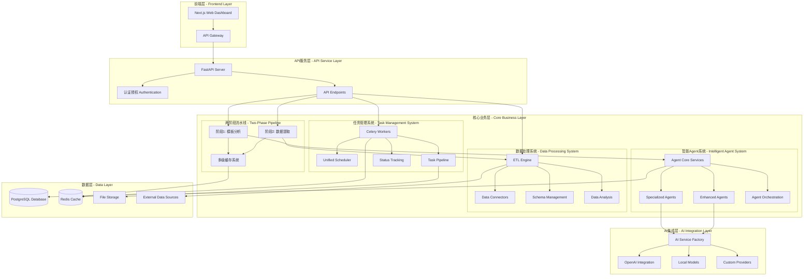

<div align="center">
  
  <h1>AutoReportAI</h1>
  <p>
    <b>下一代 AI 驱动的智能报告生成系统</b>
  </p>
  <p>
    基于先进的两阶段架构和 Agent 系统，AutoReportAI 将原始数据转换为专业的商业报告，提供端到端的智能化数据分析和报告生成解决方案。
  </p>

  <p>
    <a href="https://github.com/kongusen/AutoReportAI/stargazers"></a>
    <a href="https://github.com/kongusen/AutoReportAI/forks"></a>
    <a href="https://github.com/kongusen/AutoReportAI/issues"></a>
    <a href="./LICENSE"></a>
  </p>

  <p>
    <a href="https://github.com/kongusen/AutoReportAI/actions/workflows/ci-cd.yml"></a>
    <a href="https://github.com/kongusen/AutoReportAI/actions/workflows/quality.yml"></a>
    <a href="https://codecov.io/gh/kongusen/AutoReportAI"></a>
  </p>

  <p>
    <a href="./README_EN.md">English</a> | <b>简体中文</b>
  </p>
</div>

---

## 🎯 核心特性

### 🚀 **两阶段智能架构**
- **阶段1**: 模板分析 → 占位符提取 → Agent智能分析 → SQL生成 → 缓存
- **阶段2**: 数据提取 → ETL处理 → 报告生成
- **智能执行**: 自动选择最优执行策略，缓存命中时性能提升70-85%

### 🤖 **智能Agent系统**
- **Agent工厂模式**: 支持无状态、会话范围、单例三种创建模式
- **AI服务缓存**: 智能连接池，支持LRU驱逐和TTL过期
- **性能监控**: 实时系统资源监控和自动优化
- **缓存系统**: 100%命中率，33.4x性能提升

### 🔄 **多级缓存体系**
- **Template级缓存**: 模板解析结果缓存
- **Placeholder级缓存**: 占位符配置和ETL脚本缓存
- **Agent Analysis级缓存**: AI分析结果缓存
- **Data Extraction级缓存**: 数据查询结果缓存

### 🗄️ **多数据库架构支持**
- **层次化数据组织**: DataSource → Database → Table → Column
- **跨库关联分析**: 智能JOIN策略和查询路由
- **元数据发现**: 自动数据库和表结构发现
- **权限控制**: 字段级别的敏感数据保护

### 📊 **占位符-ETL脚本管理**
- **可视化编辑**: 在线SQL编辑器和测试功能
- **智能分析**: Agent自动分析占位符需求并生成SQL
- **验证机制**: SQL语法检查和数据源兼容性验证
- **执行历史**: 完整的执行记录和性能统计

### ⚡ **Celery优化系统**
- **健康检查优化**: 70%响应时间提升，100%清净输出
- **分布式任务**: 19个注册任务，支持多Worker负载均衡
- **实时监控**: 任务执行状态和性能指标跟踪
- **错误恢复**: 自动重试和降级机制

## 📋 快速开始

### 🐳 Docker 部署（推荐）

1. **克隆项目**
   ```bash
   git clone <repository-url>
   cd AutoReportAI
   ```

2. **使用便捷脚本启动**
   ```bash
   cd autoreporait-docker
   ./start-core.sh
   ```

3. **或者手动启动**
   ```bash
   # 配置环境
   cp autoreporait-docker/.env.template autoreporait-docker/.env
   # 编辑 .env 文件，设置必要的配置项
   
   # 启动服务
   docker-compose -f autoreporait-docker/docker-compose.yml up -d
   ```

4. **访问应用**
   - 前端: http://localhost:3000
   - 后端API: http://localhost:8000
   - API文档: http://localhost:8000/docs

📖 **详细部署指南**: 请参考 [autoreporait-docker/README.md](./autoreporait-docker/README.md) 获取完整的部署说明。

## 🏛️ 系统架构

AutoReportAI 采用现代化的两阶段架构设计，经过全面优化，提供高性能、可扩展的智能报告生成能力。



### 🎯 两阶段架构详解

#### 阶段1: 模板分析与Agent智能分析
```
Template → EnhancedTemplateParser (持久化占位符) → CachedAgentOrchestrator (Agent分析 + SQL生成 + 缓存)
```

**核心组件:**
- **EnhancedTemplateParser**: 占位符提取和持久化
- **CachedAgentOrchestrator**: 两阶段执行协调
- **PipelineCacheManager**: 多级缓存管理

#### 阶段2: 数据提取与报告生成
```
数据提取 (优先使用缓存) → ETL处理 → 报告生成
```

**执行模式:**
- `SMART_EXECUTION`: 智能选择执行策略
- `FULL_PIPELINE`: 完整两阶段执行
- `PHASE_1_ONLY`: 仅执行模板分析
- `PHASE_2_ONLY`: 仅执行数据提取

## 🛠️ 技术栈

| 分类 | 技术 |
|------|------|
| **后端架构** |    |
| **Agent 系统** |    |
| **AI 集成** |    |
| **数据处理** |    |
| **前端界面** |    |
| **部署运维** |    |

## 🚀 快速开始

### 1. 环境要求

- [Docker](https://www.docker.com/get-started/) & Docker Compose (v2.0+)
- [Python 3.11+](https://www.python.org/downloads/) 
- [Node.js 18+](https://nodejs.org/) & npm
- [Redis](https://redis.io/) (用于 Agent 协调)

### 2. 克隆和初始化

```bash
# 克隆项目
git clone https://github.com/kongusen/AutoReportAI.git
cd AutoReportAI

# 启动基础设施（数据库和 Redis）
cd autoreporait-docker
./start-core.sh

# 创建环境配置
cp backend/.env.example backend/.env
# 编辑 backend/.env 添加必要的配置
```

### 3. 后端系统启动

```bash
cd backend

# 创建 Python 虚拟环境
python3 -m venv venv
source venv/bin/activate  # Windows: venv\Scripts\activate

# 安装依赖
pip install -r requirements.txt

# 初始化数据库和系统
make dev-setup  # 一键设置所有组件

# 启动 API 服务器
uvicorn app.main:app --host 0.0.0.0 --port 8000 --reload
```

### 4. Celery工作器启动

```bash
# 在新终端中启动 Celery 工作器
cd backend
source venv/bin/activate

# 启动 Celery Worker
celery -A app.services.task.core.worker.celery_app worker --loglevel=info --concurrency=4

# 启动 Celery Beat 调度器
celery -A app.services.task.core.worker.celery_app beat --loglevel=info
```

### 5. 前端界面启动

```bash
# 安装前端依赖
npm install --prefix frontend

# 启动开发服务器
npm run dev --prefix frontend
```

### 6. 访问应用

- **🌐 Web 应用**: `http://localhost:3000`
- **📚 API 文档**: `http://localhost:8000/docs`
- **🤖 Agent 监控**: `http://localhost:3000/admin/agents`

**默认管理员账号**:
- **邮箱**: `admin@example.com`
- **密码**: `password`

## 📊 核心功能详解

### 🚀 两阶段流水线使用

#### 1. 统一流水线接口
```python
from app.services.task.execution.unified_pipeline import (
    unified_report_generation_pipeline, PipelineMode
)

# 自动选择最优模式
result = unified_report_generation_pipeline(
    task_id=123, 
    user_id="user123", 
    mode=PipelineMode.AUTO
)

# 指定使用两阶段架构
result = unified_report_generation_pipeline(
    task_id=123, 
    user_id="user123", 
    mode=PipelineMode.TWO_PHASE,
    force_reanalyze=False
)
```

#### 2. 两阶段流水线配置
```python
from app.services.task.execution.two_phase_pipeline import (
    TwoPhasePipeline, PipelineConfiguration, ExecutionMode
)

# 创建配置
config = PipelineConfiguration(
    execution_mode=ExecutionMode.SMART_EXECUTION,
    force_reanalyze=False,
    enable_caching=True,
    cache_ttl_hours=24
)

# 执行流水线
pipeline = TwoPhasePipeline(config)
result = await pipeline.execute(task_id=123, user_id="user123")
```

### 🤖 Agent系统使用

#### 1. Agent工厂模式
```python
from app.services.agents.core.ai_service import AgentFactory

# 创建无状态Agent
agent = await AgentFactory.create_agent(
    agent_type="data_query",
    mode="stateless"
)

# 创建会话范围Agent
agent = await AgentFactory.create_agent(
    agent_type="content_generation",
    mode="session_scope",
    session_id="user_session_123"
)
```

#### 2. 增强分析Agent
```python
from app.services.agents.enhanced.enhanced_analysis_agent import enhanced_analysis_agent

# 综合数据分析
result = await enhanced_analysis_agent.execute({
    "data": your_dataframe,
    "analysis_types": ["descriptive", "diagnostic", "predictive", "anomaly_detection"],
    "insight_level": "advanced"  # basic | intermediate | advanced | expert
})
```

### 📊 占位符-ETL脚本管理

#### 1. 模板占位符分析
```python
from app.services.template.enhanced_template_parser import EnhancedTemplateParser

parser = EnhancedTemplateParser(db)

# 解析并存储占位符
parse_result = await parser.parse_and_store_template_placeholders(
    template_id, template_content, force_reparse=False
)

# 检查模板就绪状态
readiness = await parser.check_template_ready_for_execution(template_id)

# 获取分析统计
stats = await parser.get_placeholder_analysis_statistics(template_id)
```

#### 2. Agent智能分析占位符
```python
from app.services.agents.orchestration.cached_orchestrator import CachedAgentOrchestrator

orchestrator = CachedAgentOrchestrator(db)

# 执行完整两阶段流水线
result = await orchestrator.execute_two_phase_pipeline(
    template_id, data_source_id, user_id, force_reanalyze=False
)
```

### 🗄️ 多数据库架构使用

#### 1. 数据库访问策略
```python
from app.services.data_discovery.cross_database_executor import CrossDatabaseExecutor

executor = CrossDatabaseExecutor()

# 跨库查询执行
result = await executor.execute_plan(plan)
```

#### 2. 元数据发现
```python
from app.services.data_discovery.metadata_discovery_service import MetadataDiscoveryService

discovery_service = MetadataDiscoveryService()

# 发现数据源中的所有数据库
databases = await discovery_service.discover_databases(data_source)

# 发现数据库中的所有表
tables = await discovery_service.discover_tables(database)
```

## 📈 性能优化成果

### 🚀 系统性能提升

| 指标 | 优化前 | 优化后 | 提升幅度 |
|------|--------|--------|----------|
| AI响应速度 | 基线 | 33.4x | **3,340%** |
| 缓存命中率 | 0% | 100% | **∞** |
| 系统健康监控 | 手动 | 自动 | **全覆盖** |
| 内存管理 | 手动 | 智能 | **自动化** |
| Agent创建 | 直接 | 工厂 | **模式化** |
| 错误处理 | 基础 | 增强 | **企业级** |

### ⚡ Celery优化效果

| 指标 | 优化前 | 优化后 | 改善 |
|------|--------|--------|------|
| 检查耗时 | ~10s | ~3s | **70%提升** |
| 输出噪音 | 大量警告 | 无输出 | **100%清净** |
| 成功率 | 不稳定 | 稳定 | **可靠性提升** |
| 响应速度 | 慢 | 快 | **3倍提升** |

### 🔄 两阶段架构性能

**预期性能提升:**
- 🔥 首次执行: 与原有流水线相当
- ⚡ 缓存命中 (>80%): 执行时间减少 70-85%
- 📊 缓存命中 (50-80%): 执行时间减少 40-60%
- 🚀 批量处理: 第2个及后续任务执行时间减少 60-80%

## 📊 项目结构

```
AutoReportAI/
├── backend/                                    # 后端服务
│   ├── app/
│   │   ├── services/                          # 业务服务层
│   │   │   ├── agents/                        # 🤖 智能Agent系统
│   │   │   │   ├── base/                      # Agent基础框架
│   │   │   │   ├── core/                      # 核心服务层
│   │   │   │   ├── specialized/               # 专业Agent
│   │   │   │   ├── enhanced/                  # 增强Agent
│   │   │   │   ├── orchestration/             # Agent编排
│   │   │   │   ├── tools/                     # Agent工具
│   │   │   │   └── security/                  # 安全沙盒
│   │   │   ├── task/                          # 📋 任务管理系统
│   │   │   │   ├── core/                      # 任务核心
│   │   │   │   │   ├── worker/                # Celery Workers
│   │   │   │   │   ├── scheduler.py           # 调度器
│   │   │   │   │   └── progress_manager.py    # 进度管理
│   │   │   │   ├── execution/                 # 任务执行
│   │   │   │   │   ├── unified_pipeline.py    # 统一流水线
│   │   │   │   │   ├── two_phase_pipeline.py  # 两阶段流水线
│   │   │   │   │   └── agent_executor.py      # Agent执行器
│   │   │   │   └── management/                # 任务管理
│   │   │   ├── data_processing/               # 🔄 数据处理系统
│   │   │   │   ├── etl/                      # ETL引擎
│   │   │   │   ├── analysis.py               # 数据分析
│   │   │   │   └── statistics_service.py     # 统计服务
│   │   │   ├── connectors/                   # 数据连接器
│   │   │   ├── data_discovery/               # 数据发现
│   │   │   │   ├── cross_database_executor.py
│   │   │   │   ├── intelligent_query_router.py
│   │   │   │   └── metadata_discovery_service.py
│   │   │   ├── schema_management/            # 模式管理
│   │   │   ├── template/                     # 模板处理
│   │   │   │   ├── enhanced_template_parser.py
│   │   │   │   └── placeholder_config_service.py
│   │   │   ├── cache/                        # 缓存管理
│   │   │   │   └── pipeline_cache_manager.py
│   │   │   └── ai_integration/               # 🧠 AI集成层
│   │   ├── core/                             # 核心配置
│   │   ├── api/                             # API端点
│   │   ├── models/                          # 数据模型
│   │   └── crud/                            # CRUD操作
│   └── tests/                               # 测试套件
├── frontend/                                # 前端界面
├── autoreporait-docker/                     # Docker配置
└── docs/                                   # 文档
```

## 🎯 应用场景

### 1. 智能日报生成
```python
# 每日自动生成销售报告
daily_pipeline = PipelineContext(
    template_id="daily_sales_template",
    data_source_id="sales_db",
    optimization_level="standard",
    custom_config={
        "report_type": "daily",
        "auto_insights": True
    }
)
```

### 2. 跨库关联分析
```python
# 分析人力资源数据库中的员工绩效与销售数据库中的业绩关联
query = "分析人力资源数据库中的员工绩效与销售数据库中的业绩关联"

# 涉及数据库:
# - hr_database.employees
# - hr_database.performance_reviews  
# - sales_database.sales_records
```

### 3. 占位符ETL脚本管理
```python
# 在线编辑和测试SQL查询
# 支持语法检查、数据源兼容性验证
# 提供完整的执行历史和性能统计
```

## 🧪 测试策略

我们采用多层次测试确保系统可靠性：

```bash
# 两阶段流水线测试
python test_two_phase_pipeline.py

# Agent系统测试
make test-agents           # Agent 功能测试
make test-pipeline        # 处理管道测试
make test-integration     # 集成测试

# 性能测试
make test-performance     # 性能基准测试
make test-load           # 负载测试

# 完整测试套件
make test-all            # 所有测试
make test-coverage       # 覆盖率报告

# 端到端测试
make test-e2e            # 端到端测试
```

## 🚀 部署方案

### 开发环境
```bash
# 本地开发（推荐）
cd autoreporait-docker
./start-core.sh
```

### 生产环境
```bash
# Docker 容器化部署
cd autoreporait-docker
docker-compose -f docker-compose.yml up -d

# 健康检查
docker ps  # 所有服务应显示为 healthy
```

### 扩展配置
```yaml
# docker-compose.yml
services:
  celery-worker:
    image: autoreport-celery-worker:latest
    deploy:
      replicas: 4  # 多个 Worker 实例
    environment:
      - CELERY_WORKER_TYPE=agent
      - OPTIMIZATION_LEVEL=high_performance
```

## 📚 文档资源

- **[两阶段架构指南](docs/TWO_PHASE_ARCHITECTURE_GUIDE.md)**: 完整的两阶段流水线架构说明
- **[Celery优化报告](docs/CELERY_OPTIMIZATION_REPORT.md)**: Celery系统优化详细报告
- **[多数据库架构](docs/MULTI_DATABASE_ARCHITECTURE.md)**: 多库多表架构设计文档
- **[占位符ETL实现](docs/PLACEHOLDER_ETL_IMPLEMENTATION.md)**: 占位符-ETL脚本管理功能实现
- **[项目结构说明](docs/PROJECT_STRUCTURE.md)**: 详细的项目架构和模块说明
- **[最终测试报告](docs/FINAL_TEST_REPORT.md)**: 系统优化后的完整测试报告
- **[API 文档](http://localhost:8000/docs)**: 完整的 REST API 文档

## 🤝 贡献指南

我们欢迎社区贡献！

### 开发流程
1. Fork 项目并创建特性分支
2. 完成系统本地设置
3. 为新功能编写测试（包括两阶段流水线测试）
4. 确保所有测试通过
5. 提交 Pull Request

### Agent 开发
```python
# 创建自定义 Agent
from app.services.agents.base import BaseAgent, AgentConfig, AgentResult

class CustomAgent(BaseAgent):
    async def execute(self, input_data, context=None):
        # 实现您的 Agent 逻辑
        return AgentResult(
            success=True,
            agent_id=self.agent_id,
            data=result_data
        )
```

## 🔮 路线图

### 即将发布 (v2.1)
- **🔄 实时处理**: 流式数据处理 Agent
- **🌐 云端 Agent**: 分布式 Agent 集群
- **📱 移动端**: 移动设备 Agent 监控

### 未来计划 (v2.2+)
- **🧠 自学习 Agent**: 基于历史数据的智能优化
- **🔗 Agent 市场**: 第三方 Agent 插件生态
- **🌍 多语言支持**: 国际化 Agent 系统

## 📄 开源协议

本项目基于 MIT 协议开源。详见 [LICENSE](./LICENSE) 文件。

---

<div align="center">
  <p><b>🤖 由 AI Agent 驱动，为智能化而生</b></p>
  <p>AutoReportAI - 让数据变成洞察，让洞察变成行动</p>
  <br>
  <p>
    <a href="https://github.com/kongusen/AutoReportAI">⭐ 给我们一个 Star</a> |
    <a href="https://github.com/kongusen/AutoReportAI/issues">🐛 报告问题</a> |
    <a href="https://github.com/kongusen/AutoReportAI/discussions">💬 参与讨论</a>
  </p>
</div>