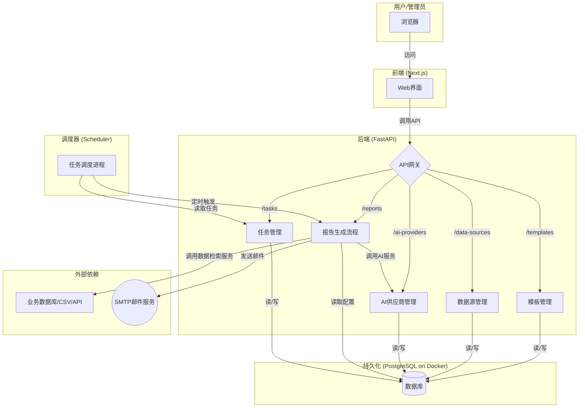
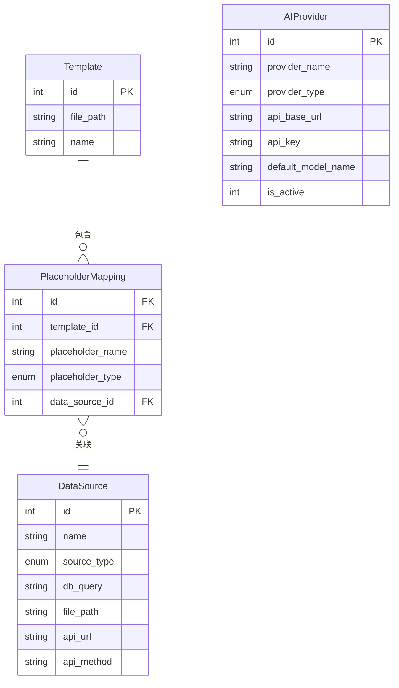

# AutoReportAI - 系统架构与功能方案 (v3)

## 1. 概览 (Overview)

本项目旨在构建一个名为“AutoReportAI”的自动化报告生成系统。系统以用户上传的Word文档为模板，通过连接**多种数据源**（SQL, CSV, API）获取实时数据，并利用**可配置的AI服务**，自动填充模板生成分析报告，最终通过邮件分发并归档。

整个系统采用现代化、容器化的微服务思想进行设计，确保各模块的高内聚、低耦合。所有核心功能都将通过RESTful API暴露，前端与后端完全分离。

### 1.1. 技术栈

*   **后端框架**: Python 3.9 + FastAPI
*   **数据库**: PostgreSQL
*   **数据持久化/ORM**: SQLAlchemy
*   **数据分析与处理**: Pandas, NumPy
*   **图表生成**: Matplotlib
*   **AI集成**: OpenAI
*   **Word文档处理**: python-docx
*   **前端框架**: Next.js, React, TypeScript, Tailwind CSS
*   **HTTP客户端**: Axios (前端), HTTpx (后端)
*   **部署与运维**: Docker, Docker Compose
*   **任务调度**: APScheduler

## 2. 系统架构图 (System Architecture Diagram)

*宏观架构图保持不变，核心交互流程依然有效。*

## 3. 核心数据库模型 (v3)

## 4. 模块功能详解 (v3)

### 4.1. 数据源管理 (Data Source Management) - **核心升级**
*   **核心能力**: 集中管理所有数据来源。这是系统灵活性和可扩展性的基石。
*   **开发思路**:
    1.  **模型 (`DataSource`)**: 定义了一个包含多种来源类型的统一模型。
        *   `source_type`: 枚举类型，包括 `sql`, `csv`, `api`。
        *   `db_query`: 存储SQL查询语句。
        *   `file_path`: 存储CSV文件的服务器路径。
        *   `api_url`, `api_method`, `api_headers`, `api_body`: 存储调用外部API所需的所有配置。
    2.  **服务 (`DataRetrievalService`)**: 创建了一个专门的服务，负责根据`DataSource`对象的类型，执行相应的数据获取逻辑（执行SQL，读取CSV，请求API），并统一返回Pandas DataFrame。
    3.  **接口**: 提供完整的CRUD API (`/api/v1/data-sources`) 来管理这些数据源配置。

### 4.2. AI供应商管理 (AI Provider Management) - **核心升级**
*   **核心能力**: 使AI服务变得可配置、可插拔。
*   **开发思路**:
    1.  **模型 (`AIProvider`)**: 存储不同AI供应商（如OpenAI）的配置，包括API Key、Base URL、默认模型等。通过一个`is_active`字段来控制当前全局使用的是哪一个配置。
    2.  **服务 (`AIService`)**: `AIService`在执行操作前，会先从数据库查询当前激活的`AIProvider`配置。
    3.  **动态调用**: 根据激活的提供商类型，服务会动态地选择使用真实的LLM客户端（如`openai`库）还是内部的mock逻辑，实现了AI能力的无缝切换。
    4.  **接口**: 提供完整的CRUD API (`/api/v1/ai-providers`) 来管理这些AI配置。

### 4.3. 模板与映射管理 (Template & Mapping Management)
*   **核心能力**: 管理模板及其占位符与数据源的关联。
*   **开发思路**:
    1.  **模型 (`PlaceholderMapping`)**: 该模型不再直接存储SQL语句，而是通过一个外键`data_source_id`关联到`DataSource`模型。
    2.  **接口**:
        *   `POST /api/v1/templates`: 上传模板并解析。
        *   `POST /api/v1/mappings`: 为模板中的占位符关联已创建的数据源ID。

### 4.4. 报告生成流程 (Report Generation Flow)
*   **核心能力**: 编排整个报告生成过程，逻辑更清晰。
*   **新流程**:
    1.  根据`template_id`获取模板及其所有`PlaceholderMapping`。
    2.  遍历每个`mapping`，获取其关联的`DataSource`对象。
    3.  将`DataSource`对象传递给 **`DataRetrievalService`**，获取一个Pandas DataFrame。
    4.  根据`mapping`中定义的占位符类型（`text`, `chart`, `table`）对DataFrame进行处理（取单个值或转为字典列表）。
    5.  对于图表类型，调用 **`AIService`**（它会使用激活的`AIProvider`）生成图表。
    6.  将最终的数据集传递给`WordGeneratorService`生成报告。
    7.  发送邮件。

## 5. 开发环境 (Development Environment)
为兼顾开发效率和环境一致性，项目采用**混合开发模式**：
*   **基础设施 (Docker)**: `PostgreSQL`数据库服务运行在Docker容器中，通过`docker-compose up -d`启动。这确保了所有开发者使用的数据库版本和配置完全一致。
*   **应用服务 (本地)**: `FastAPI`后端和`Next.js`前端应用直接在开发者本地机器上运行。
    *   **后端**: 在Python虚拟环境 (`venv`) 中运行，通过`.env`文件配置环境变量（如数据库连接字符串指向`localhost`），并使用`uvicorn`的`--reload`模式实现热重载。
    *   **前端**: 使用`npm run dev`启动开发服务器，同样支持热重载。
*   **优点**: 这种模式避免了在每次代码修改后都重新构建整个Docker镜像的耗时过程，极大地提升了编码和调试的速度，同时保证了核心依赖（数据库）的稳定性。

## 6. 前端架构 (Frontend Architecture)
*   **框架**: Next.js (App Router)
*   **状态管理**: React Hooks (`useState`, `useEffect`, `useContext`)
*   **认证流程**:
    1.  **登录页 (`/login`)**: 用户提交表单，通过API获取JWT。
    2.  **Token存储**: JWT存储在浏览器的`localStorage`中。
    3.  **API客户端 (`Axios`)**: 创建了一个`axios`实例，通过拦截器在每个发出的请求头中自动附加`Authorization: Bearer <token>`。
    4.  **路由保护 (`AuthProvider`)**: 一个包裹全局布局的客户端组件，它会检查token是否存在。如果用户未登录，则自动重定向到`/login`页面，实现了对应用内页面的保护。
*   **UI组件**:
    *   **应用布局**: 包含一个固定的侧边栏导航和主内容区。
    *   **管理页面**: 为数据源、AI供应商等模块创建了标准的表格展示页面，支持数据的增删改查。 