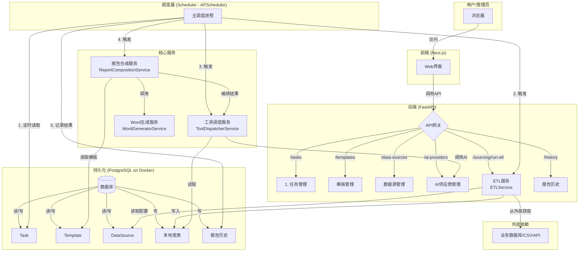
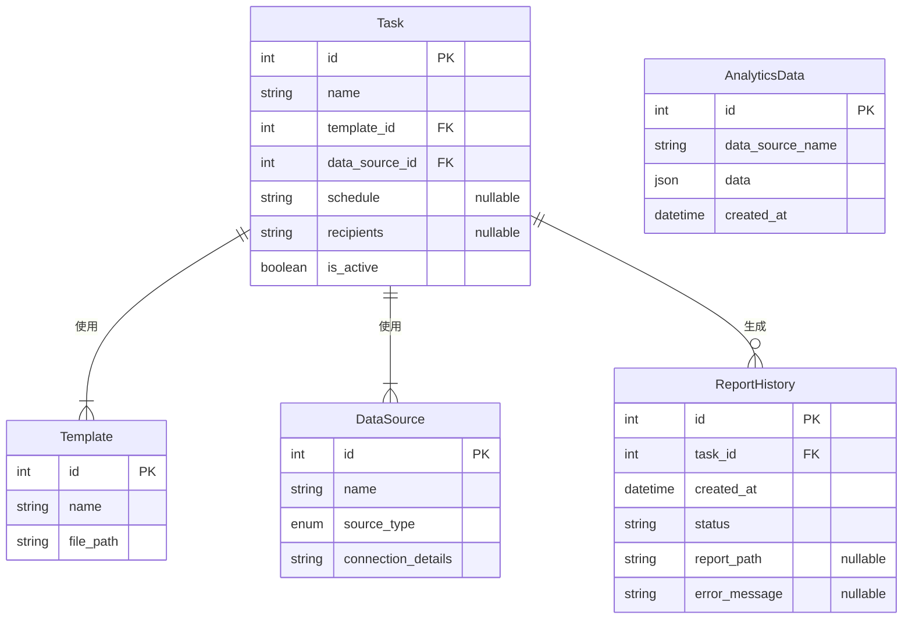

# AutoReportAI - 系统架构与功能方案 (v4)

## 1. 概览 (Overview)

本项目旨在构建一个名为“AutoReportAI”的自动化报告生成系统。系统的核心是通过**任务（Task）**来驱动。一个任务定义了报告生成的完整生命周期：使用哪个**模板（Template）**，依赖哪个**数据源（Data Source）**，何时**调度（Schedule）**，以及报告发送给哪些**收件人（Recipients）**。

系统采用现代化的、容器化的微服务思想进行设计，确保各模块的高内-低耦合。所有核心功能都将通过RESTful API暴露，前端与后端完全分离。

### 1.1. 技术栈 (保持不变)

*   **后端框架**: Python 3.9 + FastAPI
*   **数据库**: PostgreSQL
*   **数据持久化/ORM**: SQLAlchemy
*   **数据分析与处理**: Pandas, NumPy
*   **图表生成**: Matplotlib
*   **AI集成**: OpenAI
*   **Word文档处理**: python-docx
*   **前端框架**: Next.js, React, TypeScript, Tailwind CSS
*   **HTTP客户端**: Axios (前端), HTTpx (后端)
*   **部署与运维**: Docker, Docker Compose
*   **任务调度**: APScheduler

## 2. 系统架构图 (v4)

*核心交互流程已重构，以调度器为中心，分为ETL和报告生成两个阶段。*

## 3. 核心数据库模型 (v4)

## 4. 核心工作流 (v4)

### 4.1. 任务管理 (Task Management) - **流程起点**
*   **核心能力**: 系统所有自动化流程的起点。用户通过创建和配置`Task`来定义一个完整的报告生成作业。
*   **开发思路**:
    1.  **模型 (`Task`)**: `Task`是核心驱动模型。它通过外键关联了`Template`和`DataSource`，并包含了`schedule`（Cron表达式），`recipients`（邮件列表）和`is_active`（是否激活）等关键字段。
    2.  **接口**: 提供完整的CRUD API (`/api/v1/tasks`) 来管理这些任务配置。

### 4.2. 调度器与ETL流程 (Scheduler & ETL Flow) - **核心升级**
*   **核心能力**: 实现无人值守的数据同步和报告生成。
*   **工作流程**:
    1.  **调度器启动**: `scheduler/main.py` 作为一个独立的进程运行。启动时，它会从数据库加载所有`is_active`为`True`的`Task`。
    2.  **注册作业**: 为每个`Task`在`APScheduler`中注册一个定时作业，触发时间由`task.schedule`定义。
    3.  **ETL阶段**:
        *   当作业被触发时，调度器首先调用`ETLService`。
        *   `ETLService`使用`task.data_source_id`获取数据源配置，通过`DataRetrievalService`从外部（如业务数据库）拉取数据。
        *   获取到的数据被清洗和转换，并存入本地的`AnalyticsData`宽表。这一步将实时但可能缓慢的外部查询转换为了快速的本地查询。

### 4.3. 报告生成与合成 (Report Generation & Composition) - **核心升级**
*   **核心能力**: 将ETL处理后的数据和AI分析结果，智能地填充到Word模板中。
*   **工作流程**:
    1.  **工具调用阶段**: ETL成功后，调度器继续执行，调用`ToolDispatcherService`。此服务负责解析任务需求（例如，“上月投诉量分析”），并从`AnalyticsData`宽表中查询相应数据，然后可能会调用`AIService`进行深度分析或图表生成。
    2.  **内容合成阶段**: `ToolDispatcherService`返回一个包含文本、表格数据或图片（base64编码）的结果字典。调度器将此结果和`task.template_id`传递给`ReportCompositionService`。
    3.  `ReportCompositionService`读取模板，将工具结果智能地填充到对应的占位符中，生成一个中间状态的HTML字符串。
    4.  **Word文档生成**: `WordGeneratorService`接收这个HTML字符串，解析其中的文本、表格和``标签（用于处理图片），最终生成`.docx`格式的报告文件。

### 4.4. 历史与归档 (History & Archiving) - **新增模块**
*   **核心能力**: 记录每一次任务执行的结果，便于追踪和审计。
*   **开发思路**:
    1.  **模型 (`ReportHistory`)**: 每次调度器运行一个`Task`，无论成功与否，都会在`ReportHistory`表中创建一条记录。
    2.  **字段**: 记录中包含`task_id`、执行时间、状态（`success`或`failure`）、成功时生成的报告路径、以及失败时的错误信息。
    3.  **最终一致性**: 整个任务流被包裹在`try...except...finally`块中，确保即使在生成过程中发生错误，也总能记录下失败状态。

## 5. 开发环境 (Development Environment) - (无变化)
项目采用**混合开发模式**：基础设施 (Docker) + 应用服务 (本地)。

## 6. 前端架构 (Frontend Architecture) - (无变化)
基于 Next.js (App Router)，通过JWT和`AuthProvider`实现路由保护。 