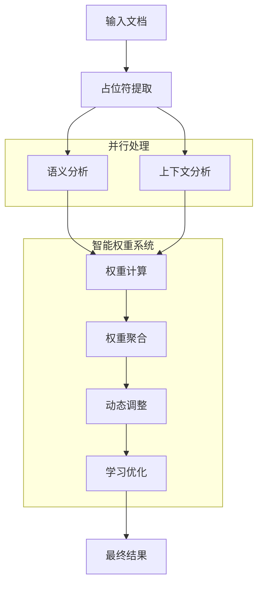

# 智能占位符系统 v2.0

一个先进的、多层次的占位符解析和处理系统，提供语义理解、上下文感知和动态权重计算功能。

## 🎯 核心特性

### 📊 多层次占位符解析
- **基础解析器**: 处理简单占位符 `{{统计：销售额}}`
- **参数化解析器**: 支持复杂参数 `{{统计：销售额|时间范围=2024-01|部门=华东区}}`
- **复合解析器**: 处理嵌套结构 `{{统计：{{获取：销售数据|源=数据库}}|聚合=sum}}`
- **条件解析器**: 支持条件逻辑 `{{统计：销售额|条件=region=='华东'&&month>=1}}`

### 🧠 语义智能分析
- **意图分类**: 自动识别占位符的业务意图
- **语义结构分析**: 理解占位符的深层语义
- **隐式参数推断**: 基于上下文推断缺失参数
- **实体识别**: 识别时间、地点、指标等实体

### 🌍 多维上下文感知
- **段落级分析**: 分析占位符在段落中的上下文
- **章节级分析**: 理解占位符在章节结构中的作用
- **文档级分析**: 把握整体文档的主题和结构
- **业务规则分析**: 应用领域特定的业务规则

### ⚖️ 智能权重计算
- **多层权重聚合**: 综合段落、章节、文档、业务规则等权重
- **动态权重调整**: 基于实时反馈动态调整权重
- **机器学习优化**: 通过历史数据学习最优权重配置
- **上下文自适应**: 根据不同场景自动调整权重策略

### 🚀 高性能特性
- **并行处理**: 支持多线程并行处理占位符
- **智能缓存**: 缓存处理结果，提升重复处理效率
- **性能监控**: 实时跟踪处理性能和质量指标
- **优雅降级**: 在组件失败时提供合理的降级方案

## 🏗️ 架构设计

```
智能占位符系统 v2.0
├── 📋 models/                    # 数据模型
│   ├── PlaceholderSpec          # 占位符规格
│   ├── DocumentContext          # 文档上下文
│   ├── BusinessContext          # 业务上下文
│   └── ProcessingResult         # 处理结果
├── 🔍 parsers/                   # 解析器层
│   ├── PlaceholderParser        # 基础解析器
│   ├── ParameterizedParser      # 参数化解析器
│   ├── CompositeParser          # 复合解析器
│   ├── ConditionalParser        # 条件解析器
│   ├── SyntaxValidator          # 语法验证器
│   └── ParserFactory           # 解析器工厂
├── 🧠 semantic/                  # 语义分析层
│   ├── SemanticPlaceholderParser # 语义解析器
│   ├── IntentClassifier         # 意图分类器
│   ├── SemanticAnalyzer         # 语义分析器
│   └── ImplicitParameterInferencer # 参数推断器
├── 🌍 context/                   # 上下文分析层
│   ├── ContextAnalysisEngine    # 上下文分析引擎
│   ├── ParagraphAnalyzer        # 段落分析器
│   ├── SectionAnalyzer          # 章节分析器
│   ├── DocumentAnalyzer         # 文档分析器
│   └── BusinessRuleAnalyzer     # 业务规则分析器
├── ⚖️ weight/                    # 权重计算层
│   ├── WeightCalculator         # 权重计算器
│   ├── DynamicWeightAdjuster    # 动态权重调整器
│   ├── WeightAggregator         # 权重聚合器
│   └── WeightLearningEngine     # 权重学习引擎
└── 🎭 orchestrator/              # 编排层
    └── IntelligentPlaceholderOrchestrator # 智能编排器
```

## 📈 支持的占位符类型

### 统计类型
- `统计` - 基础统计计算
- `趋势` - 趋势分析
- `极值` - 最大值/最小值
- `列表` - 列表展示
- `统计图` - 图表生成
- `对比` - 对比分析
- `预测` - 预测分析

### 语法类型
- `basic` - 基础语法: `{{统计：销售额}}`
- `parameterized` - 参数化: `{{统计：销售额|时间范围=2024-01}}`
- `composite` - 复合嵌套: `{{统计：{{获取：数据}}|聚合=sum}}`
- `conditional` - 条件逻辑: `{{统计：销售额|条件=region=='华东'}}`

## 🚀 快速开始

### 基础使用

```python
import asyncio
from app.services.domain.placeholder_v2 import (
    create_placeholder_system,
    DocumentContext,
    BusinessContext
)

async def main():
    # 1. 创建占位符系统
    system = create_placeholder_system({
        'enable_semantic_analysis': True,
        'enable_context_analysis': True,
        'parallel_processing': True
    })
    
    # 2. 准备文档和上下文
    document = """
    # 销售报告
    本月销售额 {{统计：销售额|时间范围=2024-01}} 表现良好。
    各部门对比：{{对比：销售额|维度=部门|时间范围=本月}}
    """
    
    doc_context = DocumentContext(
        document_type="sales_report",
        domain="sales",
        language="chinese"
    )
    
    business_context = BusinessContext(
        business_type="retail",
        primary_domain="sales"
    )
    
    # 3. 处理文档
    result = await system.process_document(
        document_content=document,
        document_context=doc_context,
        business_context=business_context
    )
    
    # 4. 查看结果
    print(f"处理了 {len(result.processed_placeholders)} 个占位符")
    print(f"质量分数: {result.quality_score:.2f}")
    
    for placeholder in result.processed_placeholders:
        print(f"- {placeholder.placeholder_spec.content}")
        print(f"  权重: {placeholder.final_weight:.3f}")

if __name__ == "__main__":
    asyncio.run(main())
```

### 高级配置

```python
# 创建带有完整配置的系统
system = create_placeholder_system({
    # 功能开关
    'enable_semantic_analysis': True,
    'enable_context_analysis': True, 
    'enable_dynamic_weights': True,
    'enable_learning': True,
    
    # 性能配置
    'parallel_processing': True,
    'max_workers': 8,
    'timeout_seconds': 60,
    
    # 缓存配置
    'cache_enabled': True,
    
    # 监控配置
    'performance_tracking': True
})
```

## 📊 处理流程



## 🎯 使用场景

### 📈 商业报告生成
- 财务报告: 自动计算财务指标和趋势
- 销售分析: 智能分析销售数据和业绩
- 运营监控: 实时监控运营指标和异常

### 📊 数据可视化
- 智能图表: 根据上下文选择最合适的图表类型
- 交互仪表盘: 动态生成仪表盘组件
- 自适应展示: 根据数据特征自动调整展示方式

### 🤖 智能文档
- 动态文档: 文档内容根据数据自动更新
- 个性化报告: 基于用户角色生成定制化内容
- 智能摘要: 自动生成文档摘要和关键洞察

## 🔧 配置选项

### OrchestrationConfig
```python
@dataclass
class OrchestrationConfig:
    enable_semantic_analysis: bool = True    # 启用语义分析
    enable_context_analysis: bool = True     # 启用上下文分析  
    enable_dynamic_weights: bool = True      # 启用动态权重
    enable_learning: bool = True             # 启用机器学习
    parallel_processing: bool = True         # 并行处理
    max_workers: int = 4                     # 最大工作线程
    timeout_seconds: int = 30                # 超时时间
    cache_enabled: bool = True               # 启用缓存
    performance_tracking: bool = True        # 性能追踪
```

## 📈 性能指标

系统提供详细的性能监控：

- **处理时间**: 总处理时间和各阶段耗时
- **成功率**: 处理成功率和错误率
- **缓存效率**: 缓存命中率和缓存大小
- **质量分数**: 处理结果的质量评估
- **权重分布**: 权重分布的合理性分析

```python
# 获取性能报告
performance = system.get_performance_report()
print(f"总处理时间: {performance['processing_metrics']['total_time']:.2f}s")
print(f"缓存命中率: {performance['processing_metrics']['cache_hits']}")
print(f"处理成功率: {performance['processing_metrics']['success_count']}")
```

## 🧪 示例和测试

运行内置示例：

```bash
# 进入项目目录
cd backend/app/services/domain/placeholder_v2

# 运行示例
python example_usage.py
```

示例包含：
- 基础功能演示
- 高级特性展示  
- 性能测试
- 错误处理

## 🔮 未来规划

### v2.1 计划功能
- [ ] 更多语言支持 (English, 日本語)
- [ ] 增强的ML模型
- [ ] 实时协作功能
- [ ] API接口优化

### v2.2 计划功能
- [ ] 云端部署支持
- [ ] 大规模并行处理
- [ ] 高级可视化界面
- [ ] 企业级安全特性

## 🤝 贡献指南

欢迎贡献代码！请参考以下流程：

1. Fork 项目
2. 创建功能分支 (`git checkout -b feature/amazing-feature`)
3. 提交更改 (`git commit -m 'Add amazing feature'`)
4. 推送到分支 (`git push origin feature/amazing-feature`)
5. 创建 Pull Request

## 📄 许可证

本项目采用 MIT 许可证 - 查看 [LICENSE](LICENSE) 文件了解详情。

## 👥 作者

- **AutoReportAI Team** - *初始工作* - [AutoReportAI](https://github.com/autoreportai)

## 🙏 致谢

感谢所有为此项目做出贡献的开发者和用户！

---

**智能占位符系统 v2.0** - 让占位符处理更智能、更准确、更高效！