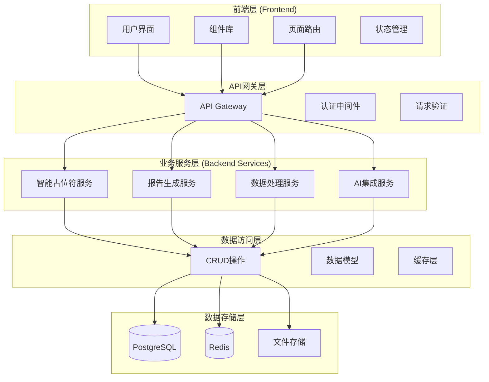

# 新架构开发指南

## 概述

AutoReportAI 已完成全面的架构重构，采用现代化的分层架构设计。本指南将帮助开发者理解新架构的设计理念和开发规范。

## 架构概览

### 整体架构图



## 后端架构

### 分层设计原则

1. **API层** (`app/api/`): 负责HTTP请求处理、参数验证、响应格式化
2. **服务层** (`app/services/`): 包含业务逻辑，按功能模块组织
3. **数据访问层** (`app/crud/`): 数据库操作的抽象层
4. **模型层** (`app/models/`): 数据库模型定义
5. **核心层** (`app/core/`): 配置、安全、依赖注入等核心功能

### 服务模块组织

服务层按功能域组织为以下模块：

#### 1. 智能占位符服务 (`services/intelligent_placeholder/`)
```python
# 示例：使用智能占位符服务
from app.services.intelligent_placeholder import IntelligentPlaceholderProcessor

async def process_template_placeholders(template_id: str):
    processor = IntelligentPlaceholderProcessor()
    result = await processor.process_placeholder(template_id)
    return result
```

**模块结构：**
- `processor.py`: 核心处理逻辑
- `adapter.py`: 数据适配器
- `matcher.py`: 字段匹配器

#### 2. 报告生成服务 (`services/report_generation/`)
```python
# 示例：使用报告生成服务
from app.services.report_generation import ReportGenerator

async def generate_report(template_id: str, data_source_id: str):
    generator = ReportGenerator()
    report = await generator.generate(template_id, data_source_id)
    return report
```

**模块结构：**
- `generator.py`: 报告生成器
- `composer.py`: 报告组合器
- `quality_checker.py`: 质量检查器

#### 3. 数据处理服务 (`services/data_processing/`)
```python
# 示例：使用数据处理服务
from app.services.data_processing import DataRetrievalService

async def fetch_data(source_config: dict):
    retrieval = DataRetrievalService()
    data = await retrieval.fetch_data(source_config)
    return data
```

**模块结构：**
- `retrieval.py`: 数据检索
- `analysis.py`: 数据分析
- `etl/`: ETL处理模块

#### 4. AI集成服务 (`services/ai_integration/`)
```python
# 示例：使用AI集成服务
from app.services.ai_integration import LLMService

async def generate_content(prompt: str):
    llm = LLMService()
    content = await llm.generate(prompt)
    return content
```

**模块结构：**
- `llm_service.py`: LLM服务
- `content_generator.py`: 内容生成
- `chart_generator.py`: 图表生成

### API端点设计

#### RESTful API规范
```python
# app/api/endpoints/templates.py
from fastapi import APIRouter, Depends
from app.services.report_generation import ReportGenerator

router = APIRouter(prefix="/api/v1/templates", tags=["templates"])

@router.get("/", response_model=List[TemplateResponse])
async def list_templates(
    skip: int = 0,
    limit: int = 100,
    current_user: User = Depends(get_current_user)
):
    """获取模板列表"""
    pass

@router.post("/", response_model=TemplateResponse)
async def create_template(
    template: TemplateCreate,
    current_user: User = Depends(get_current_user)
):
    """创建新模板"""
    pass
```

#### 依赖注入模式
```python
# app/api/deps.py
from fastapi import Depends
from app.services.intelligent_placeholder import IntelligentPlaceholderProcessor

def get_placeholder_processor() -> IntelligentPlaceholderProcessor:
    return IntelligentPlaceholderProcessor()

# 在端点中使用
@router.post("/process")
async def process_placeholder(
    request: PlaceholderRequest,
    processor: IntelligentPlaceholderProcessor = Depends(get_placeholder_processor)
):
    return await processor.process(request)
```

### 错误处理

#### 统一异常处理
```python
# app/core/exceptions.py
class AppException(Exception):
    def __init__(self, message: str, code: str, status_code: int = 400):
        self.message = message
        self.code = code
        self.status_code = status_code

class PlaceholderProcessingError(AppException):
    def __init__(self, message: str):
        super().__init__(message, "PLACEHOLDER_PROCESSING_ERROR", 422)

# 在服务中使用
async def process_placeholder(self, data):
    try:
        # 处理逻辑
        pass
    except Exception as e:
        raise PlaceholderProcessingError(f"处理失败: {str(e)}")
```

#### 全局异常处理器
```python
# app/core/exception_handlers.py
from fastapi import Request, HTTPException
from fastapi.responses import JSONResponse

async def app_exception_handler(request: Request, exc: AppException):
    return JSONResponse(
        status_code=exc.status_code,
        content={
            "error": {
                "code": exc.code,
                "message": exc.message
            }
        }
    )
```

## 前端架构

### 组件化设计

#### 组件分类
1. **UI组件** (`components/ui/`): 基础UI组件，可复用
2. **表单组件** (`components/forms/`): 业务表单组件
3. **智能组件** (`components/intelligent/`): 智能功能相关组件
4. **布局组件** (`components/layout/`): 页面布局组件
5. **提供者组件** (`components/providers/`): 上下文提供者

#### 组件开发规范
```tsx
// components/ui/button.tsx
import React from 'react';
import { cn } from '@/lib/utils';

interface ButtonProps extends React.ButtonHTMLAttributes<HTMLButtonElement> {
  variant?: 'default' | 'destructive' | 'outline' | 'secondary' | 'ghost' | 'link';
  size?: 'default' | 'sm' | 'lg' | 'icon';
}

const Button = React.forwardRef<HTMLButtonElement, ButtonProps>(
  ({ className, variant = 'default', size = 'default', ...props }, ref) => {
    return (
      <button
        className={cn(buttonVariants({ variant, size, className }))}
        ref={ref}
        {...props}
      />
    );
  }
);

Button.displayName = 'Button';
export { Button, type ButtonProps };
```

### API客户端设计

#### 模块化API客户端
```typescript
// lib/api/client.ts
class ApiClient {
  private baseURL: string;
  
  constructor(baseURL: string) {
    this.baseURL = baseURL;
  }
  
  async request<T>(endpoint: string, options?: RequestInit): Promise<T> {
    const response = await fetch(`${this.baseURL}${endpoint}`, {
      headers: {
        'Content-Type': 'application/json',
        ...options?.headers,
      },
      ...options,
    });
    
    if (!response.ok) {
      throw new ApiError(response.statusText, response.status);
    }
    
    return response.json();
  }
}

// lib/api/templates.ts
export class TemplatesApi {
  constructor(private client: ApiClient) {}
  
  async getTemplates(): Promise<Template[]> {
    return this.client.request<Template[]>('/api/v1/templates');
  }
  
  async createTemplate(template: TemplateCreate): Promise<Template> {
    return this.client.request<Template>('/api/v1/templates', {
      method: 'POST',
      body: JSON.stringify(template),
    });
  }
}
```

### 状态管理

#### Context + useReducer模式
```typescript
// lib/context/app-context.tsx
interface AppState {
  user: User | null;
  templates: Template[];
  loading: boolean;
  error: string | null;
}

type AppAction = 
  | { type: 'SET_USER'; payload: User | null }
  | { type: 'SET_TEMPLATES'; payload: Template[] }
  | { type: 'SET_LOADING'; payload: boolean }
  | { type: 'SET_ERROR'; payload: string | null };

const AppContext = createContext<{
  state: AppState;
  dispatch: Dispatch<AppAction>;
} | null>(null);

export const useAppContext = () => {
  const context = useContext(AppContext);
  if (!context) {
    throw new Error('useAppContext must be used within AppProvider');
  }
  return context;
};
```

## 开发工作流

### 1. 新功能开发流程

1. **创建功能分支**
   ```bash
   git checkout -b feature/new-feature-name
   ```

2. **后端开发**
   - 在相应的服务模块中添加业务逻辑
   - 创建或更新API端点
   - 编写单元测试和集成测试
   - 更新API文档

3. **前端开发**
   - 创建或更新组件
   - 实现API调用
   - 编写组件测试
   - 更新类型定义

4. **测试验证**
   ```bash
   # 后端测试
   cd backend && make test
   
   # 前端测试
   cd frontend && npm test
   ```

5. **提交和审查**
   ```bash
   git add .
   git commit -m "feat: add new feature"
   git push origin feature/new-feature-name
   ```

### 2. Bug修复流程

1. **创建修复分支**
   ```bash
   git checkout -b fix/bug-description
   ```

2. **编写回归测试**
   - 先编写能复现Bug的测试
   - 确保测试失败

3. **修复Bug**
   - 修改代码
   - 确保测试通过

4. **验证修复**
   - 运行完整测试套件
   - 手动验证修复效果

### 3. 代码审查要点

#### 后端审查要点
- [ ] 是否遵循分层架构原则
- [ ] 服务模块是否正确组织
- [ ] 异常处理是否完善
- [ ] 是否有足够的测试覆盖
- [ ] API文档是否更新

#### 前端审查要点
- [ ] 组件是否可复用
- [ ] 类型定义是否完整
- [ ] 状态管理是否合理
- [ ] 是否有组件测试
- [ ] 用户体验是否良好

## 最佳实践

### 1. 代码组织
- 按功能域组织代码，而非技术层
- 保持模块间的低耦合
- 使用依赖注入提高可测试性

### 2. 错误处理
- 使用统一的异常处理机制
- 提供有意义的错误信息
- 记录详细的错误日志

### 3. 测试策略
- 优先编写单元测试
- 关键业务流程需要集成测试
- 使用测试驱动开发(TDD)

### 4. 性能优化
- 使用缓存减少数据库查询
- 实现API响应分页
- 前端组件懒加载

### 5. 安全考虑
- 输入验证和输出编码
- 使用HTTPS和安全头
- 实现适当的认证和授权

## 工具和配置

### 开发工具
- **IDE**: 推荐使用 VS Code 配合相关插件
- **调试**: 使用内置调试器和日志
- **API测试**: 使用 FastAPI 自动生成的文档界面

### 代码质量
- **后端**: Black (格式化) + Flake8 (检查)
- **前端**: Prettier (格式化) + ESLint (检查)
- **类型检查**: mypy (Python) + TypeScript

### CI/CD
- 自动化测试和代码质量检查
- 自动化部署到测试环境
- 代码覆盖率报告

通过遵循这些架构指南和最佳实践，我们可以确保代码的可维护性、可扩展性和团队协作效率。