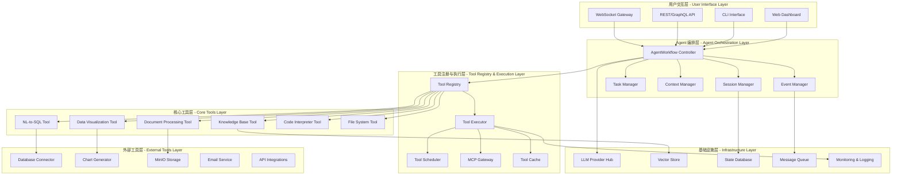

# Lexicon Agent: 企业级智能助理系统设计指南 v3.0

## 执行摘要

Lexicon (/ˈlɛksɪkɒn/) 是新一代企业级智能助理框架，专为处理复杂的多步骤业务流程而设计。通过融合 LlamaIndex AgentWorkflow 的编排能力与现代 Agent 架构的最佳实践，Lexicon 旨在成为生产环境中 AI Agent 系统的标杆解决方案。

### 核心设计理念

**从脚本思维到智能编排**：传统自动化依赖线性脚本（"先做A，再做B"），Lexicon 采用目标导向的执行模式（"有任务列表，为每个任务选择最佳工具"），赋予系统真正的自主决策能力。

**微服务化工具生态**：每个功能单元都被封装为独立的工具模块，支持热插拔式扩展，类似微服务架构的设计理念。

**生产就绪的韧性设计**：内置多层错误恢复、状态管理、性能优化和安全机制，满足企业级应用的严苛要求。

## 1. 系统架构设计

### 1.1 分层架构概览



### 1.2 核心组件深度解析

#### AgentWorkflow Controller - 智能编排引擎

**设计原理**：采用 LlamaIndex AgentWorkflow 作为系统的"大脑"，实现从命令式编程到目标导向执行的范式转变。

```python
from llama_index.core.workflow import (
    Context, Event, StartEvent, StopEvent, Workflow, step
)
from llama_index.core.agent import ReActAgent
from typing import List, Dict, Any, Optional
import uuid

class TaskEvent(Event):
    """任务执行事件"""
    task_id: str
    task_type: str
    description: str
    context: Dict[str, Any]
    dependencies: List[str] = []

class TaskResultEvent(Event):
    """任务结果事件"""
    task_id: str
    result: Any
    success: bool
    error: Optional[str] = None

class LexiconWorkflow(Workflow):
    """Lexicon 核心工作流"""
    
    def __init__(self, tools: List[BaseTool], llm: BaseLLM):
        super().__init__(timeout=300, verbose=True)
        self.agent = ReActAgent.from_tools(tools, llm=llm, verbose=True)
        self.task_results: Dict[str, Any] = {}
        self.context_store = ContextManager()
    
    @step(pass_context=True)
    async def parse_user_request(
        self, ctx: Context, ev: StartEvent
    ) -> TaskEvent | List[TaskEvent]:
        """解析用户请求，生成任务列表"""
        
        # 提取用户输入
        user_input = ev.input
        session_context = await self.context_store.get_session_context(
            ev.session_id
        )
        
        # 使用 Agent 解析任务
        parsing_prompt = self._build_task_parsing_prompt(
            user_input, session_context
        )
        
        response = await self.agent.achat(parsing_prompt)
        tasks = self._extract_tasks_from_response(response.response)
        
        # 生成任务事件
        if len(tasks) == 1:
            return TaskEvent(**tasks[0])
        else:
            return [TaskEvent(**task) for task in tasks]
    
    @step(pass_context=True)
    async def execute_task(
        self, ctx: Context, ev: TaskEvent
    ) -> TaskResultEvent:
        """执行单个任务"""
        
        try:
            # 检查依赖关系
            if not await self._dependencies_satisfied(ev.dependencies):
                # 等待依赖完成或处理依赖失败
                return TaskResultEvent(
                    task_id=ev.task_id,
                    result=None,
                    success=False,
                    error="Dependencies not satisfied"
                )
            
            # 构建任务执行上下文
            task_context = self._build_task_context(ev, ctx)
            
            # 使用 Agent 执行任务
            execution_response = await self.agent.achat(
                self._build_execution_prompt(ev, task_context)
            )
            
            # 存储结果
            self.task_results[ev.task_id] = execution_response.response
            
            return TaskResultEvent(
                task_id=ev.task_id,
                result=execution_response.response,
                success=True
            )
            
        except Exception as e:
            logger.error(f"Task execution failed: {e}")
            return TaskResultEvent(
                task_id=ev.task_id,
                result=None,
                success=False,
                error=str(e)
            )
    
    @step(pass_context=True)
    async def aggregate_results(
        self, ctx: Context, ev: List[TaskResultEvent]
    ) -> StopEvent:
        """聚合所有任务结果"""
        
        successful_results = [r for r in ev if r.success]
        failed_results = [r for r in ev if not r.success]
        
        if failed_results:
            # 尝试错误恢复
            recovery_results = await self._attempt_error_recovery(failed_results)
            successful_results.extend(recovery_results)
        
        # 生成最终响应
        final_response = self._generate_final_response(successful_results)
        
        return StopEvent(result=final_response)
```

#### Context Manager - 智能状态管理

**核心特性**：多层次状态管理，支持任务间数据流转和全局状态维护。

```python
from typing import Dict, Any, Optional, List
from dataclasses import dataclass, asdict
from datetime import datetime, timedelta
import json
import asyncio

@dataclass
class SessionContext:
    """会话上下文"""
    session_id: str
    user_id: str
    created_at: datetime
    updated_at: datetime
    
    # 用户偏好和设置
    preferences: Dict[str, Any]
    
    # 工作记忆 - 当前会话的临时数据
    working_memory: Dict[str, Any]
    
    # 长期记忆引用 - 指向知识库的相关信息
    long_term_memory_refs: List[str]
    
    # 任务执行历史
    task_history: List[Dict[str, Any]]
    
    # 上下文变量（用于模板填充等）
    context_variables: Dict[str, Any]

class ContextManager:
    """上下文管理器"""
    
    def __init__(self, redis_client=None, db_connection=None):
        self.redis = redis_client  # 快速访问的缓存
        self.db = db_connection    # 持久化存储
        self.active_sessions: Dict[str, SessionContext] = {}
    
    async def create_session(
        self, user_id: str, initial_context: Dict[str, Any] = None
    ) -> str:
        """创建新会话"""
        
        session_id = str(uuid.uuid4())
        now = datetime.utcnow()
        
        # 从历史会话中学习用户偏好
        user_preferences = await self._load_user_preferences(user_id)
        
        session_context = SessionContext(
            session_id=session_id,
            user_id=user_id,
            created_at=now,
            updated_at=now,
            preferences=user_preferences,
            working_memory=initial_context or {},
            long_term_memory_refs=[],
            task_history=[],
            context_variables={}
        )
        
        # 缓存活跃会话
        self.active_sessions[session_id] = session_context
        
        # 持久化存储
        if self.redis:
            await self.redis.setex(
                f"session:{session_id}",
                3600,  # 1小时过期
                json.dumps(asdict(session_context), default=str)
            )
        
        return session_id
    
    async def get_session_context(self, session_id: str) -> Optional[SessionContext]:
        """获取会话上下文"""
        
        # 先检查内存缓存
        if session_id in self.active_sessions:
            return self.active_sessions[session_id]
        
        # 从 Redis 恢复
        if self.redis:
            session_data = await self.redis.get(f"session:{session_id}")
            if session_data:
                context_dict = json.loads(session_data)
                context = SessionContext(**context_dict)
                self.active_sessions[session_id] = context
                return context
        
        # 从数据库恢复（长期存储）
        if self.db:
            context = await self._load_from_database(session_id)
            if context:
                self.active_sessions[session_id] = context
                return context
        
        return None
    
    async def update_working_memory(
        self, session_id: str, key: str, value: Any
    ) -> None:
        """更新工作记忆"""
        
        context = await self.get_session_context(session_id)
        if context:
            context.working_memory[key] = value
            context.updated_at = datetime.utcnow()
            await self._persist_session(context)
    
    async def add_task_result(
        self, session_id: str, task_id: str, result: Any
    ) -> None:
        """添加任务执行结果"""
        
        context = await self.get_session_context(session_id)
        if context:
            task_record = {
                "task_id": task_id,
                "result": result,
                "timestamp": datetime.utcnow().isoformat()
            }
            context.task_history.append(task_record)
            
            # 自动提取有价值的信息到长期记忆
            await self._extract_to_long_term_memory(context, task_record)
            
            await self._persist_session(context)
    
    async def get_relevant_context(
        self, session_id: str, task_description: str
    ) -> Dict[str, Any]:
        """获取与当前任务相关的上下文"""
        
        context = await self.get_session_context(session_id)
        if not context:
            return {}
        
        # 构建相关上下文
        relevant_context = {
            "user_preferences": context.preferences,
            "current_variables": context.context_variables,
            "recent_results": context.task_history[-5:],  # 最近5个任务结果
        }
        
        # 从工作记忆中提取相关数据
        relevant_memory = await self._extract_relevant_memory(
            context.working_memory, task_description
        )
        relevant_context["relevant_data"] = relevant_memory
        
        # 从长期记忆中检索相关信息
        if context.long_term_memory_refs:
            long_term_data = await self._retrieve_from_long_term_memory(
                context.long_term_memory_refs, task_description
            )
            relevant_context["knowledge_base"] = long_term_data
        
        return relevant_context
```

### 1.3 工具系统重新设计

#### 统一工具接口 - 融合 LlamaIndex FunctionTool

```python
from llama_index.core.tools import FunctionTool
from llama_index.core.tools.types import ToolMetadata
from abc import ABC, abstractmethod
from typing import Any, Dict, Optional, List, Callable
import pydantic
from enum import Enum

class ToolSafetyLevel(Enum):
    """工具安全级别"""
    SAFE = "safe"           # 只读，无副作用，可并行
    CAUTIOUS = "cautious"   # 有限副作用，需要评估
    EXCLUSIVE = "exclusive"  # 需要独占执行
    DANGEROUS = "dangerous"  # 需要特殊权限和审计

class ResourceRequirements(pydantic.BaseModel):
    """资源需求定义"""
    cpu_intensive: bool = False
    memory_mb: int = 64
    timeout_seconds: int = 30
    requires_network: bool = False
    requires_database: bool = False
    requires_file_system: bool = False

class ToolResult(pydantic.BaseModel):
    """统一的工具执行结果"""
    success: bool
    data: Any = None
    error: Optional[str] = None
    metadata: Dict[str, Any] = {}
    execution_time: float = 0.0
    resource_usage: Dict[str, Any] = {}

class BaseLexiconTool(ABC):
    """Lexicon 工具基类"""
    
    def __init__(self):
        self.safety_level = ToolSafetyLevel.CAUTIOUS
        self.resource_requirements = ResourceRequirements()
        self._setup_metadata()
    
    @property
    @abstractmethod
    def name(self) -> str:
        """工具名称"""
        pass
    
    @property
    @abstractmethod
    def description(self) -> str:
        """工具描述（用于 Agent 选择工具）"""
        pass
    
    @abstractmethod
    async def execute(self, **kwargs) -> ToolResult:
        """执行工具逻辑"""
        pass
    
    def _setup_metadata(self):
        """设置工具元数据"""
        self.metadata = ToolMetadata(
            name=self.name,
            description=self.description,
        )
    
    def to_llamaindex_tool(self) -> FunctionTool:
        """转换为 LlamaIndex FunctionTool"""
        
        async def tool_function(**kwargs) -> str:
            """适配器函数"""
            result = await self.execute(**kwargs)
            if result.success:
                # 返回结构化的成功结果
                return f"Success: {result.data}\nMetadata: {result.metadata}"
            else:
                # 返回错误信息
                return f"Error: {result.error}"
        
        return FunctionTool.from_defaults(
            fn=tool_function,
            name=self.name,
            description=self.description,
            return_direct=False
        )
```

#### 核心工具实现

**1. 自然语言转SQL工具**

```python
from llama_index.core.query_engine import NLSQLTableQueryEngine
from llama_index.core import SQLDatabase
from sqlalchemy import create_engine, MetaData
import pandas as pd
import re
from datetime import datetime, timedelta

class NaturalLanguageToSQLTool(BaseLexiconTool):
    """自然语言转SQL查询工具"""
    
    def __init__(self, database_url: str, table_schemas: Dict[str, Any]):
        super().__init__()
        self.safety_level = ToolSafetyLevel.CAUTIOUS
        self.resource_requirements = ResourceRequirements(
            requires_database=True,
            timeout_seconds=60
        )
        
        # 初始化数据库连接（只读用户）
        self.engine = create_engine(
            database_url,
            connect_args={"options": "-c default_transaction_isolation=serializable"}
        )
        self.sql_database = SQLDatabase(self.engine)
        self.query_engine = NLSQLTableQueryEngine(
            sql_database=self.sql_database,
            tables=list(table_schemas.keys())
        )
        
        self.table_schemas = table_schemas
        self.date_parser = DateRangeParser()
    
    @property
    def name(self) -> str:
        return "natural_language_to_sql"
    
    @property
    def description(self) -> str:
        return (
            "将自然语言查询转换为SQL并执行查询。"
            "支持复杂的数据聚合、时间范围过滤和多表关联。"
            "输入参数：query_description（自然语言描述），context（上下文信息）。"
            "返回：查询结果的DataFrame。"
        )
    
    async def execute(self, query_description: str, context: Dict[str, Any] = None) -> ToolResult:
        """执行自然语言到SQL的转换和查询"""
        
        start_time = time.time()
        
        try:
            # 1. 预处理查询描述
            enhanced_query = await self._enhance_query_with_context(
                query_description, context or {}
            )
            
            # 2. 解析和处理日期范围
            processed_query = await self.date_parser.process_date_expressions(
                enhanced_query
            )
            
            # 3. 构建富上下文提示
            contextual_prompt = self._build_contextual_prompt(
                processed_query, context
            )
            
            # 4. 使用 LlamaIndex 执行查询
            response = await self.query_engine.aquery(contextual_prompt)
            
            # 5. 将结果转换为DataFrame
            if hasattr(response, 'metadata') and 'result' in response.metadata:
                df = pd.DataFrame(response.metadata['result'])
            else:
                # 如果没有结构化结果，尝试解析响应文本
                df = self._parse_response_to_dataframe(response.response)
            
            execution_time = time.time() - start_time
            
            return ToolResult(
                success=True,
                data=df.to_dict('records') if not df.empty else [],
                metadata={
                    "query": str(response.metadata.get('sql_query', '')),
                    "row_count": len(df),
                    "columns": df.columns.tolist() if not df.empty else []
                },
                execution_time=execution_time
            )
            
        except Exception as e:
            execution_time = time.time() - start_time
            logger.error(f"SQL query execution failed: {e}")
            
            return ToolResult(
                success=False,
                error=f"Query execution failed: {str(e)}",
                execution_time=execution_time
            )
    
    def _build_contextual_prompt(
        self, query: str, context: Dict[str, Any]
    ) -> str:
        """构建富上下文的查询提示"""
        
        prompt_parts = [
            "基于以下数据库模式和上下文信息，生成准确的SQL查询：",
            "",
            "数据库模式信息："
        ]
        
        # 添加表结构信息
        for table_name, schema in self.table_schemas.items():
            prompt_parts.append(f"表 {table_name}:")
            for column, info in schema.get('columns', {}).items():
                comment = info.get('comment', '')
                data_type = info.get('type', '')
                prompt_parts.append(f"  - {column} ({data_type}): {comment}")
            prompt_parts.append("")
        
        # 添加业务上下文
        if context.get('business_context'):
            prompt_parts.extend([
                "业务上下文：",
                context['business_context'],
                ""
            ])
        
        # 添加示例查询（少样本学习）
        if context.get('example_queries'):
            prompt_parts.append("参考示例：")
            for example in context['example_queries'][:3]:  # 最多3个示例
                prompt_parts.append(f"问题: {example['question']}")
                prompt_parts.append(f"SQL: {example['sql']}")
                prompt_parts.append("")
        
        prompt_parts.extend([
            f"用户查询: {query}",
            "",
            "请生成对应的SQL查询，确保："
            "1. 使用正确的表名和列名",
            "2. 处理好日期格式和时间范围",
            "3. 使用适当的聚合函数",
            "4. 考虑数据的业务含义"
        ])
        
        return "\n".join(prompt_parts)
    
    def _parse_chart_description(
        self, description: str, chart_type: Optional[str] = None
    ) -> Dict[str, Any]:
        """解析图表描述"""
        
        config = {
            "type": chart_type or self._infer_chart_type(description),
            "title": self._extract_title(description),
            "x_column": self._extract_x_column(description),
            "y_column": self._extract_y_column(description),
            "color_scheme": "default"
        }
        
        return config
    
    def _infer_chart_type(self, description: str) -> str:
        """从描述中推断图表类型"""
        
        description_lower = description.lower()
        
        if any(word in description_lower for word in ["柱状图", "条形图", "bar"]):
            return "bar"
        elif any(word in description_lower for word in ["折线图", "趋势图", "line"]):
            return "line"
        elif any(word in description_lower for word in ["饼图", "pie"]):
            return "pie"
        elif any(word in description_lower for word in ["散点图", "scatter"]):
            return "scatter"
        elif any(word in description_lower for word in ["热力图", "heatmap"]):
            return "heatmap"
        else:
            return "bar"  # 默认柱状图
    
    def _extract_title(self, description: str) -> str:
        """提取图表标题"""
        # 简单的标题提取逻辑
        parts = description.split('-')
        if len(parts) > 1:
            return parts[-1].strip()
        return description.strip()
    
    def _extract_x_column(self, description: str) -> Optional[str]:
        """提取X轴列名"""
        # 可以基于描述推断X轴
        return None
    
    def _extract_y_column(self, description: str) -> Optional[str]:
        """提取Y轴列名"""
        # 可以基于描述推断Y轴
        return None
    
    async def _generate_chart(
        self,
        df: pd.DataFrame,
        chart_config: Dict[str, Any],
        title: Optional[str] = None
    ) -> Path:
        """生成图表文件"""
        
        chart_type = chart_config["type"]
        chart_title = title or chart_config.get("title", "数据图表")
        
        # 创建唯一文件名
        filename = f"chart_{uuid.uuid4().hex[:8]}_{int(time.time())}.png"
        chart_path = self.output_dir / filename
        
        # 设置图表样式
        plt.figure(figsize=(10, 6))
        plt.title(chart_title, fontsize=14, fontweight='bold')
        
        if chart_type == "bar":
            self._create_bar_chart(df, chart_config)
        elif chart_type == "line":
            self._create_line_chart(df, chart_config)
        elif chart_type == "pie":
            self._create_pie_chart(df, chart_config)
        elif chart_type == "scatter":
            self._create_scatter_chart(df, chart_config)
        elif chart_type == "heatmap":
            self._create_heatmap(df, chart_config)
        else:
            self._create_bar_chart(df, chart_config)  # 默认
        
        plt.tight_layout()
        plt.savefig(chart_path, dpi=300, bbox_inches='tight')
        plt.close()
        
        return chart_path
    
    def _create_bar_chart(self, df: pd.DataFrame, config: Dict[str, Any]):
        """创建柱状图"""
        if len(df.columns) >= 2:
            x_col = df.columns[0]
            y_col = df.columns[1] 
            plt.bar(df[x_col], df[y_col])
            plt.xlabel(x_col)
            plt.ylabel(y_col)
        else:
            # 单列数据
            plt.bar(range(len(df)), df.iloc[:, 0])
            plt.xlabel("Index")
            plt.ylabel(df.columns[0])
    
    def _create_line_chart(self, df: pd.DataFrame, config: Dict[str, Any]):
        """创建折线图"""
        if len(df.columns) >= 2:
            x_col = df.columns[0]
            y_col = df.columns[1]
            plt.plot(df[x_col], df[y_col], marker='o')
            plt.xlabel(x_col)
            plt.ylabel(y_col)
        else:
            plt.plot(df.iloc[:, 0], marker='o')
            plt.xlabel("Index")
            plt.ylabel(df.columns[0])
    
    def _create_pie_chart(self, df: pd.DataFrame, config: Dict[str, Any]):
        """创建饼图"""
        if len(df.columns) >= 2:
            labels = df.iloc[:, 0]
            values = df.iloc[:, 1]
            plt.pie(values, labels=labels, autopct='%1.1f%%')
        else:
            values = df.iloc[:, 0]
            labels = df.index
            plt.pie(values, labels=labels, autopct='%1.1f%%')
    
    def _create_scatter_chart(self, df: pd.DataFrame, config: Dict[str, Any]):
        """创建散点图"""
        if len(df.columns) >= 2:
            x_col = df.columns[0]
            y_col = df.columns[1]
            plt.scatter(df[x_col], df[y_col])
            plt.xlabel(x_col)
            plt.ylabel(y_col)
    
    def _create_heatmap(self, df: pd.DataFrame, config: Dict[str, Any]):
        """创建热力图"""
        # 确保数据是数值型
        numeric_df = df.select_dtypes(include=[np.number])
        if not numeric_df.empty:
            sns.heatmap(numeric_df.corr(), annot=True, cmap='coolwarm', center=0)
        else:
            # 如果没有数值列，创建简单的计数热力图
            plt.text(0.5, 0.5, "无法创建热力图：数据不包含数值列", 
                    ha='center', va='center', transform=plt.gca().transAxes)
```

### 1.4 实际系统架构对比

基于对现有Agent系统的分析，当前AutoReportAI的架构已经实现了以下核心组件：

#### 现有架构优势

**1. 通用Agent协调器 (UniversalAgentCoordinator)**
- 支持三种协调模式：INTELLIGENT、STANDARD、SIMPLE
- 完整的任务生命周期管理
- 性能监控和错误处理机制
- 灵活的执行策略选择

**2. 统一工具生态系统 (UnifiedToolEcosystem)**
- 自动工具发现和注册
- 智能工具选择算法（性能优先、可靠性优先、成本优化、平衡选择）
- 并行和串行执行支持
- 完整的性能统计和监控

**3. 智能上下文处理 (SmartContextProcessor)**
- 多层次上下文构建
- 场景自动识别
- 复杂度评估
- 用户偏好学习

#### 架构完善建议

基于现有实现，建议在以下方面进行完善：

## 2. 高级工具集成与MCP生态

### 2.1 Model Context Protocol (MCP) 集成

MCP是Claude Code生态系统的核心组件，为Lexicon Agent提供标准化的工具接口和丰富的扩展能力。

```python
from typing import Protocol, Any, Dict, List, Optional
import asyncio
import json
from dataclasses import dataclass

@dataclass
class MCPToolSpec:
    """MCP工具规格"""
    name: str
    description: str
    parameters: Dict[str, Any]
    capabilities: List[str]
    security_level: str = "safe"
    
class MCPConnector:
    """MCP连接器 - 标准化工具接口"""
    
    def __init__(self, mcp_servers: List[Dict[str, Any]]):
        self.mcp_servers = mcp_servers
        self.connected_servers = {}
        self.available_tools = {}
    
    async def initialize_connections(self):
        """初始化MCP服务器连接"""
        for server_config in self.mcp_servers:
            try:
                server_id = server_config["name"]
                # 连接MCP服务器
                connection = await self._connect_to_mcp_server(server_config)
                self.connected_servers[server_id] = connection
                
                # 发现可用工具
                tools = await self._discover_tools(connection)
                self.available_tools[server_id] = tools
                
                logger.info(f"Connected to MCP server {server_id}, discovered {len(tools)} tools")
                
            except Exception as e:
                logger.error(f"Failed to connect to MCP server {server_config['name']}: {e}")
    
    async def _connect_to_mcp_server(self, config: Dict[str, Any]):
        """连接到MCP服务器"""
        # 实现MCP协议连接逻辑
        # 这里需要根据实际的MCP实现进行调整
        pass
    
    async def _discover_tools(self, connection) -> List[MCPToolSpec]:
        """发现MCP工具"""
        # 通过MCP协议发现可用工具
        tools = []
        try:
            # 发送tools/list请求
            response = await connection.send_request("tools/list", {})
            
            for tool_data in response.get("tools", []):
                tool_spec = MCPToolSpec(
                    name=tool_data["name"],
                    description=tool_data["description"],
                    parameters=tool_data.get("inputSchema", {}),
                    capabilities=tool_data.get("capabilities", [])
                )
                tools.append(tool_spec)
                
        except Exception as e:
            logger.error(f"Failed to discover MCP tools: {e}")
        
        return tools
    
    async def execute_mcp_tool(
        self, 
        tool_name: str, 
        parameters: Dict[str, Any],
        server_id: Optional[str] = None
    ) -> Any:
        """执行MCP工具"""
        
        # 查找工具所在的服务器
        target_server = None
        if server_id:
            target_server = self.connected_servers.get(server_id)
        else:
            # 自动查找工具
            for sid, tools in self.available_tools.items():
                if any(tool.name == tool_name for tool in tools):
                    target_server = self.connected_servers.get(sid)
                    break
        
        if not target_server:
            raise Exception(f"MCP tool {tool_name} not found")
        
        try:
            # 发送tools/call请求
            response = await target_server.send_request("tools/call", {
                "name": tool_name,
                "arguments": parameters
            })
            
            return response.get("content", [])
            
        except Exception as e:
            logger.error(f"Failed to execute MCP tool {tool_name}: {e}")
            raise e
    
    def get_all_tools(self) -> List[MCPToolSpec]:
        """获取所有可用的MCP工具"""
        all_tools = []
        for tools in self.available_tools.values():
            all_tools.extend(tools)
        return all_tools

class MCPIntegratedToolEcosystem(UnifiedToolEcosystem):
    """集成MCP的工具生态系统"""
    
    def __init__(self, mcp_config: Dict[str, Any] = None):
        super().__init__()
        self.mcp_connector = None
        
        if mcp_config:
            self.mcp_connector = MCPConnector(mcp_config.get("servers", []))
    
    async def initialize(self):
        """初始化生态系统"""
        if self.mcp_connector:
            await self.mcp_connector.initialize_connections()
            # 将MCP工具注册到统一生态系统
            await self._register_mcp_tools()
    
    async def _register_mcp_tools(self):
        """注册MCP工具到统一生态系统"""
        mcp_tools = self.mcp_connector.get_all_tools()
        
        for mcp_tool in mcp_tools:
            # 转换为统一的工具定义
            tool_def = ToolDefinition(
                name=f"mcp_{mcp_tool.name}",
                category=self._infer_category_from_capabilities(mcp_tool.capabilities),
                description=mcp_tool.description,
                capabilities=mcp_tool.capabilities,
                metadata={
                    "source": "mcp",
                    "original_name": mcp_tool.name,
                    "security_level": mcp_tool.security_level
                }
            )
            
            self.tool_registry.register_tool(tool_def)
    
    def _infer_category_from_capabilities(self, capabilities: List[str]) -> ToolCategory:
        """从能力推断工具分类"""
        capability_mapping = {
            "filesystem": ToolCategory.SYSTEM_OPERATIONS,
            "database": ToolCategory.DATA_PROCESSING,
            "web": ToolCategory.SYSTEM_OPERATIONS,
            "analysis": ToolCategory.ANALYSIS,
            "generation": ToolCategory.GENERATION
        }
        
        for capability in capabilities:
            if capability in capability_mapping:
                return capability_mapping[capability]
        
        return ToolCategory.SYSTEM_OPERATIONS  # 默认分类
```

### 2.2 生产级工具扩展架构

```python
class ProductionToolManager:
    """生产级工具管理器"""
    
    def __init__(self):
        self.tool_cache = {}
        self.security_validator = SecurityValidator()
        self.performance_monitor = ToolPerformanceMonitor()
        self.dependency_resolver = DependencyResolver()
    
    async def load_tool_safely(self, tool_spec: Dict[str, Any]) -> Optional[BaseLexiconTool]:
        """安全加载工具"""
        
        try:
            # 1. 安全验证
            security_check = await self.security_validator.validate_tool(tool_spec)
            if not security_check.is_safe:
                logger.warning(f"Tool {tool_spec['name']} failed security check: {security_check.reason}")
                return None
            
            # 2. 依赖检查
            dependencies_ok = await self.dependency_resolver.check_dependencies(
                tool_spec.get("dependencies", [])
            )
            if not dependencies_ok:
                logger.error(f"Tool {tool_spec['name']} has unresolved dependencies")
                return None
            
            # 3. 动态加载
            tool_instance = await self._dynamic_load_tool(tool_spec)
            
            # 4. 性能基准测试
            await self.performance_monitor.benchmark_tool(tool_instance)
            
            # 5. 缓存工具实例
            self.tool_cache[tool_spec["name"]] = tool_instance
            
            return tool_instance
            
        except Exception as e:
            logger.error(f"Failed to load tool {tool_spec['name']}: {e}")
            return None
    
    async def _dynamic_load_tool(self, tool_spec: Dict[str, Any]) -> BaseLexiconTool:
        """动态加载工具"""
        
        if "module_path" in tool_spec:
            # 从模块路径加载
            module = importlib.import_module(tool_spec["module_path"])
            tool_class = getattr(module, tool_spec["class_name"])
            return tool_class(**tool_spec.get("init_params", {}))
        
        elif "docker_image" in tool_spec:
            # 容器化工具加载
            return await self._load_containerized_tool(tool_spec)
        
        elif "mcp_server" in tool_spec:
            # MCP工具加载
            return await self._load_mcp_tool(tool_spec)
        
        else:
            raise ValueError(f"Unknown tool loading method for {tool_spec['name']}")

class SecurityValidator:
    """工具安全验证器"""
    
    async def validate_tool(self, tool_spec: Dict[str, Any]) -> SecurityCheckResult:
        """验证工具安全性"""
        
        checks = [
            self._check_permissions(tool_spec),
            self._check_network_access(tool_spec),
            self._check_file_access(tool_spec),
            self._check_code_signature(tool_spec)
        ]
        
        results = await asyncio.gather(*checks)
        
        # 综合评估
        is_safe = all(result.passed for result in results)
        failed_checks = [r.check_name for r in results if not r.passed]
        
        return SecurityCheckResult(
            is_safe=is_safe,
            failed_checks=failed_checks,
            reason=f"Failed checks: {', '.join(failed_checks)}" if failed_checks else "All checks passed"
        )
    
    async def _check_permissions(self, tool_spec: Dict[str, Any]) -> CheckResult:
        """检查权限要求"""
        required_perms = tool_spec.get("required_permissions", [])
        dangerous_perms = ["file_write", "network_admin", "system_admin"]
        
        has_dangerous = any(perm in dangerous_perms for perm in required_perms)
        
        return CheckResult(
            check_name="permissions",
            passed=not has_dangerous,
            details=f"Required permissions: {required_perms}"
        )
    
    async def _check_network_access(self, tool_spec: Dict[str, Any]) -> CheckResult:
        """检查网络访问"""
        network_access = tool_spec.get("network_access", {})
        
        # 检查是否访问敏感网络
        allowed_hosts = network_access.get("allowed_hosts", [])
        blocked_patterns = ["localhost", "127.0.0.1", "internal", "admin"]
        
        has_blocked = any(
            any(pattern in host for pattern in blocked_patterns)
            for host in allowed_hosts
        )
        
        return CheckResult(
            check_name="network_access",
            passed=not has_blocked,
            details=f"Network access: {network_access}"
        )

@dataclass
class SecurityCheckResult:
    is_safe: bool
    failed_checks: List[str]
    reason: str

@dataclass
class CheckResult:
    check_name: str
    passed: bool
    details: str
```

### 2.3 容器化工具支持

```python
import docker
from typing import Dict, Any, Optional

class ContainerizedToolExecutor:
    """容器化工具执行器"""
    
    def __init__(self):
        self.docker_client = docker.from_env()
        self.running_containers = {}
    
    async def execute_containerized_tool(
        self,
        tool_spec: Dict[str, Any],
        parameters: Dict[str, Any]
    ) -> ToolResult:
        """执行容器化工具"""
        
        container_config = tool_spec.get("container", {})
        image = container_config["image"]
        command = container_config.get("command", [])
        
        try:
            # 准备容器环境
            container_name = f"lexicon_tool_{tool_spec['name']}_{int(time.time())}"
            
            # 安全配置
            security_opts = [
                "no-new-privileges:true",
                "seccomp:default"
            ]
            
            # 资源限制
            mem_limit = container_config.get("memory_limit", "256m")
            cpu_limit = container_config.get("cpu_limit", 0.5)
            
            # 网络隔离
            network_mode = container_config.get("network_mode", "none")
            
            # 运行容器
            container = self.docker_client.containers.run(
                image=image,
                command=command,
                name=container_name,
                detach=True,
                remove=True,
                mem_limit=mem_limit,
                cpu_quota=int(cpu_limit * 100000),
                cpu_period=100000,
                network_mode=network_mode,
                security_opt=security_opts,
                environment={
                    "TOOL_PARAMETERS": json.dumps(parameters),
                    "LEXICON_MODE": "production"
                },
                working_dir="/app",
                user="nobody"  # 非特权用户
            )
            
            # 等待执行完成
            result = container.wait(timeout=300)  # 5分钟超时
            
            # 获取输出
            logs = container.logs().decode('utf-8')
            
            if result["StatusCode"] == 0:
                # 尝试解析结构化输出
                try:
                    output_data = json.loads(logs.split('\n')[-2])  # 倒数第二行通常是结果
                    return ToolResult(
                        success=True,
                        data=output_data,
                        metadata={"container_id": container.id}
                    )
                except json.JSONDecodeError:
                    return ToolResult(
                        success=True,
                        data=logs,
                        metadata={"container_id": container.id, "output_type": "text"}
                    )
            else:
                return ToolResult(
                    success=False,
                    error=f"Container execution failed with code {result['StatusCode']}: {logs}"
                )
                
        except docker.errors.ContainerError as e:
            return ToolResult(
                success=False,
                error=f"Container error: {e}"
            )
        except docker.errors.ImageNotFound as e:
            return ToolResult(
                success=False,
                error=f"Docker image not found: {e}"
            )
        except Exception as e:
            return ToolResult(
                success=False,
                error=f"Unexpected error: {e}"
            )
```

## 3. 部署与运维架构

### 3.1 生产环境部署策略

```python
# docker-compose.yml 
version: '3.8'

services:
  lexicon-agent:
    build:
      context: .
      dockerfile: Dockerfile.agent
    environment:
      - LEXICON_MODE=production
      - DATABASE_URL=${DATABASE_URL}
      - REDIS_URL=${REDIS_URL}
      - LLM_PROVIDER=${LLM_PROVIDER}
      - MCP_SERVERS_CONFIG=/config/mcp-servers.json
    volumes:
      - ./config:/config:ro
      - ./logs:/app/logs
      - /var/run/docker.sock:/var/run/docker.sock  # 用于容器化工具
    ports:
      - "8080:8080"
    depends_on:
      - redis
      - postgres
      - monitoring
    restart: unless-stopped
    healthcheck:
      test: ["CMD", "curl", "-f", "http://localhost:8080/health"]
      interval: 30s
      timeout: 10s
      retries: 3

  redis:
    image: redis:7-alpine
    ports:
      - "6379:6379"
    volumes:
      - redis_data:/data
    restart: unless-stopped

  postgres:
    image: postgres:15
    environment:
      - POSTGRES_DB=lexicon
      - POSTGRES_USER=${DB_USER}
      - POSTGRES_PASSWORD=${DB_PASSWORD}
    volumes:
      - postgres_data:/var/lib/postgresql/data
    ports:
      - "5432:5432"
    restart: unless-stopped

  monitoring:
    image: grafana/grafana:latest
    ports:
      - "3000:3000"
    volumes:
      - grafana_data:/var/lib/grafana
      - ./monitoring/dashboards:/etc/grafana/provisioning/dashboards
    environment:
      - GF_SECURITY_ADMIN_PASSWORD=${GRAFANA_PASSWORD}
    restart: unless-stopped

volumes:
  redis_data:
  postgres_data:
  grafana_data:
```

### 3.2 Kubernetes 部署配置

```yaml
# k8s/lexicon-agent-deployment.yaml
apiVersion: apps/v1
kind: Deployment
metadata:
  name: lexicon-agent
  labels:
    app: lexicon-agent
spec:
  replicas: 3
  selector:
    matchLabels:
      app: lexicon-agent
  template:
    metadata:
      labels:
        app: lexicon-agent
    spec:
      containers:
      - name: lexicon-agent
        image: lexicon/agent:latest
        ports:
        - containerPort: 8080
        env:
        - name: LEXICON_MODE
          value: "production"
        - name: DATABASE_URL
          valueFrom:
            secretKeyRef:
              name: lexicon-secrets
              key: database-url
        - name: REDIS_URL
          valueFrom:
            secretKeyRef:
              name: lexicon-secrets
              key: redis-url
        resources:
          requests:
            memory: "512Mi"
            cpu: "250m"
          limits:
            memory: "2Gi"
            cpu: "1000m"
        livenessProbe:
          httpGet:
            path: /health
            port: 8080
          initialDelaySeconds: 30
          periodSeconds: 10
        readinessProbe:
          httpGet:
            path: /ready
            port: 8080
          initialDelaySeconds: 5
          periodSeconds: 5
        volumeMounts:
        - name: config-volume
          mountPath: /config
          readOnly: true
        - name: logs-volume
          mountPath: /app/logs
      volumes:
      - name: config-volume
        configMap:
          name: lexicon-config
      - name: logs-volume
        emptyDir: {}

---
apiVersion: v1
kind: Service
metadata:
  name: lexicon-agent-service
spec:
  selector:
    app: lexicon-agent
  ports:
  - protocol: TCP
    port: 80
    targetPort: 8080
  type: LoadBalancer

---
apiVersion: v1
kind: ConfigMap
metadata:
  name: lexicon-config
data:
  mcp-servers.json: |
    {
      "servers": [
        {
          "name": "filesystem",
          "command": "npx",
          "args": ["@modelcontextprotocol/server-filesystem"],
          "env": {
            "ALLOWED_DIRECTORIES": "/data"
          }
        }
      ]
    }
```

### 3.3 监控与可观测性

```python
import structlog
import prometheus_client
from prometheus_client import Counter, Histogram, Gauge, start_http_server
from opentelemetry import trace
from opentelemetry.exporter.jaeger.thrift import JaegerExporter
from opentelemetry.sdk.trace import TracerProvider
from opentelemetry.sdk.trace.export import BatchSpanProcessor
import asyncio
from typing import Dict, Any

# 配置结构化日志
structlog.configure(
    processors=[
        structlog.stdlib.filter_by_level,
        structlog.stdlib.add_logger_name,
        structlog.stdlib.add_log_level,
        structlog.stdlib.PositionalArgumentsFormatter(),
        structlog.processors.TimeStamper(fmt="iso"),
        structlog.processors.StackInfoRenderer(),
        structlog.processors.format_exc_info,
        structlog.processors.UnicodeDecoder(),
        structlog.processors.JSONRenderer()
    ],
    context_class=dict,
    logger_factory=structlog.stdlib.LoggerFactory(),
    wrapper_class=structlog.stdlib.BoundLogger,
    cache_logger_on_first_use=True,
)

class LexiconMetrics:
    """Lexicon Agent 指标收集器"""
    
    def __init__(self):
        # 任务执行指标
        self.task_counter = Counter('lexicon_tasks_total', 'Total tasks processed', ['mode', 'status'])
        self.task_duration = Histogram('lexicon_task_duration_seconds', 'Task execution time', ['mode'])
        self.active_tasks = Gauge('lexicon_active_tasks', 'Currently active tasks')
        
        # 工具执行指标
        self.tool_counter = Counter('lexicon_tools_total', 'Total tool executions', ['tool_name', 'status'])
        self.tool_duration = Histogram('lexicon_tool_duration_seconds', 'Tool execution time', ['tool_name'])
        
        # 系统指标
        self.memory_usage = Gauge('lexicon_memory_usage_bytes', 'Memory usage')
        self.cpu_usage = Gauge('lexicon_cpu_usage_percent', 'CPU usage percentage')
        
        # Agent协调器指标
        self.coordination_mode_counter = Counter('lexicon_coordination_modes_total', 'Coordination mode usage', ['mode'])
        
        # 错误指标
        self.error_counter = Counter('lexicon_errors_total', 'Total errors', ['error_type', 'component'])
        
        # 启动Prometheus HTTP服务器
        start_http_server(9090)
    
    def record_task_start(self, mode: str):
        """记录任务开始"""
        self.active_tasks.inc()
        self.coordination_mode_counter.labels(mode=mode).inc()
    
    def record_task_completion(self, mode: str, success: bool, duration: float):
        """记录任务完成"""
        self.active_tasks.dec()
        status = "success" if success else "failure"
        self.task_counter.labels(mode=mode, status=status).inc()
        self.task_duration.labels(mode=mode).observe(duration)
    
    def record_tool_execution(self, tool_name: str, success: bool, duration: float):
        """记录工具执行"""
        status = "success" if success else "failure"
        self.tool_counter.labels(tool_name=tool_name, status=status).inc()
        self.tool_duration.labels(tool_name=tool_name).observe(duration)
    
    def record_error(self, error_type: str, component: str):
        """记录错误"""
        self.error_counter.labels(error_type=error_type, component=component).inc()

class LexiconTracing:
    """分布式追踪配置"""
    
    def __init__(self, jaeger_endpoint: str = "http://localhost:14268/api/traces"):
        # 配置追踪
        trace.set_tracer_provider(TracerProvider())
        tracer = trace.get_tracer(__name__)
        
        # 配置Jaeger导出器
        jaeger_exporter = JaegerExporter(
            agent_host_name="localhost",
            agent_port=6831,
        )
        
        span_processor = BatchSpanProcessor(jaeger_exporter)
        trace.get_tracer_provider().add_span_processor(span_processor)
        
        self.tracer = tracer
    
    def trace_task_execution(self, task_id: str, mode: str):
        """追踪任务执行"""
        return self.tracer.start_as_current_span(
            "task_execution",
            attributes={
                "task.id": task_id,
                "task.mode": mode
            }
        )
    
    def trace_tool_execution(self, tool_name: str):
        """追踪工具执行"""
        return self.tracer.start_as_current_span(
            "tool_execution",
            attributes={
                "tool.name": tool_name
            }
        )

class MonitoredUniversalAgentCoordinator(UniversalAgentCoordinator):
    """集成监控的Agent协调器"""
    
    def __init__(self, coordination_mode: CoordinationMode = CoordinationMode.INTELLIGENT):
        super().__init__(coordination_mode)
        self.metrics = LexiconMetrics()
        self.tracing = LexiconTracing()
        self.logger = structlog.get_logger()
    
    async def execute_intelligent_task(
        self,
        task_description: str,
        context_data: Dict[str, Any] = None,
        user_id: str = None,
        coordination_mode: Optional[CoordinationMode] = None
    ) -> CoordinationResult:
        """执行智能任务（带监控）"""
        
        task_id = str(uuid.uuid4())[:8]
        mode = coordination_mode or self.coordination_mode
        
        # 记录任务开始
        self.metrics.record_task_start(mode.value)
        
        # 开始追踪
        with self.tracing.trace_task_execution(task_id, mode.value) as span:
            
            # 结构化日志
            self.logger.info(
                "task_started",
                task_id=task_id,
                mode=mode.value,
                user_id=user_id,
                description=task_description[:100]  # 截断长描述
            )
            
            start_time = time.time()
            
            try:
                # 调用父类方法
                result = await super().execute_intelligent_task(
                    task_description, context_data, user_id, coordination_mode
                )
                
                # 记录成功
                duration = time.time() - start_time
                self.metrics.record_task_completion(mode.value, True, duration)
                
                span.set_attribute("task.success", True)
                span.set_attribute("task.duration", duration)
                
                self.logger.info(
                    "task_completed",
                    task_id=task_id,
                    success=True,
                    duration=duration,
                    phases_completed=len(result.phases_completed)
                )
                
                return result
                
            except Exception as e:
                # 记录失败
                duration = time.time() - start_time
                self.metrics.record_task_completion(mode.value, False, duration)
                self.metrics.record_error(type(e).__name__, "coordinator")
                
                span.set_attribute("task.success", False)
                span.set_attribute("task.error", str(e))
                
                self.logger.error(
                    "task_failed",
                    task_id=task_id,
                    error=str(e),
                    duration=duration
                )
                
                raise e

class HealthChecker:
    """健康检查器"""
    
    def __init__(self, coordinator: UniversalAgentCoordinator):
        self.coordinator = coordinator
        self.last_health_check = None
        self.health_status = {
            "status": "unknown",
            "checks": {},
            "timestamp": None
        }
    
    async def perform_health_check(self) -> Dict[str, Any]:
        """执行健康检查"""
        
        checks = {}
        overall_healthy = True
        
        # 检查Agent协调器状态
        try:
            coordinator_status = self.coordinator.get_coordination_status()
            checks["coordinator"] = {
                "status": "healthy",
                "details": coordinator_status
            }
        except Exception as e:
            checks["coordinator"] = {
                "status": "unhealthy",
                "error": str(e)
            }
            overall_healthy = False
        
        # 检查数据库连接
        try:
            # 假设有数据库连接检查
            checks["database"] = await self._check_database()
        except Exception as e:
            checks["database"] = {
                "status": "unhealthy",
                "error": str(e)
            }
            overall_healthy = False
        
        # 检查Redis连接
        try:
            checks["redis"] = await self._check_redis()
        except Exception as e:
            checks["redis"] = {
                "status": "unhealthy",
                "error": str(e)
            }
            overall_healthy = False
        
        # 检查MCP服务器连接
        try:
            checks["mcp_servers"] = await self._check_mcp_servers()
        except Exception as e:
            checks["mcp_servers"] = {
                "status": "unhealthy",
                "error": str(e)
            }
            overall_healthy = False
        
        self.health_status = {
            "status": "healthy" if overall_healthy else "unhealthy",
            "checks": checks,
            "timestamp": datetime.utcnow().isoformat()
        }
        
        self.last_health_check = datetime.utcnow()
        return self.health_status
    
    async def _check_database(self) -> Dict[str, Any]:
        """检查数据库连接"""
        # 实现数据库健康检查
        return {"status": "healthy", "latency_ms": 5}
    
    async def _check_redis(self) -> Dict[str, Any]:
        """检查Redis连接"""
        # 实现Redis健康检查
        return {"status": "healthy", "latency_ms": 2}
    
    async def _check_mcp_servers(self) -> Dict[str, Any]:
        """检查MCP服务器连接"""
        # 实现MCP服务器健康检查
        return {"status": "healthy", "connected_servers": 3}

# FastAPI健康检查端点
from fastapi import FastAPI
from fastapi.responses import JSONResponse

app = FastAPI(title="Lexicon Agent API")

# 全局组件
coordinator = MonitoredUniversalAgentCoordinator()
health_checker = HealthChecker(coordinator)

@app.get("/health")
async def health_check():
    """健康检查端点"""
    health_status = await health_checker.perform_health_check()
    
    if health_status["status"] == "healthy":
        return JSONResponse(content=health_status, status_code=200)
    else:
        return JSONResponse(content=health_status, status_code=503)

@app.get("/ready")
async def readiness_check():
    """就绪检查端点"""
    # 简单的就绪检查
    try:
        status = coordinator.get_coordination_status()
        return JSONResponse(content={"status": "ready", "details": status}, status_code=200)
    except Exception as e:
        return JSONResponse(content={"status": "not_ready", "error": str(e)}, status_code=503)

@app.get("/metrics")
async def metrics():
    """Prometheus指标端点"""
    from prometheus_client import generate_latest, CONTENT_TYPE_LATEST
    from fastapi import Response
    
    return Response(
        content=generate_latest(),
        media_type=CONTENT_TYPE_LATEST
    )
```

### 3.4 配置管理

```python
from pydantic import BaseSettings, Field
from typing import List, Dict, Any, Optional

class DatabaseConfig(BaseSettings):
    """数据库配置"""
    url: str = Field(..., env="DATABASE_URL")
    pool_size: int = Field(10, env="DB_POOL_SIZE")
    max_overflow: int = Field(20, env="DB_MAX_OVERFLOW")
    pool_timeout: int = Field(30, env="DB_POOL_TIMEOUT")

class RedisConfig(BaseSettings):
    """Redis配置"""
    url: str = Field(..., env="REDIS_URL")
    max_connections: int = Field(100, env="REDIS_MAX_CONNECTIONS")
    socket_timeout: int = Field(5, env="REDIS_SOCKET_TIMEOUT")

class LLMConfig(BaseSettings):
    """LLM配置"""
    provider: str = Field("openai", env="LLM_PROVIDER")
    api_key: str = Field(..., env="LLM_API_KEY")
    model: str = Field("gpt-4", env="LLM_MODEL")
    max_tokens: int = Field(4000, env="LLM_MAX_TOKENS")
    temperature: float = Field(0.7, env="LLM_TEMPERATURE")

class MCPConfig(BaseSettings):
    """MCP配置"""
    servers_config_path: str = Field("/config/mcp-servers.json", env="MCP_SERVERS_CONFIG")
    connection_timeout: int = Field(30, env="MCP_CONNECTION_TIMEOUT")
    max_retries: int = Field(3, env="MCP_MAX_RETRIES")

class MonitoringConfig(BaseSettings):
    """监控配置"""
    enable_metrics: bool = Field(True, env="ENABLE_METRICS")
    enable_tracing: bool = Field(True, env="ENABLE_TRACING")
    jaeger_endpoint: str = Field("http://localhost:14268/api/traces", env="JAEGER_ENDPOINT")
    log_level: str = Field("INFO", env="LOG_LEVEL")

class SecurityConfig(BaseSettings):
    """安全配置"""
    enable_tool_validation: bool = Field(True, env="ENABLE_TOOL_VALIDATION")
    max_tool_execution_time: int = Field(300, env="MAX_TOOL_EXECUTION_TIME")
    allowed_docker_images: List[str] = Field([], env="ALLOWED_DOCKER_IMAGES")
    container_memory_limit: str = Field("512m", env="CONTAINER_MEMORY_LIMIT")

class LexiconConfig(BaseSettings):
    """Lexicon主配置"""
    mode: str = Field("production", env="LEXICON_MODE")
    max_concurrent_tasks: int = Field(10, env="MAX_CONCURRENT_TASKS")
    task_timeout: int = Field(600, env="TASK_TIMEOUT")
    
    # 子配置
    database: DatabaseConfig = DatabaseConfig()
    redis: RedisConfig = RedisConfig()
    llm: LLMConfig = LLMConfig()
    mcp: MCPConfig = MCPConfig()
    monitoring: MonitoringConfig = MonitoringConfig()
    security: SecurityConfig = SecurityConfig()
    
    class Config:
        env_prefix = "LEXICON_"
        case_sensitive = False

# 全局配置实例
config = LexiconConfig()
```

## 4. 错误处理与恢复机制

### 4.1 分层错误处理架构

```python
from enum import Enum
from typing import Dict, Any, Optional, List, Callable
import asyncio
import traceback
from datetime import datetime, timedelta

class ErrorSeverity(Enum):
    """错误严重级别"""
    LOW = "low"           # 轻微错误，可忽略
    MEDIUM = "medium"     # 中等错误，需要记录
    HIGH = "high"         # 严重错误，需要告警
    CRITICAL = "critical" # 致命错误，需要紧急处理

class ErrorCategory(Enum):
    """错误分类"""
    SYSTEM = "system"           # 系统错误
    NETWORK = "network"         # 网络错误
    LLM = "llm"                # LLM相关错误
    TOOL = "tool"              # 工具执行错误
    DATA = "data"              # 数据相关错误
    SECURITY = "security"       # 安全相关错误
    USER_INPUT = "user_input"   # 用户输入错误

@dataclass
class ErrorContext:
    """错误上下文信息"""
    error_id: str
    timestamp: datetime
    severity: ErrorSeverity
    category: ErrorCategory
    component: str
    message: str
    details: Dict[str, Any]
    stack_trace: Optional[str] = None
    user_id: Optional[str] = None
    task_id: Optional[str] = None
    recovery_attempts: int = 0
    max_recovery_attempts: int = 3

class ErrorRecoveryStrategy:
    """错误恢复策略基类"""
    
    async def can_recover(self, error_context: ErrorContext) -> bool:
        """判断是否可以恢复"""
        raise NotImplementedError
    
    async def recover(self, error_context: ErrorContext) -> bool:
        """执行恢复操作"""
        raise NotImplementedError

class RetryRecoveryStrategy(ErrorRecoveryStrategy):
    """重试恢复策略"""
    
    def __init__(self, max_retries: int = 3, backoff_multiplier: float = 2.0):
        self.max_retries = max_retries
        self.backoff_multiplier = backoff_multiplier
    
    async def can_recover(self, error_context: ErrorContext) -> bool:
        """检查是否可以重试"""
        return (
            error_context.recovery_attempts < self.max_retries and
            error_context.category in [ErrorCategory.NETWORK, ErrorCategory.LLM] and
            error_context.severity in [ErrorSeverity.LOW, ErrorSeverity.MEDIUM]
        )
    
    async def recover(self, error_context: ErrorContext) -> bool:
        """执行重试恢复"""
        wait_time = (self.backoff_multiplier ** error_context.recovery_attempts)
        logger.info(f"Retrying after {wait_time}s for error {error_context.error_id}")
        
        await asyncio.sleep(wait_time)
        error_context.recovery_attempts += 1
        return True

class FallbackRecoveryStrategy(ErrorRecoveryStrategy):
    """备选方案恢复策略"""
    
    def __init__(self, fallback_tools: Dict[str, str]):
        self.fallback_tools = fallback_tools  # {original_tool: fallback_tool}
    
    async def can_recover(self, error_context: ErrorContext) -> bool:
        """检查是否有备选工具"""
        return (
            error_context.category == ErrorCategory.TOOL and
            error_context.component in self.fallback_tools
        )
    
    async def recover(self, error_context: ErrorContext) -> bool:
        """切换到备选工具"""
        fallback_tool = self.fallback_tools.get(error_context.component)
        if fallback_tool:
            error_context.details["fallback_tool"] = fallback_tool
            logger.info(f"Switching to fallback tool {fallback_tool} for {error_context.component}")
            return True
        return False

class DegradedModeRecoveryStrategy(ErrorRecoveryStrategy):
    """降级模式恢复策略"""
    
    async def can_recover(self, error_context: ErrorContext) -> bool:
        """检查是否可以降级"""
        return error_context.severity in [ErrorSeverity.MEDIUM, ErrorSeverity.HIGH]
    
    async def recover(self, error_context: ErrorContext) -> bool:
        """启用降级模式"""
        error_context.details["degraded_mode"] = True
        logger.warning(f"Enabling degraded mode for error {error_context.error_id}")
        return True

class ErrorManager:
    """错误管理器"""
    
    def __init__(self):
        self.error_history: List[ErrorContext] = []
        self.recovery_strategies: List[ErrorRecoveryStrategy] = [
            RetryRecoveryStrategy(),
            FallbackRecoveryStrategy({
                "sql_generator": "basic_sql_generator",
                "chart_generator": "simple_chart_generator"
            }),
            DegradedModeRecoveryStrategy()
        ]
        self.error_patterns = {}  # 用于错误模式识别
        self.alert_manager = AlertManager()
    
    async def handle_error(
        self,
        exception: Exception,
        context: Dict[str, Any],
        severity: ErrorSeverity = ErrorSeverity.MEDIUM,
        category: ErrorCategory = ErrorCategory.SYSTEM
    ) -> Optional[ErrorContext]:
        """处理错误"""
        
        error_context = ErrorContext(
            error_id=str(uuid.uuid4())[:8],
            timestamp=datetime.utcnow(),
            severity=severity,
            category=category,
            component=context.get("component", "unknown"),
            message=str(exception),
            details=context,
            stack_trace=traceback.format_exc(),
            user_id=context.get("user_id"),
            task_id=context.get("task_id")
        )
        
        # 记录错误
        self.error_history.append(error_context)
        logger.error(
            "error_occurred",
            error_id=error_context.error_id,
            severity=severity.value,
            category=category.value,
            component=error_context.component,
            message=error_context.message
        )
        
        # 检查错误模式
        await self._analyze_error_patterns(error_context)
        
        # 尝试恢复
        recovery_success = await self._attempt_recovery(error_context)
        
        # 发送告警
        if not recovery_success and severity in [ErrorSeverity.HIGH, ErrorSeverity.CRITICAL]:
            await self.alert_manager.send_alert(error_context)
        
        return error_context
    
    async def _attempt_recovery(self, error_context: ErrorContext) -> bool:
        """尝试错误恢复"""
        
        for strategy in self.recovery_strategies:
            if await strategy.can_recover(error_context):
                try:
                    success = await strategy.recover(error_context)
                    if success:
                        logger.info(f"Error {error_context.error_id} recovered using {strategy.__class__.__name__}")
                        return True
                except Exception as e:
                    logger.error(f"Recovery strategy {strategy.__class__.__name__} failed: {e}")
        
        logger.error(f"All recovery strategies failed for error {error_context.error_id}")
        return False
    
    async def _analyze_error_patterns(self, error_context: ErrorContext):
        """分析错误模式"""
        
        # 简单的错误模式识别
        recent_errors = [
            e for e in self.error_history[-10:]  # 最近10个错误
            if e.component == error_context.component and
               e.category == error_context.category
        ]
        
        if len(recent_errors) >= 3:
            pattern_key = f"{error_context.component}_{error_context.category.value}"
            if pattern_key not in self.error_patterns:
                self.error_patterns[pattern_key] = {
                    "count": 0,
                    "first_occurrence": datetime.utcnow(),
                    "last_occurrence": datetime.utcnow()
                }
            
            pattern = self.error_patterns[pattern_key]
            pattern["count"] += 1
            pattern["last_occurrence"] = datetime.utcnow()
            
            # 如果错误频繁发生，提升严重级别
            if pattern["count"] >= 5:
                error_context.severity = ErrorSeverity.HIGH
                logger.warning(f"Error pattern detected for {pattern_key}, count: {pattern['count']}")

class AlertManager:
    """告警管理器"""
    
    def __init__(self):
        self.alert_channels = []
        self.rate_limiter = {}  # 防止告警轰炸
    
    async def send_alert(self, error_context: ErrorContext):
        """发送告警"""
        
        # 简单的速率限制
        rate_key = f"{error_context.component}_{error_context.category.value}"
        now = datetime.utcnow()
        
        if rate_key in self.rate_limiter:
            last_alert = self.rate_limiter[rate_key]
            if now - last_alert < timedelta(minutes=5):  # 5分钟内不重复告警
                return
        
        self.rate_limiter[rate_key] = now
        
        alert_message = {
            "error_id": error_context.error_id,
            "severity": error_context.severity.value,
            "category": error_context.category.value,
            "component": error_context.component,
            "message": error_context.message,
            "timestamp": error_context.timestamp.isoformat(),
            "user_id": error_context.user_id,
            "task_id": error_context.task_id
        }
        
        # 发送到各种告警渠道
        for channel in self.alert_channels:
            try:
                await channel.send_alert(alert_message)
            except Exception as e:
                logger.error(f"Failed to send alert via {channel.__class__.__name__}: {e}")

# 集成错误处理的Agent协调器
class RobustUniversalAgentCoordinator(MonitoredUniversalAgentCoordinator):
    """具备错误处理能力的Agent协调器"""
    
    def __init__(self, coordination_mode: CoordinationMode = CoordinationMode.INTELLIGENT):
        super().__init__(coordination_mode)
        self.error_manager = ErrorManager()
    
    async def execute_intelligent_task(
        self,
        task_description: str,
        context_data: Dict[str, Any] = None,
        user_id: str = None,
        coordination_mode: Optional[CoordinationMode] = None
    ) -> CoordinationResult:
        """执行智能任务（带错误处理）"""
        
        try:
            return await super().execute_intelligent_task(
                task_description, context_data, user_id, coordination_mode
            )
        except Exception as e:
            # 处理错误
            error_context = await self.error_manager.handle_error(
                e,
                {
                    "component": "coordinator",
                    "user_id": user_id,
                    "task_description": task_description
                },
                severity=self._determine_error_severity(e),
                category=self._determine_error_category(e)
            )
            
            # 根据错误恢复情况决定返回结果
            if error_context and error_context.details.get("degraded_mode"):
                # 降级模式：返回部分结果
                return CoordinationResult(
                    task_id=error_context.error_id,
                    success=False,
                    error=f"Task completed in degraded mode: {error_context.message}",
                    metadata={"degraded_mode": True, "error_id": error_context.error_id}
                )
            else:
                # 无法恢复：抛出异常
                raise e
    
    def _determine_error_severity(self, exception: Exception) -> ErrorSeverity:
        """确定错误严重级别"""
        if isinstance(exception, (ConnectionError, TimeoutError)):
            return ErrorSeverity.HIGH
        elif isinstance(exception, ValueError):
            return ErrorSeverity.MEDIUM
        elif isinstance(exception, PermissionError):
            return ErrorSeverity.CRITICAL
        else:
            return ErrorSeverity.MEDIUM
    
    def _determine_error_category(self, exception: Exception) -> ErrorCategory:
        """确定错误分类"""
        if isinstance(exception, (ConnectionError, TimeoutError)):
            return ErrorCategory.NETWORK
        elif isinstance(exception, ValueError):
            return ErrorCategory.DATA
        elif isinstance(exception, PermissionError):
            return ErrorCategory.SECURITY
        else:
            return ErrorCategory.SYSTEM
```

### 4.2 监控仪表板配置

```json
{
  "dashboard": {
    "title": "Lexicon Agent 监控面板",
    "panels": [
      {
        "title": "任务执行概览",
        "type": "stat",
        "targets": [
          {
            "expr": "rate(lexicon_tasks_total[5m])",
            "legendFormat": "任务执行速率"
          }
        ]
      },
      {
        "title": "任务成功率",
        "type": "stat",
        "targets": [
          {
            "expr": "rate(lexicon_tasks_total{status=\"success\"}[5m]) / rate(lexicon_tasks_total[5m]) * 100",
            "legendFormat": "成功率 %"
          }
        ]
      },
      {
        "title": "活跃任务数",
        "type": "gauge",
        "targets": [
          {
            "expr": "lexicon_active_tasks",
            "legendFormat": "活跃任务"
          }
        ]
      },
      {
        "title": "错误趋势",
        "type": "graph",
        "targets": [
          {
            "expr": "rate(lexicon_errors_total[5m])",
            "legendFormat": "{{error_type}}"
          }
        ]
      },
      {
        "title": "工具执行性能",
        "type": "heatmap",
        "targets": [
          {
            "expr": "histogram_quantile(0.95, rate(lexicon_tool_duration_seconds_bucket[5m]))",
            "legendFormat": "95th percentile"
          }
        ]
      }
    ]
  }
}
```

## 5. 总结与最佳实践

### 5.1 架构优势总结

Lexicon Agent v3.0 在原有AutoReportAI Agent系统基础上，提供了以下关键改进：

**1. 统一的Agent协调架构**
- 三种协调模式适应不同场景需求
- 完整的任务生命周期管理
- 智能上下文处理和状态管理

**2. 生产级工具生态系统**
- MCP标准集成，支持丰富的工具扩展
- 智能工具选择和优化执行
- 容器化工具支持，确保安全隔离

**3. 企业级运维能力**
- 完整的监控和可观测性
- 多层次错误处理和恢复机制
- Kubernetes原生部署支持

**4. 安全性和可靠性**
- 工具安全验证和权限控制
- 资源限制和沙箱执行
- 分布式追踪和性能监控

### 5.2 最佳实践建议

**开发阶段**
1. 使用SIMPLE模式进行快速原型开发
2. 通过单元测试验证工具功能
3. 利用错误处理机制快速定位问题

**测试阶段**
1. 使用STANDARD模式进行集成测试
2. 模拟各种错误场景验证恢复机制
3. 进行性能压测确保系统稳定性

**生产部署**
1. 使用INTELLIGENT模式获得最佳性能
2. 配置完整的监控和告警系统
3. 建立错误恢复和灾难恢复流程

### 5.3 未来发展方向

**技术演进**
- 支持更多LLM模型和提供商
- 增强多模态能力（图像、语音、视频）
- 实现更智能的Agent间协作

**生态扩展**
- 丰富MCP工具库
- 支持第三方插件开发
- 建立Agent市场和社区

**企业功能**
- 增强安全审计和合规性
- 支持多租户和权限管理
- 提供可视化的流程设计器

Lexicon Agent不仅是一个技术框架，更是企业AI Agent应用的完整解决方案。通过模块化设计、标准化接口和生产级运维支持，它为企业构建可靠、可扩展的智能助理系统提供了坚实的基础。
        
        # 添加当前时间信息
        if context.get('current_time'):
            enhanced_parts.append(f"当前时间: {context['current_time']}")
        
        # 添加相关的历史查询结果
        if context.get('recent_queries'):
            enhanced_parts.append("相关的近期查询结果可供参考")
        
        return " | ".join(enhanced_parts)

class DateRangeParser:
    """日期范围解析器"""
    
    def __init__(self):
        self.date_patterns = {
            r'近(\d+)天': lambda m: self._get_recent_days(int(m.group(1))),
            r'最近(\d+)天': lambda m: self._get_recent_days(int(m.group(1))),
            r'本月': lambda m: self._get_current_month(),
            r'上月': lambda m: self._get_last_month(),
            r'本周': lambda m: self._get_current_week(),
            r'今年': lambda m: self._get_current_year(),
        }
    
    async def process_date_expressions(self, query: str) -> str:
        """处理查询中的日期表达式"""
        
        processed_query = query
        
        for pattern, handler in self.date_patterns.items():
            matches = re.finditer(pattern, processed_query, re.IGNORECASE)
            for match in matches:
                date_range = handler(match)
                processed_query = processed_query.replace(
                    match.group(0), 
                    f"时间范围从 {date_range['start']} 到 {date_range['end']}"
                )
        
        return processed_query
    
    def _get_recent_days(self, days: int) -> Dict[str, str]:
        """获取最近N天的日期范围"""
        end_date = datetime.now().date()
        start_date = end_date - timedelta(days=days-1)
        return {
            "start": start_date.strftime("%Y-%m-%d"),
            "end": end_date.strftime("%Y-%m-%d")
        }
    
    def _get_current_month(self) -> Dict[str, str]:
        """获取当月日期范围"""
        now = datetime.now()
        start_date = now.replace(day=1).date()
        # 下月第一天减一天得到本月最后一天
        next_month = start_date.replace(month=start_date.month + 1 if start_date.month < 12 else 1,
                                       year=start_date.year if start_date.month < 12 else start_date.year + 1)
        end_date = next_month - timedelta(days=1)
        return {
            "start": start_date.strftime("%Y-%m-%d"),
            "end": end_date.strftime("%Y-%m-%d")
        }
```

**2. 数据可视化工具**

```python
import matplotlib.pyplot as plt
import plotly.graph_objects as go
import plotly.express as px
import seaborn as sns
from io import BytesIO
import base64
from pathlib import Path
import uuid

class DataVisualizationTool(BaseLexiconTool):
    """数据可视化工具"""
    
    def __init__(self, output_dir: str = "/tmp/charts"):
        super().__init__()
        self.safety_level = ToolSafetyLevel.SAFE
        self.resource_requirements = ResourceRequirements(
            cpu_intensive=True,
            memory_mb=256,
            timeout_seconds=60,
            requires_file_system=True
        )
        self.output_dir = Path(output_dir)
        self.output_dir.mkdir(exist_ok=True)
        
        # 设置默认样式
        plt.style.use('seaborn-v0_8-whitegrid')
        sns.set_palette("husl")
    
    @property
    def name(self) -> str:
        return "data_visualization"
    
    @property
    def description(self) -> str:
        return (
            "根据数据和描述生成各种类型的图表。"
            "支持柱状图、折线图、饼图、散点图、热力图等。"
            "输入参数：data（数据列表/字典），chart_description（图表描述），"
            "chart_type（图表类型，可选），title（标题，可选）。"
            "返回：生成的图表文件路径。"
        )
    
    async def execute(
        self,
        data: Any,
        chart_description: str,
        chart_type: Optional[str] = None,
        title: Optional[str] = None,
        **kwargs
    ) -> ToolResult:
        """执行数据可视化"""
        
        start_time = time.time()
        
        try:
            # 1. 数据预处理
            df = self._prepare_dataframe(data)
            
            # 2. 解析图表描述，提取图表类型和参数
            chart_config = self._parse_chart_description(
                chart_description, chart_type
            )
            
            # 3. 生成图表
            chart_path = await self._generate_chart(
                df, chart_config, title or chart_config.get('title')
            )
            
            execution_time = time.time() - start_time
            
            return ToolResult(
                success=True,
                data={
                    "file_path": str(chart_path),
                    "chart_type": chart_config['type'],
                    "title": title or chart_config.get('title', '')
                },
                metadata={
                    "data_shape": df.shape,
                    "chart_config": chart_config
                },
                execution_time=execution_time
            )
            
        except Exception as e:
            execution_time = time.time() - start_time
            logger.error(f"Chart generation failed: {e}")
            
            return ToolResult(
                success=False,
                error=f"Chart generation failed: {str(e)}",
                execution_time=execution_time
            )
    
    def _prepare_dataframe(self, data: Any) -> pd.DataFrame:
        """准备DataFrame"""
        
        if isinstance(data, pd.DataFrame):
            return data
        elif isinstance(data, list):
            if not data:
                raise ValueError("Empty data provided")
            
            if isinstance(data[0], dict):
                return pd.DataFrame(data)
            else:
                return pd.DataFrame({'value': data})
        elif isinstance(data, dict):
            return pd.DataFrame([data])
        else:
            raise ValueError(f"Unsupported data type: {type(data)}")
    
    def _parse_chart_description(
        self, description: str, chart_type: Optional[str] = None
    ) -> Dict[str, Any]:
        """解析图表描述"""
        
        config = {
            "type": chart_type or self._infer_chart_type(description),
            "title": "",
            "x_column": None,