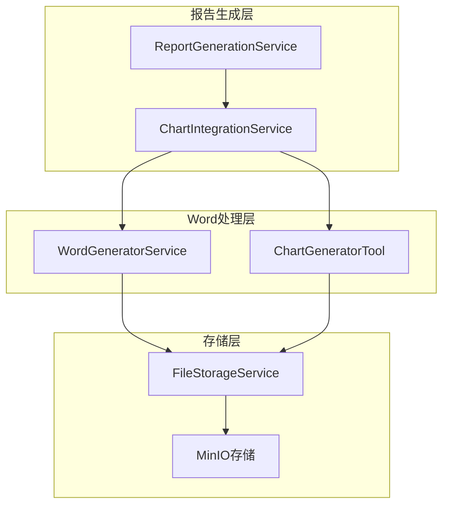

# AutoReportAI 图表插入功能技术指南

## 概述

AutoReportAI现已完善了从图表生成到Word文档插入的完整流程。本指南详细说明了图表插入功能的技术实现、使用方法和最佳实践。

## 核心功能特性

### ✅ 完善的功能清单

1. **图表占位符识别**: 支持 `{{chart:type}}` 和 `{{chart:type:title}}` 格式
2. **智能图表匹配**: 根据类型和标题匹配生成的图表文件
3. **自动尺寸调整**: 保持宽高比的智能尺寸控制
4. **文档格式保持**: 完美集成到Word文档布局中
5. **错误容错处理**: 全面的错误处理和降级策略
6. **中文完美支持**: 图表标题和文档内容的中文显示

## 技术架构

### 数据流转架构

```
模板解析 → 占位符识别 → 图表生成 → 文件存储 → Word插入 → 文档输出
    ↓           ↓           ↓           ↓           ↓           ↓
Template    Regex       Chart       PNG/SVG     docx.py     MinIO
Parser      Match       Generator   Storage     Insert      Upload
```

### 类结构关系



## 核心实现

### 1. 占位符识别正则表达式

```python
CHART_PLACEHOLDER_REGEX = re.compile(r'\{\{chart:(\w+)(?::([^}]+))?\}\}')
```

**支持格式**:
- `{{chart:bar}}` - 基础柱状图
- `{{chart:line:销售趋势}}` - 带标题的折线图
- `{{chart:pie:产品占比}}` - 带标题的饼图

### 2. 图表类型映射

| 占位符类型 | 图表文件名模式 | 生成工具方法 |
|-----------|---------------|-------------|
| `bar` | `bar_chart_*.png` | `generate_bar_chart()` |
| `line` | `line_chart_*.png` | `generate_line_chart()` |
| `pie` | `pie_chart_*.png` | `generate_pie_chart()` |

### 3. 图表尺寸配置

```python
# 默认尺寸配置
DEFAULT_CHART_WIDTH = Inches(6.0)    # 6英寸宽
DEFAULT_CHART_HEIGHT = Inches(4.0)   # 4英寸高
CHART_MAX_WIDTH = Inches(6.5)        # 最大宽度限制
CHART_MAX_HEIGHT = Inches(5.0)       # 最大高度限制
```

**尺寸计算逻辑**:
1. 读取原图片尺寸
2. 计算宽高比
3. 按比例调整到合适的文档尺寸
4. 应用最大尺寸限制

### 4. 图表匹配算法

```python
def _find_matching_chart(chart_type, chart_title, chart_results):
    # 1. 精确类型匹配
    for chart in chart_results:
        if chart['chart_type'].replace('_chart', '') == chart_type:
            # 2. 标题匹配（如果指定）
            if chart_title and chart_title.lower() in chart['title'].lower():
                return chart
            elif not chart_title:
                return chart
    
    # 3. 备选策略：返回第一个可用图表
    return chart_results[0] if chart_results else None
```

## 使用方法

### 1. 基础使用

```python
from app.services.domain.reporting.word_generator_service import WordGeneratorService

# 准备模板内容
template_content = """
# 销售报告
本月销售额: {{total_sales}}

## 趋势分析
{{chart:line:销售趋势}}

## 产品分布
{{chart:pie:产品占比}}
"""

# 准备占位符数据
placeholder_values = {
    "total_sales": "1250万"
}

# 准备图表结果
chart_results = [
    {
        "chart_type": "line_chart",
        "filepath": "/path/to/line_chart_123.png",
        "title": "销售趋势"
    },
    {
        "chart_type": "pie_chart", 
        "filepath": "/path/to/pie_chart_456.png",
        "title": "产品占比"
    }
]

# 生成报告
word_service = WordGeneratorService()
report_path = word_service.generate_report_from_template(
    template_content=template_content,
    placeholder_values=placeholder_values,
    title="销售分析报告",
    chart_results=chart_results
)
```

### 2. 集成到任务处理

```python
# 在ReportGenerationService中的使用
async def generate_report(self, task_id, template_id, data_source_id):
    # ... 数据处理 ...
    
    # 生成图表
    chart_service = ChartIntegrationService(self.db, str(task.owner_id))
    chart_results = await chart_service.generate_charts_for_task(
        task=task,
        data_results=etl_results,
        placeholder_data=placeholder_results
    )
    
    # 生成Word文档（包含图表）
    report_path = self.word_generator.generate_report_from_template(
        template_content=template_content,
        placeholder_values=placeholder_results,
        title=f"{task.name}_报告",
        chart_results=chart_results.get('charts', [])
    )
```

## 错误处理机制

### 1. 图表文件不存在
```python
if not chart_filepath or not Path(chart_filepath).exists():
    logger.warning(f"图表文件不存在: {chart_filepath}")
    error_paragraph = doc.add_paragraph(f"[图表文件不存在: {chart_title}]")
    return
```

### 2. 图表插入失败
```python
try:
    run.add_picture(chart_filepath, width=width, height=height)
except Exception as e:
    logger.error(f"插入图表失败: {e}")
    run = paragraph.add_run(f"[图表插入失败: {chart_title}]")
    run.font.color.rgb = docx.shared.RGBColor(255, 0, 0)  # 红色显示
```

### 3. 降级处理策略
```python
try:
    # 尝试使用新的图表插入功能
    report_path = self.word_generator.generate_report_from_template(
        template_content=content,
        chart_results=chart_results
    )
except Exception as e:
    logger.error(f"图表插入失败，降级到普通报告生成: {e}")
    # 降级到不包含图表的报告生成
    report_path = self.word_generator.generate_report(content, title)
```

## 性能优化

### 1. 图片尺寸优化
- 使用PIL预计算图片尺寸，避免Word处理大图片
- 按比例缩放，保持清晰度的同时控制文件大小
- 缓存尺寸计算结果

### 2. 文件I/O优化
- 批量处理图表插入，减少文档操作次数
- 使用内存缓冲区处理，避免临时文件
- 异步处理图表生成和文档组装

### 3. 错误恢复优化
- 单个图表失败不影响整体报告生成
- 智能备选图表选择
- 渐进式降级处理

## 扩展功能

### 1. 支持的图表类型扩展

可以轻松添加新的图表类型：

```python
# 在ChartGeneratorTool中添加新类型
def generate_scatter_chart(self, data: Dict[str, Any]) -> Dict[str, Any]:
    # 散点图生成逻辑
    pass

# 在占位符匹配中支持新类型
SUPPORTED_CHART_TYPES = ['bar', 'line', 'pie', 'scatter', 'area']
```

### 2. 图表样式定制

```python
# 支持样式参数的占位符
{{chart:bar:销售数据:style=business}}
{{chart:line:趋势:color=blue,size=large}}
```

### 3. 动态图表配置

```python
# 基于数据内容智能选择图表类型
def auto_select_chart_type(data_characteristics):
    if data_characteristics['time_series']:
        return 'line'
    elif data_characteristics['categorical_distribution']:
        return 'pie'
    else:
        return 'bar'
```

## 测试策略

### 1. 单元测试

```python
def test_chart_placeholder_regex():
    text = "销售情况：{{chart:bar:月度销售}} 和 {{chart:line}}"
    matches = CHART_PLACEHOLDER_REGEX.findall(text)
    assert len(matches) == 2
    assert matches[0] == ('bar', '月度销售')
    assert matches[1] == ('line', '')

def test_chart_size_calculation():
    # 测试尺寸计算逻辑
    pass

def test_chart_matching():
    # 测试图表匹配算法
    pass
```

### 2. 集成测试

```python
async def test_full_chart_insertion_flow():
    # 端到端测试：从模板到最终Word文档
    pass

def test_error_handling():
    # 测试各种错误场景的处理
    pass
```

## 部署注意事项

### 1. 依赖包要求

```bash
pip install python-docx>=0.8.11
pip install Pillow>=8.0.0
pip install matplotlib>=3.5.0
pip install seaborn>=0.11.0
```

### 2. Docker环境配置

```dockerfile
# 确保中文字体支持
RUN apt-get update && apt-get install -y \
    fonts-noto-cjk \
    fonts-wqy-microhei \
    fonts-wqy-zenhei

# 刷新字体缓存
RUN fc-cache -fv
```

### 3. 存储路径配置

```python
# 确保图表存储路径可访问
CHART_STORAGE_PATH = "/app/storage/reports/"
os.makedirs(CHART_STORAGE_PATH, exist_ok=True)
```

## 监控和日志

### 1. 关键指标监控
- 图表生成成功率
- 文档插入成功率
- 平均处理时间
- 文件大小分布

### 2. 日志级别
- `INFO`: 成功的图表插入操作
- `WARNING`: 图表文件不存在或匹配失败
- `ERROR`: 插入过程中的严重错误
- `DEBUG`: 详细的处理步骤信息

### 3. 性能日志
```python
logger.info(f"图表插入完成 - 处理{len(chart_results)}个图表，用时{duration:.2f}秒")
logger.info(f"文档大小: {doc_size}KB，包含{chart_count}个图表")
```

## 最佳实践

### 1. 模板设计
- 使用清晰的图表占位符命名
- 合理安排图表在文档中的位置
- 为图表预留足够的空间

### 2. 错误预防
- 确保图表文件在插入前已生成完成
- 验证图表文件的完整性
- 使用标准化的文件命名规则

### 3. 性能优化
- 批量处理多个图表插入
- 预先验证图表文件存在性
- 使用适当的图片格式和尺寸

这个完善的图表插入功能现在已经全面集成到AutoReportAI系统中，提供了从图表生成到Word文档插入的完整解决方案！