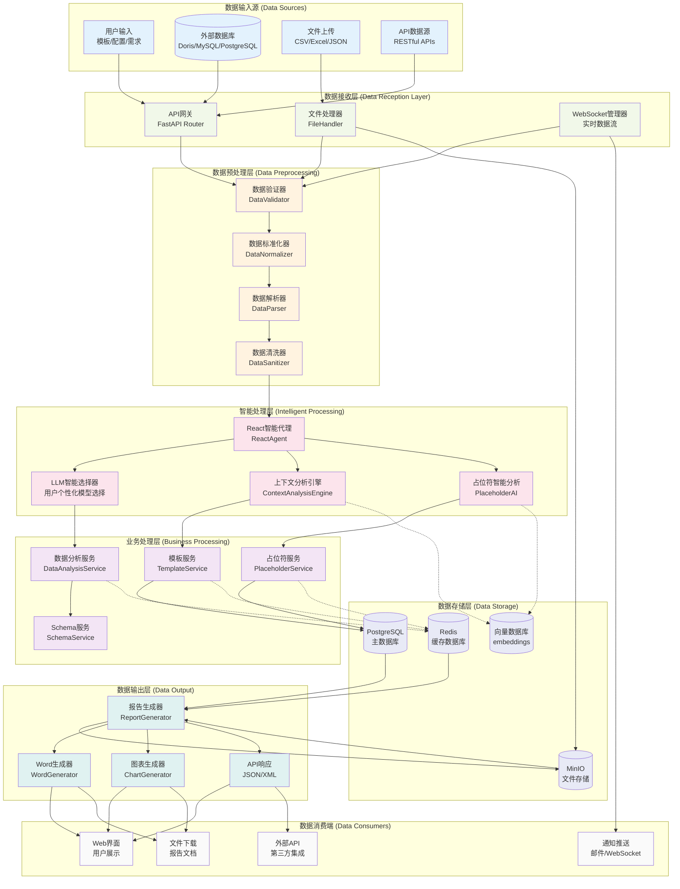
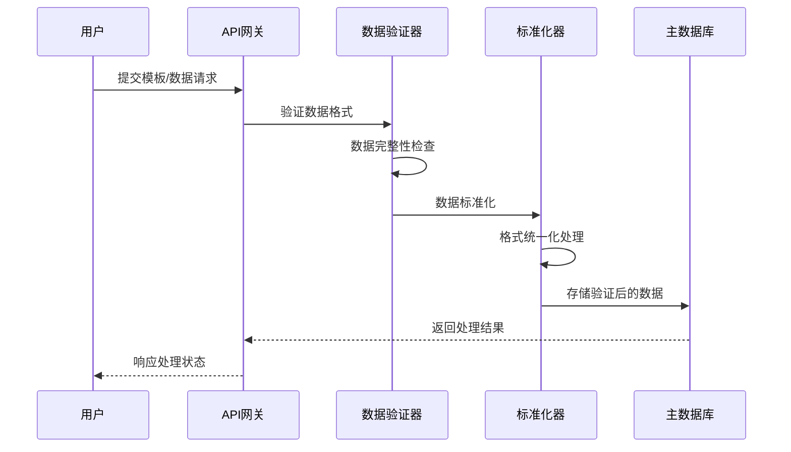
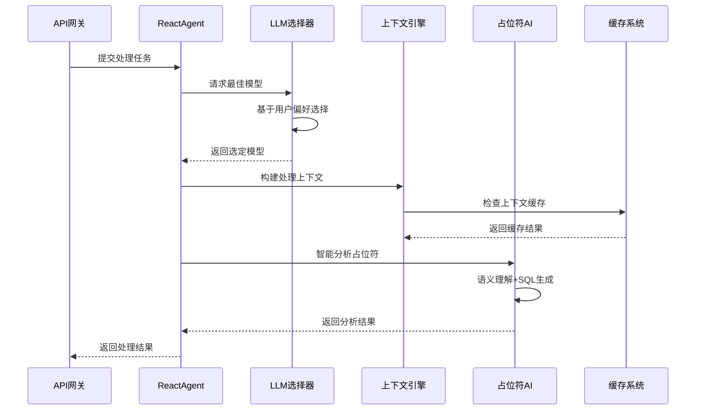
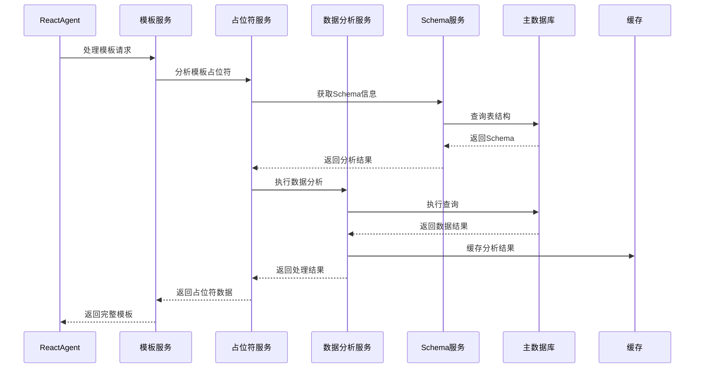
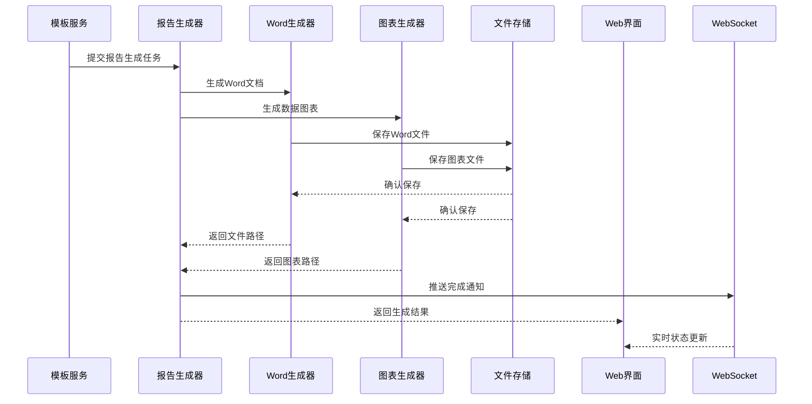
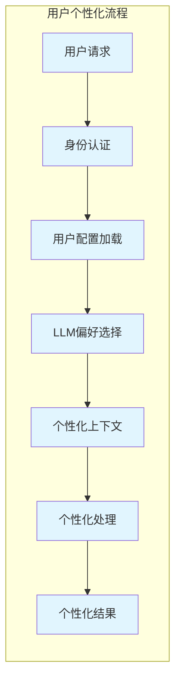
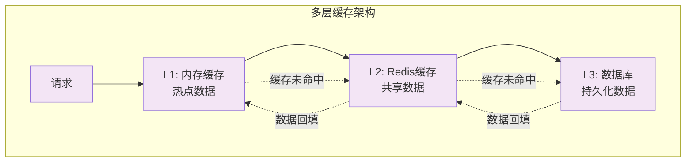
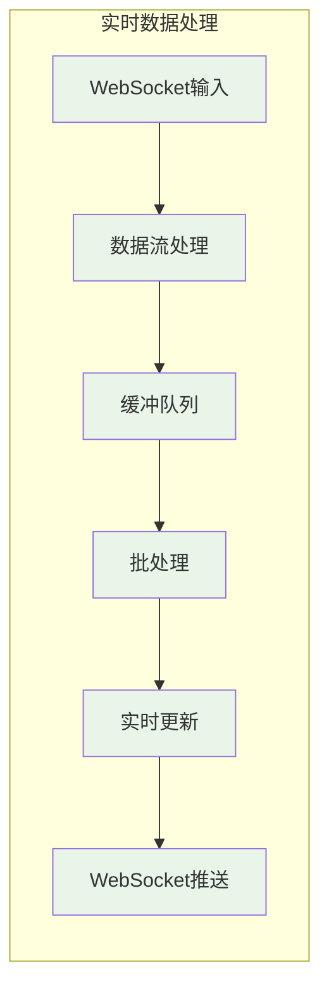

# AutoReportAI 数据流转图

## 系统数据流转总览

## 详细数据流转说明

### 1. 数据输入阶段 (Data Input Stage)

### 2. 智能处理阶段 (Intelligent Processing Stage)

### 3. 业务处理阶段 (Business Processing Stage)

### 4. 数据输出阶段 (Data Output Stage)

## 关键数据流转节点

### 1. 用户个性化数据流

### 2. 缓存数据流

### 3. 实时数据流

## 数据一致性保证

### 1. 事务管理
- **ACID事务**: 关键业务操作使用数据库事务
- **分布式事务**: 跨服务操作使用补偿模式
- **最终一致性**: 缓存更新采用最终一致性

### 2. 数据同步
- **主从同步**: PostgreSQL主从复制
- **缓存同步**: Redis与数据库的延迟同步
- **文件同步**: MinIO分布式存储同步

### 3. 错误恢复
- **重试机制**: 网络错误自动重试
- **降级策略**: 服务不可用时的降级处理
- **数据修复**: 定期数据一致性检查和修复

## 性能优化策略

### 1. 数据预加载
- **预热缓存**: 系统启动时预加载热点数据
- **预测缓存**: 基于用户行为预测数据需求
- **批量加载**: 批量加载相关数据减少IO

### 2. 并发处理
- **异步处理**: 非阻塞的异步数据处理
- **并行计算**: 多核并行处理大数据集
- **流水线**: 数据处理流水线优化

### 3. 智能优化
- **AI预测**: 使用AI预测数据访问模式
- **动态调整**: 根据负载动态调整缓存策略
- **自动优化**: 自动SQL查询优化和索引建议

这个数据流转图展现了AutoReportAI系统中数据的完整生命周期，从输入、处理、存储到输出的全链路数据流转过程，体现了智能化、个性化和高性能的数据处理架构。