# AutoReportAI 占位符分析到数据生成全量流程图

## 占位符处理全流程总览

```mermaid
graph TD
    %% 用户输入阶段
    subgraph "用户输入阶段 (User Input Stage)"
        USER_INPUT[用户输入<br/>模板内容/需求描述]
        TEMPLATE_UPLOAD[模板上传<br/>Word/Text文档]
        REQUIREMENT_DESC[需求描述<br/>自然语言描述]
    end
    
    %% 模板解析阶段
    subgraph "模板解析阶段 (Template Parsing Stage)"
        TEMPLATE_PARSER[模板解析器<br/>TemplateParser]
        PLACEHOLDER_EXTRACTOR[占位符提取器<br/>PlaceholderExtractor]
        SYNTAX_VALIDATOR[语法验证器<br/>SyntaxValidator]
        PRELIMINARY_ANALYSIS[初步分析器<br/>PreliminaryAnalyzer]
    end
    
    %% React Agent智能分析阶段
    subgraph "React Agent智能分析阶段 (AI Analysis Stage)"
        REACT_AGENT[React智能代理<br/>用户个性化Agent]
        LLM_SELECTOR[LLM智能选择器<br/>基于任务复杂度选择]
        CONTEXT_BUILDER[上下文构建器<br/>ContextBuilder]
        SEMANTIC_ANALYZER[语义分析器<br/>SemanticAnalyzer]
    end
    
    %% 占位符智能处理阶段
    subgraph "占位符智能处理阶段 (Placeholder Processing)"
        PLACEHOLDER_CLASSIFIER[占位符分类器<br/>类型识别]
        INTENT_ANALYZER[意图分析器<br/>业务意图理解]
        PARAM_INFERENCER[参数推断器<br/>隐式参数推断]
        DEPENDENCY_ANALYZER[依赖分析器<br/>占位符依赖关系]
    end
    
    %% Schema智能分析阶段
    subgraph "Schema智能分析阶段 (Schema Analysis)"
        SCHEMA_DISCOVERY[Schema发现<br/>数据源结构发现]
        TABLE_ANALYZER[表分析器<br/>表结构和关系分析]
        FIELD_MAPPER[字段映射器<br/>业务字段映射]
        RELATIONSHIP_ANALYZER[关系分析器<br/>表关系和约束分析]
    end
    
    %% SQL智能生成阶段
    subgraph "SQL智能生成阶段 (SQL Generation)"
        QUERY_PLANNER[查询规划器<br/>查询策略规划]
        SQL_GENERATOR[SQL生成器<br/>智能SQL生成]
        QUERY_OPTIMIZER[查询优化器<br/>性能优化]
        SQL_VALIDATOR[SQL验证器<br/>语法和逻辑验证]
    end
    
    %% 数据执行阶段
    subgraph "数据执行阶段 (Data Execution)"
        CONNECTION_MANAGER[连接管理器<br/>数据源连接池]
        QUERY_EXECUTOR[查询执行器<br/>SQL执行引擎]
        RESULT_PROCESSOR[结果处理器<br/>数据后处理]
        DATA_TRANSFORMER[数据转换器<br/>格式转换]
    end
    
    %% 数据生成阶段
    subgraph "数据生成阶段 (Data Generation)"
        CHART_GENERATOR[图表生成器<br/>数据可视化]
        CHART_STORAGE[图表文件存储<br/>PNG/SVG保存]
        PLACEHOLDER_REPLACER[占位符替换器<br/>智能内容替换]
        REPORT_COMPOSER[报告组装器<br/>内容组装]
        WORD_GENERATOR[Word生成器<br/>文档生成]
        CHART_INSERTER[图表插入器<br/>图表嵌入文档]
        QUALITY_CHECKER[质量检查器<br/>结果质量检查]
    end
    
    %% 缓存和存储
    subgraph "缓存和存储 (Cache & Storage)"
        UNIFIED_CACHE[统一缓存<br/>多层缓存系统]
        RESULT_STORAGE[结果存储<br/>文件存储系统]
        METADATA_STORE[元数据存储<br/>处理过程记录]
        VERSION_CONTROL[版本控制<br/>结果版本管理]
    end
    
    %% 用户交互和反馈
    subgraph "用户交互和反馈 (User Interaction)"
        PROGRESS_TRACKER[进度跟踪<br/>实时进度更新]
        RESULT_PREVIEW[结果预览<br/>中间结果预览]
        USER_FEEDBACK[用户反馈<br/>结果确认和调整]
        FINAL_OUTPUT[最终输出<br/>完整报告交付]
    end
    
    %% 流程连接 - 主流程
    USER_INPUT --> TEMPLATE_PARSER
    TEMPLATE_UPLOAD --> TEMPLATE_PARSER
    REQUIREMENT_DESC --> TEMPLATE_PARSER
    
    TEMPLATE_PARSER --> PLACEHOLDER_EXTRACTOR
    PLACEHOLDER_EXTRACTOR --> SYNTAX_VALIDATOR
    SYNTAX_VALIDATOR --> PRELIMINARY_ANALYSIS
    
    PRELIMINARY_ANALYSIS --> REACT_AGENT
    REACT_AGENT --> LLM_SELECTOR
    REACT_AGENT --> CONTEXT_BUILDER
    CONTEXT_BUILDER --> SEMANTIC_ANALYZER
    
    SEMANTIC_ANALYZER --> PLACEHOLDER_CLASSIFIER
    PLACEHOLDER_CLASSIFIER --> INTENT_ANALYZER
    INTENT_ANALYZER --> PARAM_INFERENCER
    PARAM_INFERENCER --> DEPENDENCY_ANALYZER
    
    DEPENDENCY_ANALYZER --> SCHEMA_DISCOVERY
    SCHEMA_DISCOVERY --> TABLE_ANALYZER
    TABLE_ANALYZER --> FIELD_MAPPER
    FIELD_MAPPER --> RELATIONSHIP_ANALYZER
    
    RELATIONSHIP_ANALYZER --> QUERY_PLANNER
    QUERY_PLANNER --> SQL_GENERATOR
    SQL_GENERATOR --> QUERY_OPTIMIZER
    QUERY_OPTIMIZER --> SQL_VALIDATOR
    
    SQL_VALIDATOR --> CONNECTION_MANAGER
    CONNECTION_MANAGER --> QUERY_EXECUTOR
    QUERY_EXECUTOR --> RESULT_PROCESSOR
    RESULT_PROCESSOR --> DATA_TRANSFORMER
    
    DATA_TRANSFORMER --> CHART_GENERATOR
    CHART_GENERATOR --> CHART_STORAGE
    CHART_STORAGE --> PLACEHOLDER_REPLACER
    DATA_TRANSFORMER --> REPORT_COMPOSER
    REPORT_COMPOSER --> WORD_GENERATOR
    WORD_GENERATOR --> CHART_INSERTER
    CHART_STORAGE --> CHART_INSERTER
    PLACEHOLDER_REPLACER --> CHART_INSERTER
    CHART_INSERTER --> QUALITY_CHECKER
    
    QUALITY_CHECKER --> FINAL_OUTPUT
    
    %% 缓存流程
    SEMANTIC_ANALYZER -.-> UNIFIED_CACHE
    SQL_GENERATOR -.-> UNIFIED_CACHE
    QUERY_EXECUTOR -.-> UNIFIED_CACHE
    CHART_GENERATOR -.-> UNIFIED_CACHE
    PLACEHOLDER_REPLACER -.-> UNIFIED_CACHE
    
    %% 存储流程
    CHART_STORAGE --> RESULT_STORAGE
    WORD_GENERATOR --> RESULT_STORAGE
    QUALITY_CHECKER --> METADATA_STORE
    FINAL_OUTPUT --> VERSION_CONTROL
    
    %% 交互流程
    REACT_AGENT --> PROGRESS_TRACKER
    QUERY_EXECUTOR --> PROGRESS_TRACKER
    CHART_GENERATOR --> RESULT_PREVIEW
    RESULT_PREVIEW --> USER_FEEDBACK
    USER_FEEDBACK -.-> REACT_AGENT
    
    %% 样式定义
    classDef inputStage fill:#e3f2fd
    classDef parseStage fill:#f1f8e9
    classDef aiStage fill:#fce4ec
    classDef placeholderStage fill:#fff3e0
    classDef schemaStage fill:#f3e5f5
    classDef sqlStage fill:#e8eaf6
    classDef executeStage fill:#e0f2f1
    classDef generateStage fill:#fafafa
    classDef cacheStage fill:#e1f5fe
    classDef interactStage fill:#f9fbe7
    
    class USER_INPUT,TEMPLATE_UPLOAD,REQUIREMENT_DESC inputStage
    class TEMPLATE_PARSER,PLACEHOLDER_EXTRACTOR,SYNTAX_VALIDATOR,PRELIMINARY_ANALYSIS parseStage
    class REACT_AGENT,LLM_SELECTOR,CONTEXT_BUILDER,SEMANTIC_ANALYZER aiStage
    class PLACEHOLDER_CLASSIFIER,INTENT_ANALYZER,PARAM_INFERENCER,DEPENDENCY_ANALYZER placeholderStage
    class SCHEMA_DISCOVERY,TABLE_ANALYZER,FIELD_MAPPER,RELATIONSHIP_ANALYZER schemaStage
    class QUERY_PLANNER,SQL_GENERATOR,QUERY_OPTIMIZER,SQL_VALIDATOR sqlStage
    class CONNECTION_MANAGER,QUERY_EXECUTOR,RESULT_PROCESSOR,DATA_TRANSFORMER executeStage
    class CHART_GENERATOR,CHART_STORAGE,PLACEHOLDER_REPLACER,REPORT_COMPOSER,WORD_GENERATOR,CHART_INSERTER,QUALITY_CHECKER generateStage
    class UNIFIED_CACHE,RESULT_STORAGE,METADATA_STORE,VERSION_CONTROL cacheStage
    class PROGRESS_TRACKER,RESULT_PREVIEW,USER_FEEDBACK,FINAL_OUTPUT interactStage
```

## 详细流程时序图

### 1. 占位符解析和分析阶段

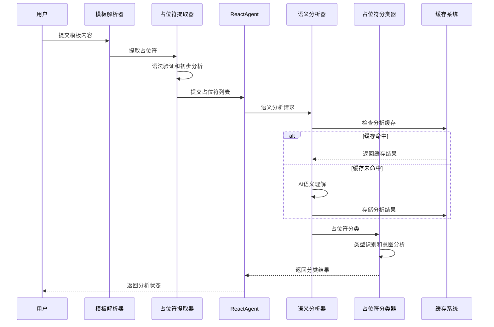

### 2. Schema分析和SQL生成阶段

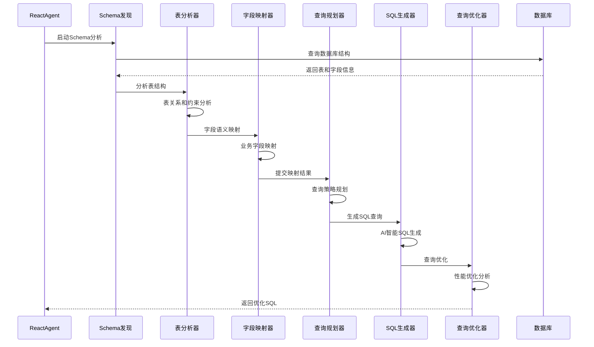

### 3. 数据执行和生成阶段

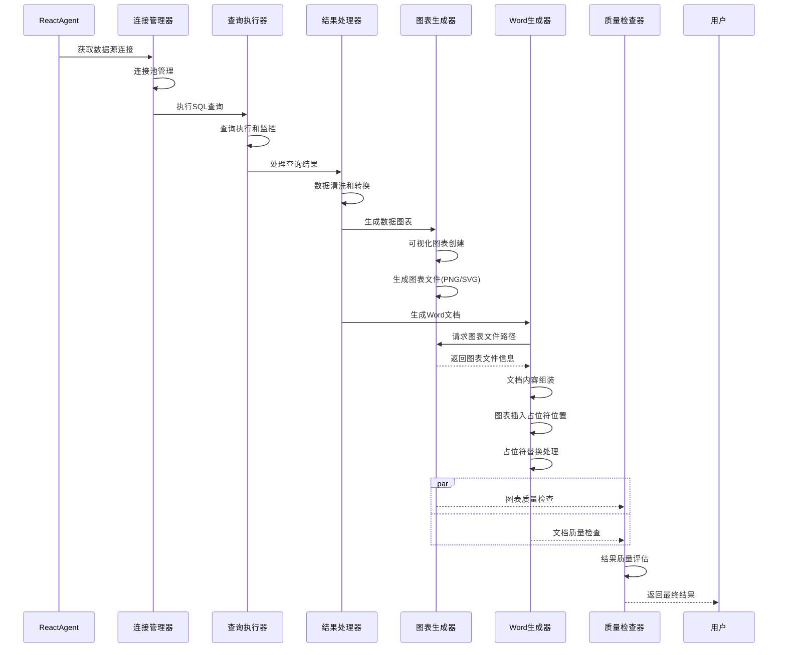

## 核心处理节点详解

### 1. React Agent智能决策节点

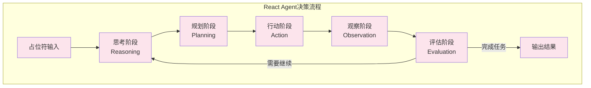

### 2. 占位符智能分析节点

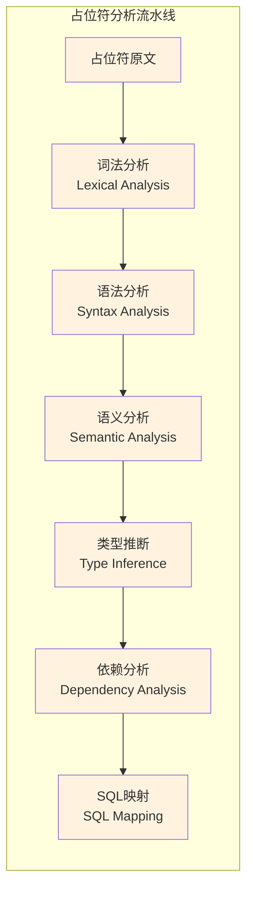

### 3. 数据生成优化节点

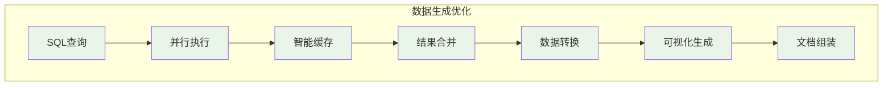

## 占位符类型处理策略

### 1. 标量占位符 (Scalar Placeholders)

```mermaid
graph LR
    subgraph "标量占位符处理"
        SCALAR[{{value}}] --> PARSE[解析变量名]
        PARSE --> INFER[推断数据类型]
        INFER --> MAP[映射数据库字段]
        MAP --> AGG[聚合函数选择]
        AGG --> QUERY[生成查询语句]
        QUERY --> RESULT[返回单一值]
    end
```

### 2. 表格占位符 (Table Placeholders)

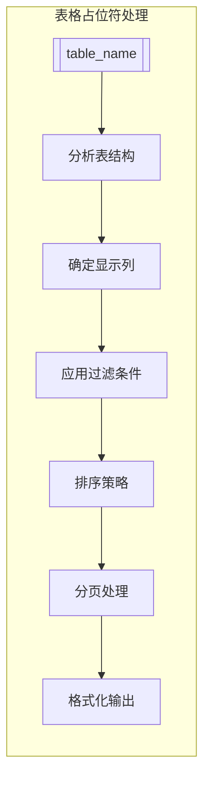

### 3. 图表占位符 (Chart Placeholders)

```mermaid
graph LR
    subgraph "图表占位符处理"
        CHART[{{chart:type}}] --> DATA[数据查询]
        DATA --> VIS_TYPE[确定图表类型]
        VIS_TYPE --> STYLE[样式配置]
        STYLE --> RENDER[图表渲染]
        RENDER --> SAVE[保存图表文件]
        SAVE --> EMBED[嵌入文档]
    end
```

## 图表插入和占位符替换详细流程

### 图表生成和文档插入流程

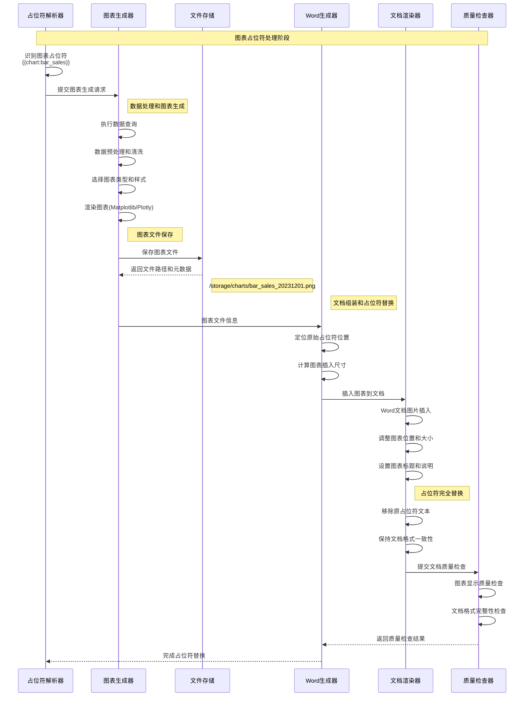

### 占位符替换策略详解

```mermaid
graph TD
    subgraph "占位符替换流程"
        TEMPLATE[原始模板文档] --> SCAN[扫描所有占位符]
        SCAN --> CLASSIFY[占位符分类]
        
        CLASSIFY --> TEXT_PH[文本占位符<br/>{{variable}}]
        CLASSIFY --> TABLE_PH[表格占位符<br/>[[table_data]]]
        CLASSIFY --> CHART_PH[图表占位符<br/>{{chart:type}}]
        CLASSIFY --> COND_PH[条件占位符<br/>{{if condition}}]
        
        TEXT_PH --> TEXT_REPLACE[文本直接替换]
        TABLE_PH --> TABLE_INSERT[表格插入替换]
        CHART_PH --> CHART_INSERT[图表插入替换]
        COND_PH --> COND_PROCESS[条件逻辑处理]
        
        TEXT_REPLACE --> MERGE[内容合并]
        TABLE_INSERT --> MERGE
        CHART_INSERT --> MERGE
        COND_PROCESS --> MERGE
        
        MERGE --> FORMAT[格式保持]
        FORMAT --> FINAL[最终文档]
    end
    
    classDef replaceFlow fill:#e8f5e8
    class TEMPLATE,SCAN,CLASSIFY,TEXT_PH,TABLE_PH,CHART_PH,COND_PH,TEXT_REPLACE,TABLE_INSERT,CHART_INSERT,COND_PROCESS,MERGE,FORMAT,FINAL replaceFlow
```

### 图表插入技术实现

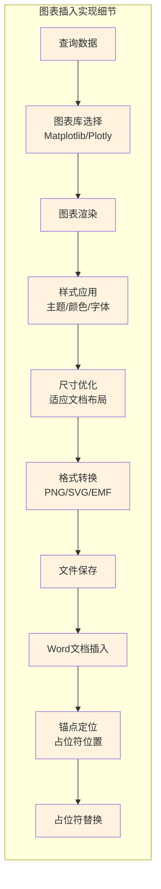

### 占位符替换执行顺序

```mermaid
graph TD
    subgraph "替换执行优先级"
        START[开始替换] --> PRIORITY1[优先级1: 条件占位符<br/>{{if}} {{else}} {{endif}}]
        PRIORITY1 --> PRIORITY2[优先级2: 循环占位符<br/>{{for}} {{endfor}}]
        PRIORITY2 --> PRIORITY3[优先级3: 表格占位符<br/>[[table_name]]]
        PRIORITY3 --> PRIORITY4[优先级4: 图表占位符<br/>{{chart:type}}]
        PRIORITY4 --> PRIORITY5[优先级5: 标量占位符<br/>{{variable}}]
        PRIORITY5 --> VALIDATE[验证替换完整性]
        VALIDATE --> FORMAT_CHECK[格式一致性检查]
        FORMAT_CHECK --> COMPLETE[替换完成]
    end
    
    classDef priorityFlow fill:#f3e5f5
    class START,PRIORITY1,PRIORITY2,PRIORITY3,PRIORITY4,PRIORITY5,VALIDATE,FORMAT_CHECK,COMPLETE priorityFlow
```

### 图表插入质量保证

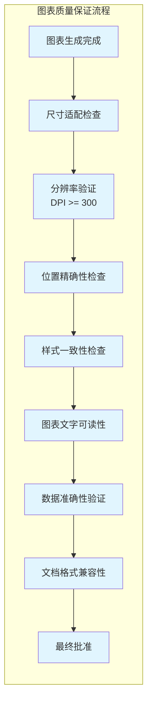

### 4. 条件占位符 (Conditional Placeholders)

```mermaid
graph LR
    subgraph "条件占位符处理"
        COND[{{if condition}}] --> EVAL[条件评估]
        EVAL --> TRUE_BRANCH[条件为真]
        EVAL --> FALSE_BRANCH[条件为假]
        TRUE_BRANCH --> TRUE_CONTENT[渲染真分支内容]
        FALSE_BRANCH --> FALSE_CONTENT[渲染假分支内容]
        TRUE_CONTENT --> MERGE[合并结果]
        FALSE_CONTENT --> MERGE
    end
```

## 性能优化策略

### 1. 并行处理策略

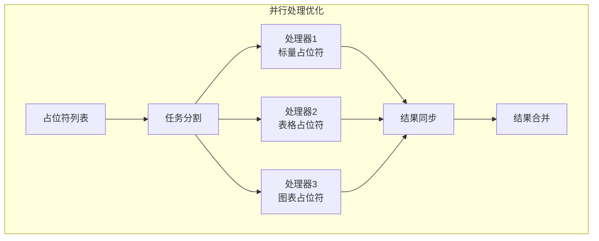

### 2. 智能缓存策略

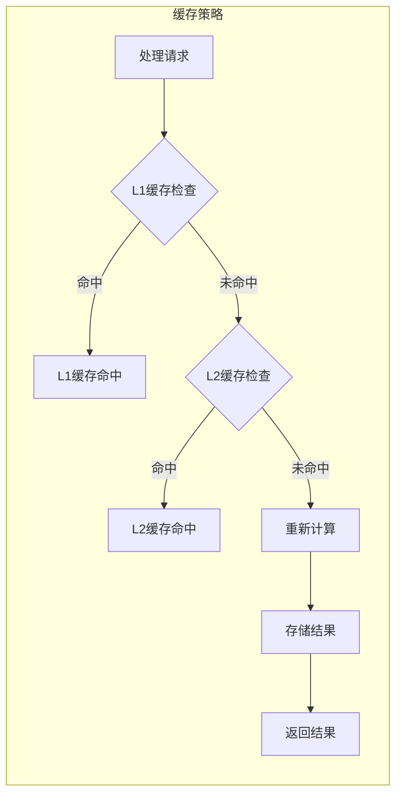

### 3. 渐进式生成策略

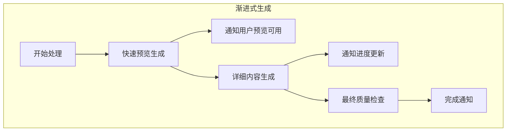

## 错误处理和恢复

### 1. 错误分类和处理

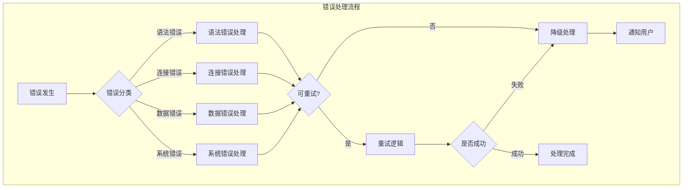

### 2. 数据质量保证

```mermaid
graph LR
    subgraph "质量检查流程"
        RESULT[处理结果] --> VALIDATE[数据验证]
        VALIDATE --> COMPLETE{完整性检查}
        COMPLETE -->|通过| ACCURACY{准确性检查}
        COMPLETE -->|不通过| FIX[数据修复]
        ACCURACY -->|通过| FORMAT{格式检查}
        ACCURACY -->|不通过| FIX
        FORMAT -->|通过| APPROVE[质量批准]
        FORMAT -->|不通过| FIX
        FIX --> VALIDATE
    end
```

这个占位符分析到数据生成的全量流程图展现了AutoReportAI系统中从用户输入模板到最终生成报告的完整智能化处理流程，体现了React Agent驱动的智能决策、多层缓存优化、并行处理加速等先进的技术架构特性。
