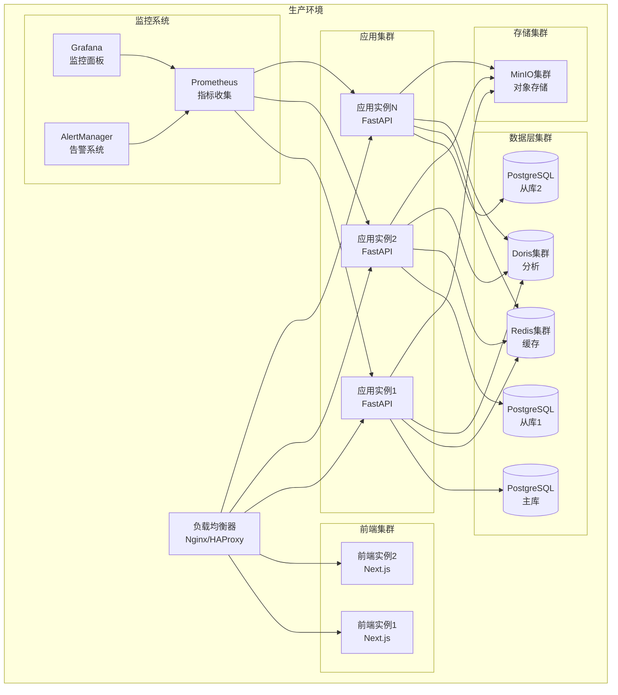

# AutoReportAI 项目整体架构图

## 系统总体架构

```mermaid
graph TB
    %% 用户接入层
    subgraph "用户接入层 (User Interface Layer)"
        UI[前端界面<br/>Next.js + TypeScript]
        API[RESTful API<br/>FastAPI + WebSocket]
    end
    
    %% 应用层
    subgraph "应用层 (Application Layer)"
        UF[统一服务门面<br/>UnifiedServiceFacade]
        WOA[工作流编排代理<br/>WorkflowOrchestrationAgent]
        TCA[任务协调代理<br/>TaskCoordinationAgent]
        CAA[上下文感知代理<br/>ContextAwareAgent]
        AS[应用服务<br/>ApplicationServices]
    end
    
    %% 领域层
    subgraph "领域层 (Domain Layer)"
        subgraph "占位符领域"
            IPS[智能占位符服务<br/>IntelligentPlaceholderService]
            PE[占位符解析引擎<br/>ParserEngine]
            CE[上下文分析引擎<br/>ContextAnalysisEngine]
        end
        
        subgraph "模板领域"
            TS[模板服务<br/>TemplateService]
            TDS[模板领域服务<br/>TemplateDomainService]
            TCP[模板缓存服务<br/>TemplateCacheService]
        end
        
        subgraph "报告领域"
            RGS[报告生成服务<br/>ReportGenerationService]
            WGS[Word生成服务<br/>WordGeneratorService]
            QC[质量检查器<br/>QualityChecker]
        end
        
        subgraph "数据源领域"
            DSS[数据源服务<br/>DataSourceService]
            DSE[数据源实体<br/>DataSourceEntity]
            CE2[连接实体<br/>ConnectionEntity]
        end
    end
    
    %% 基础设施层
    subgraph "基础设施层 (Infrastructure Layer)"
        subgraph "AI服务"
            RA[React智能代理<br/>ReactAgent]
            LLM[LLM管理器<br/>LLMManager]
            ILS[智能LLM选择器<br/>IntelligentLLMSelector]
            AT[AI工具集<br/>AITools]
        end
        
        subgraph "缓存系统"
            UCM[统一缓存管理器<br/>UnifiedCacheManager]
            RC[Redis缓存<br/>RedisCache]
            MC[内存缓存<br/>MemoryCache]
            CAC[上下文感知缓存<br/>ContextAwareCache]
        end
        
        subgraph "存储服务"
            SS[存储服务<br/>StorageService]
            FSM[文件存储管理器<br/>FileStorageManager]
            VSM[版本存储管理器<br/>VersionStorageManager]
        end
        
        subgraph "通知服务"
            NS[通知服务<br/>NotificationService]
            ES[邮件服务<br/>EmailService]
            WS[WebSocket管理器<br/>WebSocketManager]
        end
    end
    
    %% 数据层
    subgraph "数据层 (Data Layer)"
        subgraph "连接器系统"
            CF[连接器工厂<br/>ConnectorFactory]
            DC[Doris连接器<br/>DorisConnector]
            SC[SQL连接器<br/>SQLConnector]
            CC[CSV连接器<br/>CSVConnector]
            AC[API连接器<br/>APIConnector]
        end
        
        subgraph "数据存储库"
            DR[数据存储库<br/>DataRepositories]
            TR[模板存储库<br/>TemplateRepository]
            PR[占位符存储库<br/>PlaceholderRepository]
            DSR[数据源存储库<br/>DataSourceRepository]
        end
        
        subgraph "Schema服务"
            SAS[Schema分析服务<br/>SchemaAnalysisService]
            SMS[Schema元数据服务<br/>SchemaMetadataService]
            SQS[Schema查询服务<br/>SchemaQueryService]
        end
    end
    
    %% 外部系统
    subgraph "外部系统 (External Systems)"
        DB[(PostgreSQL<br/>主数据库)]
        REDIS[(Redis<br/>缓存数据库)]
        DORIS[(Apache Doris<br/>OLAP数据库)]
        MINIO[MinIO<br/>文件存储]
        LLMS[第三方LLM<br/>OpenAI/Anthropic/等]
    end
    
    %% 连接关系
    UI --> API
    API --> UF
    UF --> WOA
    UF --> TCA
    UF --> CAA
    UF --> AS
    
    WOA --> IPS
    WOA --> TS
    WOA --> RGS
    TCA --> IPS
    TCA --> DSS
    CAA --> CE
    
    IPS --> PE
    IPS --> CE
    TS --> TDS
    TS --> TCP
    RGS --> WGS
    RGS --> QC
    
    RA --> LLM
    LLM --> ILS
    RA --> AT
    
    UCM --> RC
    UCM --> MC
    UCM --> CAC
    
    CF --> DC
    CF --> SC
    CF --> CC
    CF --> AC
    
    DR --> TR
    DR --> PR
    DR --> DSR
    
    %% 外部连接
    RC --> REDIS
    DR --> DB
    DC --> DORIS
    SS --> MINIO
    LLM --> LLMS
    
    %% 样式定义
    classDef userLayer fill:#e1f5fe
    classDef appLayer fill:#f3e5f5
    classDef domainLayer fill:#e8f5e8
    classDef infraLayer fill:#fff3e0
    classDef dataLayer fill:#fce4ec
    classDef externalLayer fill:#f5f5f5
    
    class UI,API userLayer
    class UF,WOA,TCA,CAA,AS appLayer
    class IPS,PE,CE,TS,TDS,TCP,RGS,WGS,QC,DSS,DSE,CE2 domainLayer
    class RA,LLM,ILS,AT,UCM,RC,MC,CAC,SS,FSM,VSM,NS,ES,WS infraLayer
    class CF,DC,SC,CC,AC,DR,TR,PR,DSR,SAS,SMS,SQS dataLayer
    class DB,REDIS,DORIS,MINIO,LLMS externalLayer
```

## 架构层级说明

### 1. 用户接入层 (User Interface Layer)
- **前端界面**: Next.js + TypeScript 构建的响应式Web界面
- **API网关**: FastAPI构建的RESTful API + WebSocket实时通信

### 2. 应用层 (Application Layer)
- **统一服务门面**: 封装复杂跨层调用，提供清晰业务接口
- **工作流编排代理**: 复杂跨领域工作流编排
- **任务协调代理**: 任务调度与协调管理
- **上下文感知代理**: 基于上下文的智能任务处理

### 3. 领域层 (Domain Layer)
- **占位符领域**: 智能占位符解析、上下文分析、语义理解
- **模板领域**: 模板管理、缓存、领域服务
- **报告领域**: 报告生成、Word文档生成、质量检查
- **数据源领域**: 数据源管理、连接实体、业务实体

### 4. 基础设施层 (Infrastructure Layer)
- **AI服务**: React智能代理、LLM管理、智能选择器
- **缓存系统**: 多层缓存架构、上下文感知缓存
- **存储服务**: 文件存储、版本管理
- **通知服务**: 多渠道通知、实时推送

### 5. 数据层 (Data Layer)
- **连接器系统**: 多数据源连接器、工厂模式
- **数据存储库**: DDD存储库模式、数据访问抽象
- **Schema服务**: 智能Schema分析、元数据管理

### 6. 外部系统 (External Systems)
- **数据存储**: PostgreSQL主库、Redis缓存
- **大数据**: Apache Doris OLAP分析
- **文件存储**: MinIO对象存储
- **AI服务**: 多厂商LLM服务集成

## 核心特性

### 1. 纯数据库驱动架构
- 所有配置存储在数据库中
- 用户中心化设计，所有服务需要user_id
- 动态配置加载，无静态配置文件依赖

### 2. React Agent智能系统
- 用户个性化AI代理
- ReAct推理循环 (Reasoning + Action)
- 智能模型选择和成本优化
- 丰富的工具生态系统

### 3. DDD分层架构
- 清晰的层级职责分离
- 领域驱动的业务建模
- 松耦合、高内聚的服务设计

### 4. 智能缓存体系
- 多层缓存策略
- 上下文感知缓存失效
- 性能优化和资源管理

### 5. 微服务化设计
- 服务间清晰的边界
- 异步消息通信
- 高可用性和横向扩展能力

## 部署架构

这个架构图展现了AutoReportAI项目的完整技术架构，体现了DDD设计原则、React Agent智能系统集成、以及现代化的微服务部署架构。